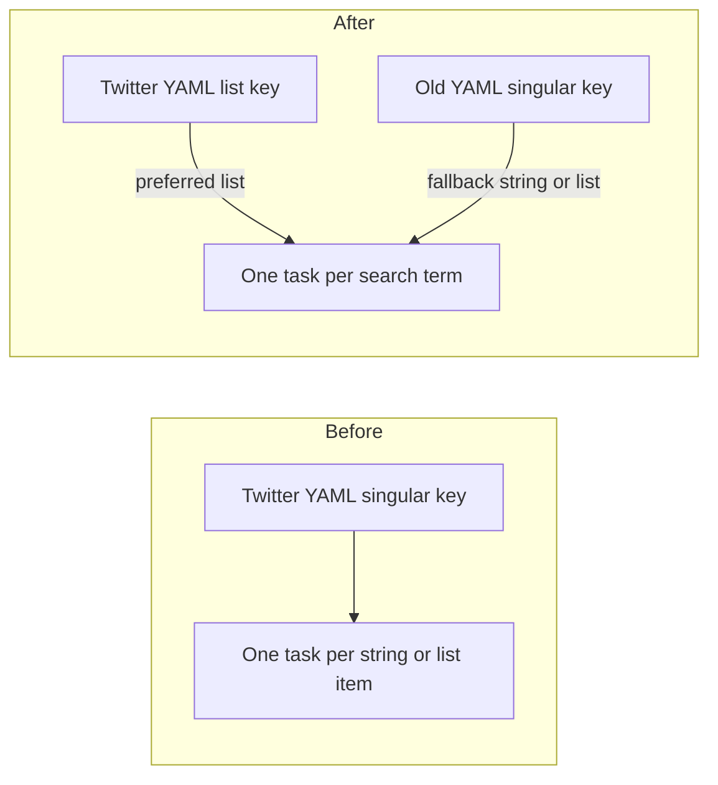

# Require list-form search terms on Twitter ingest configs

## Remember
- Exact file paths always
- Exact commands with expected output
- DRY, YAGNI, TDD, frequent commits
- Delegated tasks must be impossible to misread.

## Overview

Twitter ingest YAML currently accepts search terms as one string or as a list, under a singular key. Bluesky ingest YAML already requires a list under a shared list key. The change points Twitter at that shared list key, keeps the old singular key working as a fallback so local configs still run, and updates committed Twitter configs that still use the old key. Bluesky is unchanged. The per-task fetch cap key is left for a later PR.

## Happy flow

An operator lists search terms in Twitter ingest YAML under the same list key Bluesky already uses. The Twitter sync command reads that list and builds one checkpoint task per term. If only the old singular key is set, the command still accepts a string or a list. If neither key is set, or the list key is present and invalid, the command raises before it fetches.

## Approach

Keep lookup in the Twitter task builder. Prefer the list key when it is present, and apply the same list and entry checks Bluesky already uses. When that key is absent, keep the current Twitter string-or-list fallback. Do not add a shared alias helper, a deprecation log, or a migration tool. Update committed Twitter YAML only. Do not rename the per-task fetch cap key. Do not change Bluesky.

## Steps

### Step 1: Point Twitter ingest at the list search-term key

Add a local resolver in the Twitter sync module. Use it from the Twitter task builder so each checkpoint task comes from the list key, or from the old singular key when the list key is absent. Rename the old key in committed Twitter YAML. Prove the lookup and the YAML rename with tests in the Twitter checkpoint file and the ingest YAML key file. Keep the shared query quoting tests green.

## What "done" looks like

1. Twitter task building reads the list key first. When that key is present, it must be a non-empty list of non-empty strings, matching Bluesky. When it is absent, the old singular key still accepts a string or a list.
2. Committed Twitter ingest YAML that used the old singular key now uses the list key. Values stay the same. The per-task fetch cap key is unchanged.
3. Bluesky task building and Bluesky YAML are unchanged.
4. `PYTHONPATH=. uv run pytest tests/data_platform/ingestion/test_sync_twitter_checkpoint.py tests/data_platform/ingestion/test_ingest_yaml_keys.py tests/data_platform/ingestion/test_query_terms.py -q` exits 0.
5. `PYTHONPATH=. uv run pytest tests/data_platform/ingestion -q` exits 0 with no new failures.
6. Sibling ingest-contract work is not in this PR, including the later rename of the per-task fetch cap.
