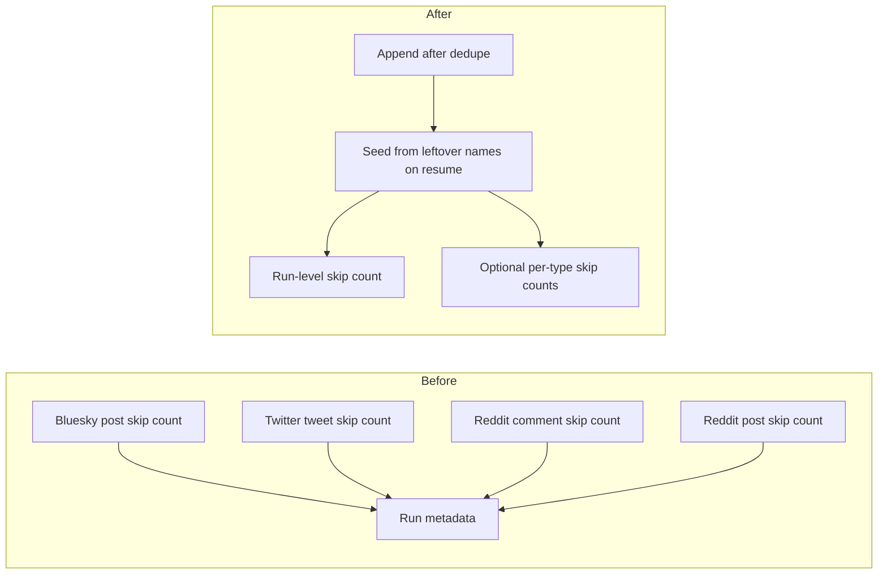

# Write one duplicate-skip count in ingest run metadata

## Remember
- Exact file paths always
- Exact commands with expected output
- DRY, YAGNI, TDD, frequent commits
- Delegated tasks must be impossible to misread.

## Overview

After a sync run skips rows that were already stored, Bluesky, Twitter, and Reddit each write a different field name onto run metadata. Operators and later tools cannot read one total across platforms. This PR writes one run-level skip count and an optional count per record type. Resume still counts skips that older runs stored under the leftover platform names. The skip logic itself stays the same.

## Happy flow

An operator runs a Bluesky, Twitter, or Reddit sync. After each append, run metadata stores one total of rows skipped as duplicates, plus a per-record-type map when that run writes more than one type. If the operator resumes a run that only has the older platform names, the next append seeds the new fields from those leftover counts and then only updates the new fields.

## Approach

Add two helpers in the shared checkpoint module. One seeds the new fields from leftover platform names when those new fields are missing. One adds the latest skip count after an append. Bluesky, Twitter, and Reddit call the increment helper instead of writing their old field names. Do not add a generic metadata alias framework, a deprecation log, or a disk migration. Do not initialize the new fields in the shared metadata builder. They appear on the first increment, including a zero skip.

## Decisions (resolved from review)

1. Two public helpers, not one private seed inside increment only. Resume tests need to prove seeding without an append, and Reddit needs to seed both leftover names even when the first increment is for one type.
2. Write a run-level total and a per-record-type map. Do not keep writing the older platform names on new flushes. Leave those leftover names on disk when they already exist.
3. Do not add the new fields in the shared metadata builder. The increment helper seeds missing fields, so a new run gets them on first append.
4. Do not rewrite completed run files. Do not change ISO timestamps, YAML, or dedupe session behavior.

## Steps

### Step 1: Write one skip count after each append, and seed leftover names on resume

Add the seed helper and the increment helper in the checkpoint module. Call the increment helper from Bluesky, Twitter, and Reddit after each dedupe append. Prove seeding, increment, caller wiring, and leftover-name resume with tests on the helpers and the platform fetch paths.

## What "done" looks like

1. After a sync append, run metadata stores one run-level skip count. It also stores a per-record-type map keyed by the record type that was appended. Bluesky, Twitter, and Reddit no longer write their older skip-count names on new flushes.
2. Resume of a run that only has leftover platform names seeds the new fields from those leftover counts, then adds new skips only to the new fields. Leftover names stay on that metadata object and are not deleted.
3. `PYTHONPATH=. uv run pytest tests/data_platform/ingestion/test_sync_checkpoint.py tests/data_platform/ingestion/test_sync_bluesky_checkpoint.py tests/data_platform/ingestion/test_sync_twitter_checkpoint.py tests/data_platform/ingestion/test_sync_reddit_checkpoint.py -q` exits 0.
4. `PYTHONPATH=. uv run pytest tests/data_platform/ingestion -q` exits 0 with no new failures.
5. Sibling ingest-contract work is not in this PR, including ISO creation timestamps.
