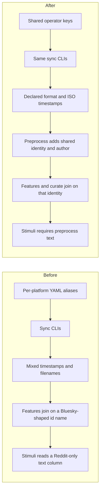

# Unify ingest operator contracts and downstream record identity

## Remember
- Exact file paths always
- Exact commands with expected output
- DRY, YAGNI, TDD, frequent commits
- Delegated tasks must be impossible to misread.

## Overview

Ingest already shares one CLI wrapper, checkpoint ledger, and on-disk layout, but operator configs, raw row columns, and run metadata name the same knobs differently per platform. Downstream feature files then join on a column name that only matches one platform’s native id. This plan makes each selected cleanup its own mergeable PR, in an order that keeps overlapping files from colliding. Engagement-metric aliases and configs-folder hygiene are out of scope. Platform-native ids on raw rows stay.

## Happy flow

An operator writes one YAML shape per shared knob, runs the existing per-platform sync CLIs, and gets raw runs whose manifests and timestamps are honest. Preprocess adds shared author and identity columns. Feature labeling and curation join on that identity. Stimuli sampling reads preprocess text and fails if that column is missing.

## Approach

Ship fourteen independently mergeable PRs. Isolated platform-only and metadata-path changes land first. Shared filename handling lands before other writers keep diverging. Config-key PRs that touch the same YAML files go one after another so they do not fight. Row-schema and downstream identity work wait until ingest writers are stable. Keep deprecation aliases for old YAML except stimuli sampling, which must require the preprocess text column with no fallback. Do not rename raw platform ids.

Implementation order is for merge conflict reduction. GitHub `blocked-by` stays empty unless a later PR cannot behave correctly without an earlier one.

## Steps

### Step 1: Validate Twitter ingest record types at CLI startup

Reject Twitter configs whose record-type list is not the allowed Twitter value, matching Bluesky and Reddit fail-fast behavior. Twitter-only files.

### Step 2: Rename Bluesky YAML author filter away from login identity

Give the optional Bluesky author filter a name that cannot be confused with the login environment handle. Bluesky configs and Bluesky sync only. Keep a short deprecation alias.

### Step 3: Store repo-relative ingest config paths in manifests

Write the same repo-relative config path into run metadata and the dataset manifest so two files named alike cannot be confused. Checkpoint and dataset helpers only.

### Step 4: Honor declared output format for Twitter and Reddit raw files

Route Twitter and Reddit writers through the same format-aware filename helper Bluesky already uses, and make the dataset manifest list the files that were actually written.

### Step 5: Require list-form search terms on Twitter ingest configs

Make Twitter accept the same search-term list key Bluesky already uses. Keep a one-release alias for the old singular key. Twitter configs and Twitter sync.

### Step 6: Standardize per-task fetch caps across ingest platforms

Use one YAML key for the per-keyword and per-subreddit fetch cap. Keep platform-specific aliases so existing configs still load. All three ingest YAML families and their sync scripts.

### Step 7: Split global ingest row caps by posts versus comments

Stop using one global cap name for Twitter/Bluesky posts and Reddit comments. New keys make the cap’s unit explicit; the old key remains a documented alias with Reddit-comment meaning.

### Step 8: Collapse ingest dedupe policy keys and drop the unused current-run token

One top-level policy plus an optional per-record-type override for Reddit posts versus comments. Document within-run dedupe as always on. Remove the unused current-run token from the documented policy set.

### Step 9: Unify duplicate-skip counters in ingest run metadata

Replace platform-specific skip counter names with one run-level count and an optional per-record-type breakdown.

### Step 10: Write ISO creation timestamps and drop Reddit’s duplicate utc column

Normalize all three platforms to UTC ISO-8601 creation time at raw write. Delete the redundant Reddit utc column. Fix Twitter so it no longer stores a Python datetime string.

### Step 11: Point stimuli sampling at preprocess text with no fallback

Read the preprocess text column for every platform, including Reddit. Do not fall back to the raw comment body field. Fail if text is missing.

### Step 12: Add canonical author fields at preprocess

Leave platform-native author columns on raw rows. Preprocess adds a shared handle column and an id column when the platform provides one.

### Step 13: Add a canonical source record id through feature and curate joins

Keep native ids on raw rows. Preprocess adds a shared source record id. Feature CSVs and curation joins use that name instead of overloading the Bluesky id column name.

### Step 14: Own content-length and language policy at preprocess

Document one length and language policy per record type, enforced at preprocess. Ingest keeps only cheap fetch-time filters. Do not import the PushShift experiment thresholds into sync.

## What "done" looks like

1. Twitter configs fail at startup when record types are invalid.
2. Bluesky author filter YAML no longer shares a name with login identity.
3. Run metadata and the dataset manifest store the same repo-relative config path.
4. Twitter and Reddit raw files match the declared output format; the manifest lists those paths.
5. Twitter search-term YAML uses the same list key as Bluesky, with a temporary alias for the old key.
6. Per-task fetch caps share one operator key, with aliases for old names.
7. Global row caps name posts versus comments explicitly; Reddit’s old cap still means comments.
8. Dedupe policy is one key plus optional per-type override; current-run is not a switch.
9. Duplicate-skip metadata uses one counter name for all platforms.
10. Raw creation times are UTC ISO-8601; Reddit no longer writes a duplicate utc column.
11. Stimuli sampling requires preprocess text and does not read Reddit body as a fallback.
12. Preprocess rows expose shared author handle and optional author id without rewriting raw columns.
13. Feature files and curation join on a shared source record id; raw platform ids remain.
14. Length and language gates live in preprocess policy; ingest does not grow new content filters.
15. Engagement-metric renaming and configs-folder README hygiene are not done.
16. Each step is one PR and can merge without bundling a sibling step.
