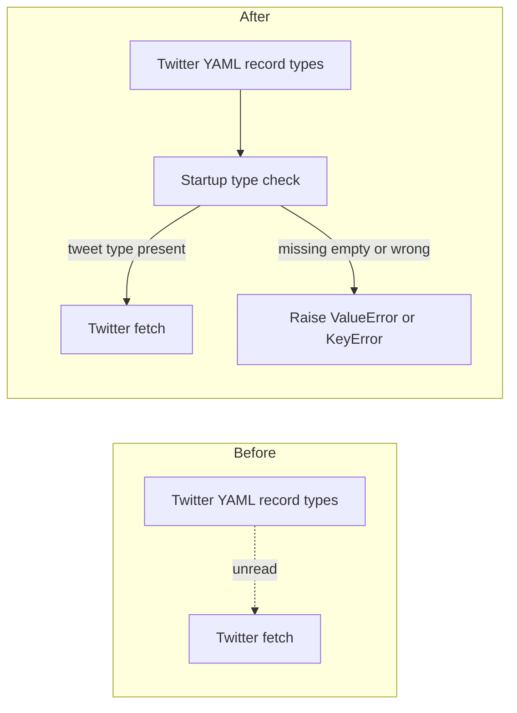

# Validate Twitter ingest record types at CLI startup

## Remember
- Exact file paths always
- Exact commands with expected output
- DRY, YAGNI, TDD, frequent commits
- Delegated tasks must be impossible to misread.

## Overview

Twitter ingest YAML already lists a tweet record type, but the Twitter sync command never reads that list. Bluesky and Reddit already stop at startup when the list is missing or empty, and they also stop when the list does not include a type those commands support. This PR adds the same startup check to Twitter so a bad config fails before any Twitter API fetch starts.

## Happy flow

An operator runs the Twitter sync command with a config that lists the tweet record type. The command confirms the list, then creates the Twitter client and fetches tweets. If the list is missing, empty, or does not include the tweet type, the command raises before fetch.

## Approach

Copy the Bluesky and Reddit startup check into the Twitter sync entrypoint. Add one Python constant for the tweet type string that YAML already uses. Prove it with unit tests on the public sync function and with a YAML-key test that Twitter ingest configs still list that type. Do not change YAML keys, raw tweet ids, or the shared filename map.

## Steps

### Step 1: Check Twitter record types before fetch

Read the record type list in the Twitter sync entrypoint the same way Bluesky and Reddit do. Reject missing, empty, or unsupported lists before the Twitter client is created. Add tests in the Twitter checkpoint file and the ingest YAML key file.

## What "done" looks like

1. The Twitter sync entrypoint reads the record type list and rejects missing, empty, or wrong types before fetch begins.
2. Twitter ingest YAML still lists the tweet record type, and tests confirm that list against the Python constant.
3. `PYTHONPATH=. uv run pytest tests/data_platform/ingestion/test_sync_twitter_checkpoint.py tests/data_platform/ingestion/test_ingest_yaml_keys.py -q` exits 0.
4. `PYTHONPATH=. uv run pytest tests/data_platform/ingestion -q` exits 0 with no new failures.
5. Shared checkpoint filename mapping is unchanged. Sibling ingest-contract work is not in this PR.
