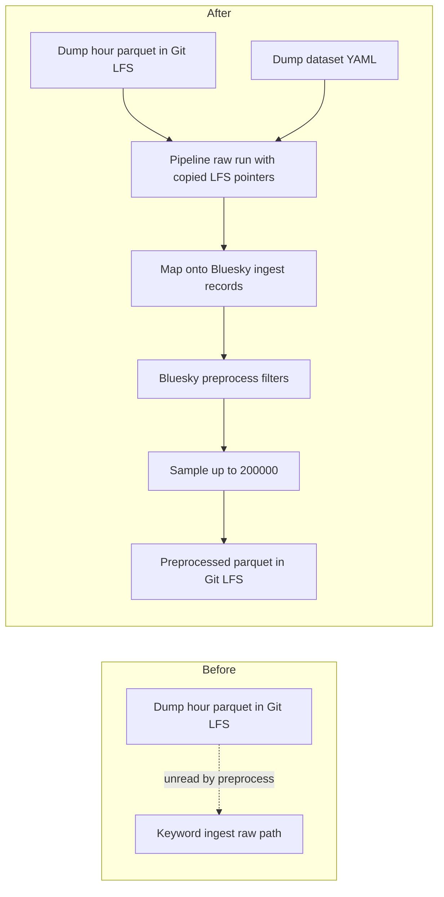

# Publish Bluesky dump posts into pipeline raw and preprocess a sampled subset

## Remember
- Exact file paths always
- Exact commands with expected output
- DRY, YAGNI, TDD, frequent commits
- Delegated tasks must be impossible to misread.

## Overview

Pull requests 135 and 153 landed warehouse dumps for Bluesky and Reddit. Bluesky dump parquet still sits beside the dump scripts, not on the pipeline raw path that preprocess reads. This work copies those Git LFS pointers into a dump dataset under the pipeline raw layout, adds a YAML file later stages can read, runs Bluesky preprocess, and writes a configurable sample (200,000 posts) before the preprocessed files are stored with Git LFS.

## Happy flow

An operator copies the dump parquet pointers into the dump dataset's raw run folder, then runs Bluesky preprocess with the dump YAML. Preprocess maps warehouse rows onto the Bluesky ingest record shape, applies the usual Bluesky filters, samples up to 200,000 kept posts, and writes a completed preprocessed run.

## Approach

Reuse the dump parquet already in Git LFS. Copy the pointer files into the pipeline raw path so Git reuses the same objects. Do not re-query Athena. Do not change keyword Bluesky ingest. Add one YAML for the dump dataset id, parquet format, and sample size. Teach preprocess to load hive-partitioned dump parquet and to sample after filters, immediately before write.

## Decisions

1. Copy dump LFS pointers into `data_platform/data/bluesky/bluesky_7e2c4a91-3b5f-4d8e-a6c1-0f9b8d2e5a73/raw/2026_09_01-00:00:00/`, keeping the `date=` and `hour=` folders. Do not move or rewrite the dump parquet files.
2. Put the dump YAML under preprocess configs, not ingest configs, so ingest YAML key tests do not force unused keyword-sync keys onto this file.
3. Warehouse dump columns stay `uri`, `did`, `created_at`, and `text` until preprocess loads them. Preprocess maps those rows onto the Bluesky ingest record shape. Author handle is the DID. Public post URL uses the DID. Engagement counts are 0. Record id uses the existing Bluesky record-id helper.
4. Sample after every preprocess filter and before writing the preprocessed run. Default size is 200,000. Default seed is 20260901. If fewer rows survive filters, write every survivor. Keyword preprocess that passes only `--dataset-id` does not sample.
5. Track dump-dataset parquet under `data_platform/data/bluesky/bluesky_7e2c4a91-3b5f-4d8e-a6c1-0f9b8d2e5a73/` with Git LFS. Leave other pipeline data ignored.
6. Keyword Bluesky ingest, Twitter, Reddit, feature generation, and curation stay unchanged. Do not re-dump from Athena.

## Steps

### Step 1: Copy dump LFS parquet into pipeline raw and add the dump YAML

Copy the existing dump parquet Git LFS pointers into the dump dataset raw run folder. Write dataset and run metadata. Add a preprocess YAML with the dataset id, parquet format, and sample settings. Un-ignore that dataset path and track its parquet with Git LFS. See [steps/step1.md](steps/step1.md).

### Step 2: Map dump rows, load hive raw runs, and sample before preprocess writes

Map warehouse dump rows onto the Bluesky ingest record shape. Load hive-partitioned parquet from a raw run that has no `posts.parquet`. Sample kept rows after filters and before write when a sample size is set. Wire Bluesky preprocess to read the dump YAML. See [steps/step2.md](steps/step2.md).

### Step 3: Run preprocess on the dump dataset and store the sampled output in Git LFS

Pull the dump parquet blobs, run Bluesky preprocess with the dump YAML, and commit the preprocessed parquet through Git LFS. See [steps/step3.md](steps/step3.md).

## What "done" looks like

1. Dump parquet Git LFS pointers also exist under `data_platform/data/bluesky/bluesky_7e2c4a91-3b5f-4d8e-a6c1-0f9b8d2e5a73/raw/2026_09_01-00:00:00/`, with the same `date=` and `hour=` layout and the same LFS object ids as the dump folder.
2. `data_platform/preprocessing/configs/bluesky/jetstream_dump.yaml` names that dataset id, parquet format, sample size 200,000, and sample seed 20260901.
3. `dataset.json` and completed `metadata.json` exist for that raw run.
4. Bluesky preprocess with `--config` pointing at that YAML maps dump rows, applies the current Bluesky filters, samples at most 200,000 kept posts, and writes a completed preprocessed run.
5. Preprocessed parquet for that dataset is on the branch and tracked with Git LFS.
6. `PYTHONPATH=. uv run pytest tests/data_platform/preprocessing/test_preprocess_bluesky.py tests/data_platform/ingestion/test_bluesky_dump_preprocess.py -q` exits 0.
7. `PYTHONPATH=. uv run pytest tests/data_platform/preprocessing tests/data_platform/ingestion -q` exits 0 with no new failures.
8. Keyword Bluesky ingest, Twitter, Reddit, feature generation, and curation are unchanged.
