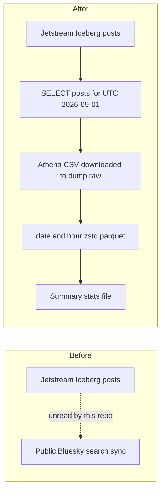

# Pull one UTC day of Bluesky posts from the Jetstream warehouse into a local dump

## Remember
- Exact file paths always
- Exact commands with expected output
- DRY, YAGNI, TDD, frequent commits
- Delegated tasks must be impossible to misread.

## Overview

The lab Jetstream pipeline already stores Bluesky creates in an Iceberg warehouse in AWS. This repository's Bluesky ingest still talks to the public search API. This plan adds a dump package that reads posts only from that warehouse for 2026-09-01 UTC, downloads the Athena CSV, writes hour-partitioned zstd parquet, and reports size and per-user stats. Keyword sync, preprocess, features, and curate stay unchanged. No test files.

Live warehouse check (2026-09-03, IAM user `mark_iam_credentials`, workgroup `bluesky_raw_maintenance`):

- Glue database `bluesky_raw`, Iceberg table `posts`, on-disk day folders `created_at_day=YYYY-MM-DD` under `s3://lab-data-integrations-interface/bluesky/raw/posts/data/`.
- Partitioning is UTC day of post creation time, not hour. Collection is table identity (`posts` vs likes/reposts/follows), not a partition.
- Half-open UTC day filter on creation time prunes that day. `EXPLAIN` shows a table scan with a creation-time constraint of `[2026-09-01 00:00:00 UTC, 2026-09-02 00:00:00 UTC)`.
- `EXPLAIN ANALYZE` of a count over that window: 3,450,253 rows, 0 bytes scanned (Iceberg metadata), 1.2s.
- That day's data files: 122 parquet objects, 1.08 GiB.
- A column-pruned scan of text and author DID: 243 MiB scanned (~$0.001 at $5/TB). A full-column dump is bounded by the 1.08 GiB partition (~$0.005).
- Preview stats for that day: mean text length 98.4 characters, 574,545 distinct DIDs, mean 6.00 posts per DID, median 2 posts per DID.

## Happy flow

An operator runs the dump runner, then the parquet transform, then summary stats. Local raw CSV is gitignored. Hour parquet (zstd-compressed) and a small stats file land in the dump folder and go on the PR.

## Approach

Copy the lab Athena wait-and-download client into the dump folder. Query only the posts table with a half-open UTC day range on creation time. Enforce SELECT-only in that client so ALTER, CREATE, DELETE, UPDATE, and UNLOAD cannot run. Download the workgroup CSV rather than paging the Athena API. Rebuild parquet locally with UTC date and hour folders, zstd compression on every file, and hashed filenames small enough for GitHub. Do not UNLOAD in Athena. Do not hook this dump into `data_platform/ingestion/sync_bluesky.py`. Do not add tests.

## Decisions (resolved)

1. Day means UTC 2026-09-01 on post creation time, matching the warehouse day folders. Ingest time is not the filter. Deletes and likes are not in this dump.
2. SELECT only. Copy `data_platform/aws/athena.py` from the lab repo into `data_platform/ingestion/data_dumps/bluesky/athena.py`, keep wait and output-location helpers, and drop the partition-registration method that issues `ALTER TABLE`. Reject any statement that is not SELECT.
3. Use Glue database `bluesky_raw` and workgroup `bluesky_raw_maintenance`. Do not use the old lab ingest database or workgroup names that the copied client defaults to.
4. Hour folders use UTC hour of creation time. Files are `date=<date>/hour=<hour>/{hash}.parquet`. Split so each parquet stays under 50 MiB.
5. Gitignore `data_platform/ingestion/data_dumps/bluesky/data/raw/`. Commit parquet plus a small stats file. Every committed parquet file uses zstd compression (not uncompressed, not snappy). Confirm codec in file metadata before `git add`.
6. This dump is a sibling of keyword ingest. Do not write into `data_platform/data/bluesky/`, and do not change preprocess, features, or curate.
7. No unit or integration test files. Do not add anything under `tests/`.

## Steps

### Step 1: Land the dump package and SELECT-only download

Add `data_platform/ingestion/data_dumps/bluesky/` with `queries.py`, the copied Athena client, and `run_query.py`. The query selects post columns from `bluesky_raw.posts` for UTC 2026-09-01. The runner submits SELECT, waits, and copies the workgroup CSV into `data_platform/ingestion/data_dumps/bluesky/data/raw/`. Gitignore that raw folder. See [steps/step1.md](steps/step1.md).

### Step 2: Write UTC date and hour zstd parquet

Add `transform_raw_data_to_parquet.py`. Read the downloaded CSV, partition by UTC date and hour of creation time, and write hashed zstd parquet under `data_platform/ingestion/data_dumps/bluesky/data/parquet/`. See [steps/step2.md](steps/step2.md).

### Step 3: Summary stats and the parquet PR payload

Add `summary_statistics.py` for total records, mean text length, mean records per DID, and median records per DID. Write a small stats file next to parquet. Commit zstd parquet and stats, not raw. See [steps/step3.md](steps/step3.md).

## What "done" looks like

1. `data_platform/ingestion/data_dumps/bluesky/` contains `queries.py`, `athena.py`, `run_query.py`, `transform_raw_data_to_parquet.py`, and `summary_statistics.py`.
2. A live SELECT of `bluesky_raw.posts` for UTC 2026-09-01 downloads to `data_platform/ingestion/data_dumps/bluesky/data/raw/` and is not committed.
3. Parquet exists at `data_platform/ingestion/data_dumps/bluesky/data/parquet/date=2026-09-01/hour=<00-23>/{hash}.parquet`. Each file is zstd-compressed, each file is under 50 MiB, and those files are on the PR.
4. Stats file reports total records, mean text length, mean records per DID, and median records per DID. Live preview: 3,450,253 records, mean text length 98.4, mean 6.00 per DID, median 2 per DID.
5. Non-SELECT statements fail in the dump Athena client. `ALTER TABLE`, UNLOAD, CREATE, DELETE, and UPDATE are not used.
6. No files exist under `tests/data_platform/ingestion/data_dumps/` or any other new test path for this dump.
7. `data_platform/ingestion/sync_bluesky.py` and the rest of the keyword pipeline are unchanged.
