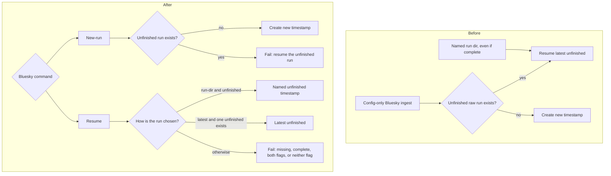

# Split Bluesky raw ingest into exclusive new-run and resume commands

## Remember
- Exact file paths always
- Exact commands with expected output
- DRY, YAGNI, TDD, frequent commits
- Delegated tasks must be impossible to misread.

## Overview

Bluesky ingest currently guesses whether to start a new raw run or attach to an unfinished one. A plain config invocation resumes the latest incomplete timestamp when one exists, and a named run directory can be reopened even after it is marked complete. This work makes new-run and resume separate, required choices on Bluesky only. Each path fails immediately when the dataset is in the other path's state. Resume may name a timestamp or ask for the latest unfinished run. Completed runs stay closed. Twitter and Reddit keep today's combined opener.

## Happy flow

An operator who wants a fresh timestamp runs the Bluesky new-run command with only a config path. An operator who wants to continue an interrupted run runs the resume command with that config path and either the existing raw timestamp or the latest-unfinished flag. The fetch loop, skip-set policy, and per-task ledger stay as they are.

## Approach

Add two openers next to the existing combined opener. Bluesky calls only the new openers. Twitter and Reddit keep calling the combined opener, so their CLI and tests stay as they are. Resume on Bluesky requires exactly one of a named timestamp or the latest-unfinished flag. Do not add a force-reopen flag.

## Decisions

1. New-run fails if the dataset already has an unfinished raw run.
2. Resume fails if the named timestamp is missing, and it fails if that run is already complete.
3. Resume `--latest` opens the newest unfinished raw run and fails if none exists.
4. Resume requires exactly one of `--run-dir` or `--latest`. Both or neither is an error.
5. The CLI requires the new-run command or the resume command. Config-only with no command is an error.
6. Twitter, Reddit, the per-task fetch loop, skip-set policy, dataset manifest creation, and feature-generation resume stay as they are.

## Steps

### Step 1: Add fail-fast new-run and resume helpers beside the combined opener

Add tests first for new-run on a clean dataset, new-run blocked by an unfinished run, resume of an unfinished named run, resume of the latest unfinished run, and resume rejected for a missing run, a completed run, or no unfinished run when latest is requested. Keep the combined opener in place for Twitter and Reddit.

### Step 2: Require an explicit mode on Bluesky ingest only

Replace the Bluesky config-only entrypoint with new-run and resume commands. Resume accepts a named timestamp or `--latest`. Update Bluesky module docs, `data_platform/README.md`, and the Bluesky sections of the ingest runbook. Leave Twitter and Reddit CLIs unchanged.

## What "done" looks like

1. Bluesky config-only ingest no longer creates or resumes a raw run. The operator must choose new-run or resume.
2. Bluesky new-run always creates a new timestamp and refuses to run when an unfinished raw run already exists for that dataset.
3. Bluesky resume opens an unfinished named timestamp, or the latest unfinished run when `--latest` is set. A missing directory, a completed run, both flags, neither flag, and `--latest` with no unfinished run all fail before any fetch.
4. Twitter and Reddit still use the combined opener and the existing config-only CLI.
5. `PYTHONPATH=. uv run pytest tests/data_platform/ingestion/test_sync_checkpoint.py tests/data_platform/ingestion/test_sync_bluesky_checkpoint.py -q` exits 0.
6. `PYTHONPATH=. uv run pytest tests/data_platform/ingestion -q` exits 0 with no new failures.
7. No reopen of completed runs. Feature-generation `--run-dir` is unchanged.
