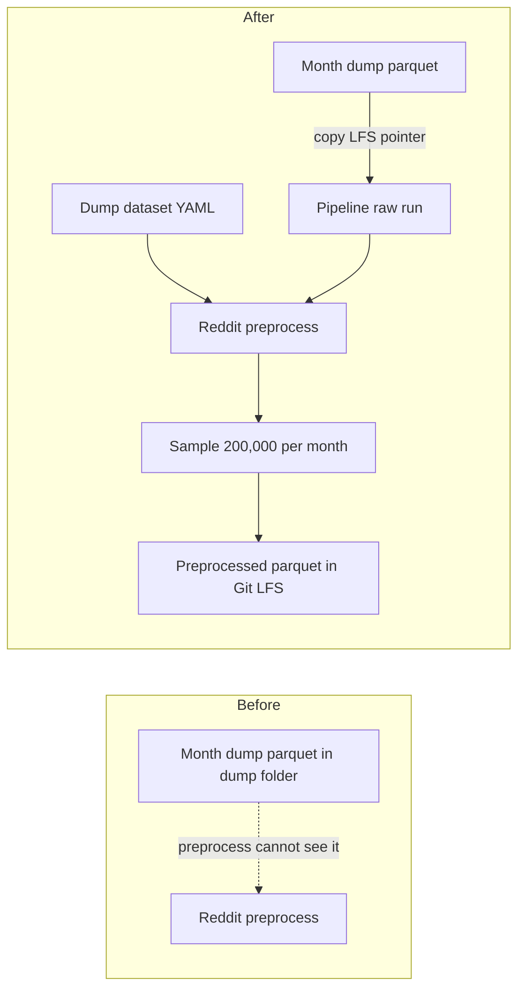

# Promote dumped Reddit comments into the pipeline and preprocess a sample

## Remember
- Exact file paths always
- Exact commands with expected output
- DRY, YAGNI, TDD, frequent commits
- Delegated tasks must be impossible to misread.

## Overview

Pull requests 136, 135, and 153 landed the Reddit and Bluesky dump files. Reddit now has two month parquet files of dump comments in the ingest-model shape. Those files still sit beside the dump processor, not under the pipeline `raw/` tree, so preprocess cannot see them. This work copies those Git LFS pointers into a dump dataset's raw runs, pins a YAML that later stages can read, runs Reddit preprocess, samples 200,000 kept comments per month file, and stores the preprocessed parquet with Git LFS. Bluesky dump files and live PRAW Reddit ingest stay as they are.

## Happy flow

An operator promotes the two month dump parquet files into one dump dataset under the usual Reddit raw layout. They then run Reddit preprocess with that dataset's YAML. Preprocess applies the existing Reddit filters, samples up to 200,000 kept comments from each month file, and writes one preprocessed run. Later feature and curate commands use the same dataset id from that YAML.

## Approach

Treat the dump parquet as already-ingested raw comments. Copy Git LFS pointers rather than rewriting rows. Give the dump dataset its own YAML outside the live PRAW ingest config folder so later stages have a dataset id and parquet format without dummy subreddit fetch keys. Add sampling only on the YAML path, after existing preprocess filters and before the write. Keep `--dataset-id` with no sample for live PRAW datasets.

## Decisions

1. One dump dataset. Two raw run directories, one per month parquet. Copy each Git LFS pointer to `comments.parquet` in that run. Do not copy the file bytes as a second LFS object.
2. YAML lives next to the dump processor, not under the live PRAW ingest config folder. It pins dataset id, parquet format, source files, raw run names, and preprocess sample size.
3. Sample after Reddit preprocess filters and before the write. Sample size is 200,000 per source raw run, with a fixed seed. If a month has fewer keepers, write every keeper from that month.
4. Existing Reddit preprocess `--dataset-id` keeps every filtered row. Sampling is opt-in through the dump YAML.
5. Do not preprocess Bluesky dump files. Do not change live PRAW Reddit ingest. Do not edit agent-owned dump or preprocess README files.

## Steps

### Step 1: Promote dump parquet pointers into pipeline raw runs

Copy each month dump Git LFS pointer into a completed raw run for a new dump dataset, write the dataset manifest and raw metadata, and pin those paths in a dump YAML. See [steps/step1.md](steps/step1.md).

### Step 2: Sample kept dump comments at the end of Reddit preprocess

Teach Reddit preprocess to read that YAML, run the current filter path, then sample up to 200,000 kept comments per source raw run before writing. Prove this on tiny fixtures. See [steps/step2.md](steps/step2.md).

### Step 3: Write the dump dataset's preprocessed parquet with Git LFS

Run Reddit preprocess against the promoted dump dataset and commit the preprocessed parquet through Git LFS. See [steps/step3.md](steps/step3.md).

## What "done" looks like

1. Each month dump parquet Git LFS pointer also exists as `comments.parquet` under a completed raw run for the dump dataset.
2. A committed YAML names that dataset id, parquet format, source files, raw run names, and a 200,000 per-run sample size.
3. Reddit preprocess with that YAML writes at most 200,000 kept comments per month file after the existing Reddit filters.
4. Reddit preprocess with `--dataset-id` still writes every filtered row.
5. The dump dataset's preprocessed parquet is committed with Git LFS.
6. `PYTHONPATH=. uv run pytest tests/data_platform/ingestion/test_promote_reddit_dump_to_raw.py tests/data_platform/preprocessing/test_preprocess_reddit.py tests/data_platform/preprocessing/test_preprocess_sample.py -q` exits 0.
7. `PYTHONPATH=. uv run pytest tests/data_platform/preprocessing tests/data_platform/ingestion -q` exits 0 with no new failures.
8. Bluesky dump files, live PRAW Reddit ingest, and agent-owned README files are unchanged.
