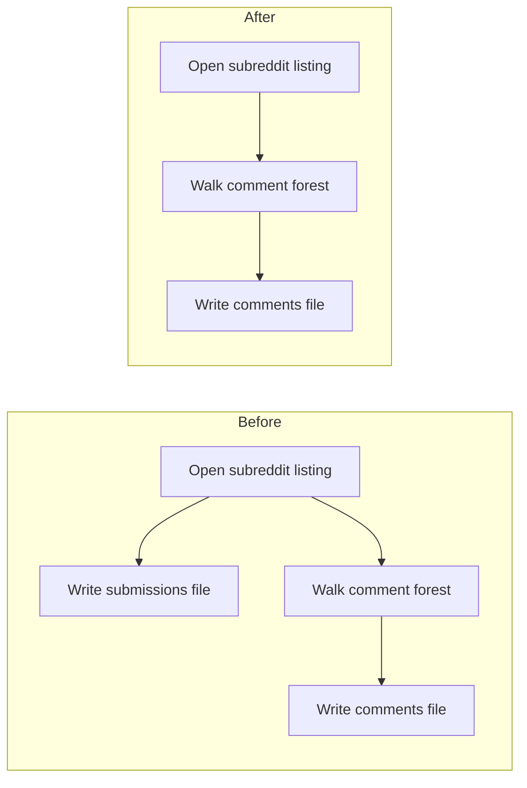

# Stop persisting Reddit submissions from PRAW ingest

## Remember
- Exact file paths always
- Exact commands with expected output
- DRY, YAGNI, TDD, frequent commits
- Delegated tasks must be impossible to misread.

## Overview

Reddit ingest still writes a submissions file on every raw run, even though later Reddit stages only read comments. PRAW still has to open listings and walk comment forests, because comments only exist on a submission. New runs should write comments only. Old leftover submission files stay on disk and are unused. No migration.

## Happy flow

An operator runs Reddit sync with a comments-only config. The client still opens hot, top, or new listings and walks each submission's comment forest. Eligibility filters still apply. The run directory gets a comments file and metadata. It does not get a submissions file.

## Approach

Treat a PRAW submission as a fetch handle, not a stored row. Keep listing fetch, comment-forest walk, and eligibility filters. Drop the Reddit submission model, the second storage manager, the second skip session, and the submissions skip-list YAML key. Shared skip list is the comment skip list. Error if a Reddit config still names the submission record type. Do not change Bluesky or Twitter. Do not migrate gitignored historical files. Do not edit historical plan packets.

## Steps

### Step 1: Write Reddit raw runs as comments only

Strip submission persistence from the Reddit sync CLI, models, storage helper, record-type map, and committed Reddit YAML. Rewrite the Reddit ingest tests so they prove comments-only writes, listing fetch still happens, and a config that names the submission record type fails at startup.

### Step 2: Say Reddit ingest stores comments, not submissions

Update the operator runbooks and the data-platform README so they describe Reddit raw output as a comments file. Keep saying that PRAW listings are how comments are fetched.

## What "done" looks like

1. A new Reddit raw run writes comments only. It does not write `posts.csv` or `posts.parquet`.
2. The Reddit submission ingest model and the Reddit post storage helper are gone.
3. Every committed Reddit ingest YAML lists only the comment record type and has no submissions skip-list key.
4. PRAW still lists submissions and walks comment forests. Stickied, distinguished, and short-body filters still apply. `limit_per_task` is still how many submissions to open per subreddit.
5. `PYTHONPATH=. uv run pytest tests/data_platform/ -q` exits 0.
6. Preprocess, feature generation, and curate Reddit entrypoints keep their current behavior.
7. Bluesky and Twitter post ingest, `parse_max_posts`, dump ingest, experiments, and historical plan packets are unchanged.
