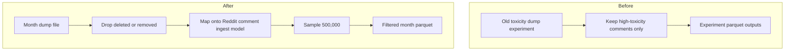

# Filter Reddit dump comments into sampled parquet files

## Remember
- Exact file paths always
- Exact commands with expected output
- DRY, YAGNI, TDD, frequent commits
- Delegated tasks must be impossible to misread.

## Overview

Pull request 152 added a read-only spec for turning two monthly Reddit comment dump files into sampled parquet. The old dump experiment kept only high-toxicity comments. This work keeps almost every comment, drops deleted or removed ones, writes rows in the same shape as live Reddit ingest, and stores a random sample of 500,000 comments per month file. Live PRAW Reddit ingest and the old toxicity experiment stay as they are.

## Happy flow

An operator points the dump processor at one month dump file. The processor streams comments, drops deleted or removed ones, samples up to 500,000 keepers with a fixed seed, and writes a parquet file under the filtered directory named after that month. The same command is run once per month file.

## Approach

Put a dump-only processor beside the spec, not inside live Reddit ingest. Stream each month file on its own. Reuse the existing comment ingest model and record-id helper. Do not reconstruct comment trees. Do not run toxicity, length, language, or extra subreddit filters. Do not commit the dump files or the filtered parquet.

## Decisions

1. Drop a comment when author or body, after stripping, is `[deleted]` or `[removed]`. Empty or short bodies that are not those tokens stay.
2. Fill every field on the Reddit comment ingest model. Top-level comments get depth 0. Nested comments get depth 1. Comment rank is 0. Creation time is UTC ISO-8601 from the dump unix time, matching live Reddit ingest. Record id uses the existing Reddit helper. Run timestamp uses the shared current-timestamp helper.
3. Sample with reservoir sampling, size 500,000, seed 20260615. If a file has fewer keepers than 500,000, write every keeper.
4. Default inputs are the two month dump files next to the spec. Default outputs are `filtered/RC_2025-05.parquet` and `filtered/RC_2025-06.parquet` in that same directory. Refuse to overwrite an existing output file.
5. Do not edit the spec README. Do not change live Reddit ingest, the comment ingest model, or the old toxicity experiment.

## Steps

### Step 1: Read dump comments, drop deleted or removed, map onto the ingest model

Add a dump reader, a deleted-or-removed check, and a mapper that returns a row the Reddit comment ingest model accepts. Prove this on tiny compressed fixtures. Do not sample or write parquet yet.

### Step 2: Sample 500,000 keepers per month file and write filtered parquet

Add reservoir sampling, parquet write, and a CLI that processes one dump file at a time. Default to the two named month files. Ignore dump artifacts in git. Point the stimuli runbook at the dump directory used by the spec.

## What "done" looks like

1. An operator can process each month dump file on its own from the repo root.
2. Deleted or removed comments are dropped. Other comments stay for later stages to filter.
3. Each output row validates as the same Reddit comment ingest model used by live Reddit ingest, including record id and UTC ISO creation time.
4. Each output file has at most 500,000 rows. The sample is repeatable for a given seed. A file with fewer keepers writes all of them.
5. Default outputs are `data_platform/ingestion/data_dumps/reddit/filtered/RC_2025-05.parquet` and `data_platform/ingestion/data_dumps/reddit/filtered/RC_2025-06.parquet`.
6. `data_platform/ingestion/data_dumps/reddit/README.md` is unchanged.
7. `PYTHONPATH=. uv run pytest tests/data_platform/ingestion/test_reddit_data_dump.py -q` exits 0.
8. `PYTHONPATH=. uv run pytest tests/data_platform/ingestion -q` exits 0 with no new failures.
9. Live Reddit ingest, the comment ingest model, and `experiments/fetch_reddit_pushshift_dump_2026_06_15/` are unchanged. Dump files and filtered parquet are not committed.
