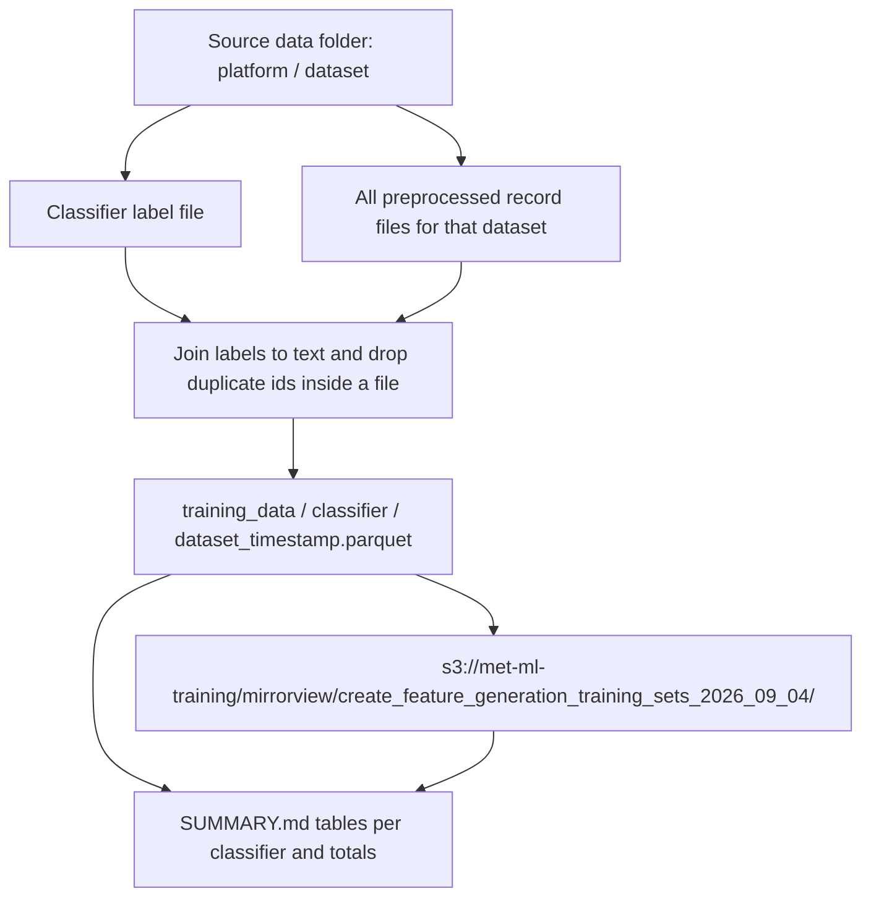

# Build per-classifier training parquets from existing feature labels and preprocessed records

## Remember
- Exact file paths always
- Exact commands with expected output
- DRY, YAGNI, TDD, frequent commits
- Delegated tasks must be impossible to misread.

## Overview

The job is to turn classifier labels that already exist on disk into one training table per classifier per dataset. You then upload those tables to S3, and you write the counts into `experiments/create_feature_generation_training_sets_2026_09_04/SUMMARY.md`.

The source folder is `/Users/mark/Documents/work/lab_data_integrations_interface/data_platform/data`. Bluesky, Twitter, and Reddit each have dataset folders there, and there are nine datasets in total. Each dataset has raw, preprocessed, features, and usually curated stages. Classifier labels sit as one file per classifier directly under the dataset's features folder. The label files are not in timestamped run directories. The classifiers match `data_platform/generate_features/`. The folder names are `is_likely_spam`, `is_news_or_opinion`, `is_political`, `is_self_contained`, `is_structurally_complete`, `is_toxic_tiered`, and `political_stance`. Several datasets have no likely-spam file. The large Reddit dump has only the tiered-toxicity file.

Each training row has a record id, a label time, the post or comment text, and that classifier's label columns. Leave `experiments/create_feature_generation_training_sets_2026_09_04/README.md` unchanged. Leave the source data folder unchanged. Do not change the generate-features pipeline.

## Happy flow

You run one experiment command against the source data folder. You join each existing classifier file to preprocessed text, and you write local parquet under the experiment training-data tree. You then upload the same layout to `s3://met-ml-training/mirrorview/create_feature_generation_training_sets_2026_09_04/`, and you write `SUMMARY.md` with one table per classifier and one totals table.

## Approach

Keep the work inside the experiment folder. Do not add helpers to the data platform for this job.

Join each classifier file to every preprocessed run for that dataset. The features metadata pointer names one run, and that run is a subset. Using only that run would drop most labels on at least one Bluesky dataset.

Use the platform's own record id for the join, then write a unified id column named `uri` on the training table. Detect parquet by file bytes, because some files with a `.csv` suffix start with `PAR1`. Reddit comment text is in the `body` column.

If a dataset has no file for a classifier, skip that classifier. Deduplicate ids only inside one classifier file, and keep the row with the latest label time. Do not merge rows across datasets.

Stamp every parquet from one production run with one UTC timestamp from `lib/timestamp_utils.get_current_timestamp`. Upload with `lib/aws/s3.py`. Prove join and write on tiny fixtures before you read the full source folder.

## Steps

### Step 1: Scaffold the experiment package, category folders, and join contract

[steps/step1.md](steps/step1.md)

Add a package under `experiments/create_feature_generation_training_sets_2026_09_04/` with a CLI stub, the seven empty `training_data/` category folders, and tests that freeze output column names. Do not edit the experiment README. Do not walk the source data folder in this step.

### Step 2: Join one classifier file into a training parquet

[steps/step2.md](steps/step2.md)

Implement join, id dedupe inside a file, text attachment, and parquet write for one classifier file plus that dataset's preprocessed records. Cover Bluesky, Twitter, and Reddit id and text columns. Cover csv files and parquet bytes stored with a csv suffix. Skip missing label files. Drop unmatched ids. Tests use fixtures only.

### Step 3: Walk every platform, dataset, and classifier to local parquet

[steps/step3.md](steps/step3.md)

Run the production walk over `/Users/mark/Documents/work/lab_data_integrations_interface/data_platform/data`. Write one parquet per existing classifier file to `experiments/create_feature_generation_training_sets_2026_09_04/training_data/{category}/{dataset_id}_{timestamp}.parquet`. Skip missing classifiers. Do not upload yet.

### Step 4: Upload to S3 and write SUMMARY.md

[steps/step4.md](steps/step4.md)

Upload each local parquet to `s3://met-ml-training/mirrorview/create_feature_generation_training_sets_2026_09_04/{category}/{dataset_id}_{timestamp}.parquet`. Write `experiments/create_feature_generation_training_sets_2026_09_04/SUMMARY.md` with one table per classifier (file, size in MB, row count, S3 prefix) and a final table of row counts per classifier.

## What "done" looks like

1. `experiments/create_feature_generation_training_sets_2026_09_04/README.md` is unchanged.
2. The source data folder is unchanged.
3. `data_platform/generate_features/` is unchanged.
4. Seven category folders exist under `experiments/create_feature_generation_training_sets_2026_09_04/training_data/`.
5. Every existing classifier label file in the source tree has a matching local parquet. Missing classifier files are skipped, not invented.
6. Each parquet has record id, label time, text, and that classifier's label column or columns. Ids are unique inside a file.
7. The parquets are on S3 under `s3://met-ml-training/mirrorview/create_feature_generation_training_sets_2026_09_04/` with keys `{category}/{dataset_id}_{timestamp}.parquet`.
8. `experiments/create_feature_generation_training_sets_2026_09_04/SUMMARY.md` has one table per classifier plus a totals table of rows per classifier.
9. Fixture tests for join and write pass. `PYTHONPATH=. uv run pytest experiments/create_feature_generation_training_sets_2026_09_04/tests -q` exits 0.
