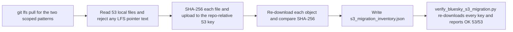

# Copy the pinned Bluesky pipeline LFS artifacts to S3 with a hash inventory

## Remember
- Exact file paths always
- Exact commands with expected output
- DRY, YAGNI, frequent commits
- Do not add or run automated tests. Use only the approved smoke checks in the step spec.
- Delegated tasks must be impossible to misread.

## Overview

The Bluesky pipeline data for dataset `bluesky_7e2c4a91-3b5f-4d8e-a6c1-0f9b8d2e5a73` lives in Git LFS today. Later steps of epic #180 read that data from the `mirrorview-experimental-artifacts` S3 bucket, so the bytes have to exist there first. The plan copies the 53 scoped objects (28 pipeline files and 25 source dump files) to S3 at repo-relative keys, checks every object with SHA-256, and commits a JSON inventory of what was uploaded. Git LFS pointers stay in the repository unchanged, and no pipeline storage code changes.

The plan is one PR for child issue #181 and does not depend on any sibling issue.

## Happy flow

An operator exports the lab AWS credentials, runs the migration script once, then runs the verify script once. The migration script pulls the LFS blobs, uploads each file, re-downloads it to compare hashes, and writes the inventory. The verify script re-reads the inventory and re-downloads every object to confirm the hashes still match.

## Approach

Keep the change to two small scripts and one committed JSON file. The migration script holds a frozen list of the 53 paths, so nothing outside the locked scope can be uploaded by accident. Both scripts wrap the existing `lib/aws/s3.py` helper instead of changing it, and both compare full-object SHA-256 digests rather than S3 ETags.

## Steps

### Step 1: Add the migration script, the verify script, and the committed inventory

Write `data_platform/scripts/migrate_bluesky_lfs_to_s3.py` and `data_platform/scripts/verify_bluesky_s3_migration.py`, run them once against the live bucket, and commit `s3_migration_inventory.json` under the pinned dataset directory. The full spec is in `steps/step1.md`.

## What "done" looks like

1. All 53 scoped objects exist in `mirrorview-experimental-artifacts` at repo-relative keys that start with `data_platform/` and never with `data_platform/data_platform/`.
2. `s3_migration_inventory.json` is committed under `data_platform/data/bluesky/bluesky_7e2c4a91-3b5f-4d8e-a6c1-0f9b8d2e5a73/` with 53 rows, and every row has a matching local and remote SHA-256.
3. `verify_bluesky_s3_migration.py` prints `OK: 53/53 objects present with matching sha256`.
4. `git lfs ls-files | grep "bluesky_7e2c4a91" | wc -l` still prints `25`, and no file under `lib/aws/`, `data_platform/utils/`, `.gitattributes`, or `.gitignore` changed.
