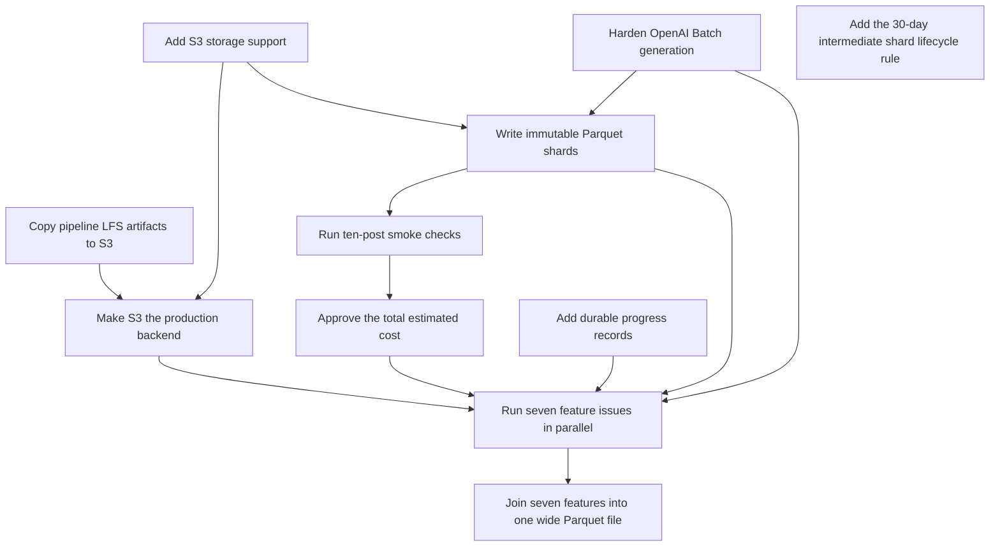

# Generate seven reliable S3-backed LLM features for 200,000 Bluesky posts

## Remember
- Exact file paths always
- Exact commands with expected output
- DRY and YAGNI
- Use only the approved smoke checks. Do not add or run automated tests.
- Frequent commits
- Delegated tasks must be impossible to misread.

## Overview

Move the current pipeline data from Git LFS to the `mirrorview-experimental-artifacts` S3 bucket, and make S3 the production storage backend while retaining local storage for development. Harden the OpenAI Batch feature generator, then generate seven LLM features for the pinned 200,000-post Bluesky dataset from PR #164.

Each feature run writes immutable 2,000-row Parquet shards, a final feature Parquet file, a hash manifest, progress records, and a permanent run report. A final step joins the seven outputs with the complete preprocessed post records.

## Happy flow

An operator starts seven feature agents after the storage and reliability work has merged. Each agent runs the same ten-post smoke sample and posts its cost estimate to its feature issue. The parent issue records the total estimate and waits for one approval before the agents process the remaining posts.

## Approach

Use the fixed dataset `bluesky_7e2c4a91-3b5f-4d8e-a6c1-0f9b8d2e5a73` and preprocessed run `2026_09_03-23:51:30`. Record the input hash so a later dataset requires a separate campaign.

Store pipeline artifacts under `s3://mirrorview-experimental-artifacts/data_platform/data/`. Use one campaign ID and one isolated prefix per feature so parallel agents cannot change the same metadata. Keep one blocking OpenAI Batch job per feature agent, persist provider job IDs before polling, and resume the existing provider job after an interruption.

Each feature issue is one future pull request. Temporary smoke inputs, outputs, cost records, and resume evidence are committed for review and removed before merge. The permanent run report records the S3 locations, hashes, model and prompt identity, costs, throughput, retries, validation checks, and label counts.

## Steps

### Step 1: Copy current pipeline LFS artifacts to S3

Copy the current pipeline data and required source dumps to matching S3 keys. Verify every object with SHA-256 hashes, retain the Git LFS copies, and commit the migration inventory.

### Step 2: Add first-class S3 storage support to the data pipeline

Add configurable S3 reads and writes while preserving local storage for development. Reject Git LFS pointer text, unsafe paths, missing hashes, and accidental overwrites.

### Step 3: Make S3 the default pipeline backend and remove current LFS artifacts

Set S3 as the production backend after the copied objects and S3 reader have been verified. Remove current pipeline artifacts from Git LFS without rewriting repository history.

### Step 4: Harden OpenAI Batch feature generation and resume

Persist in-flight OpenAI job identity, keep successful records from partly failed jobs, retry only transient failures, and make every run resumable. Mark a feature complete only after every pinned input ID has one valid output.

### Step 5: Write resumable 2,000-row Parquet feature shards

Write immutable S3 shards, progress records, error records, hash manifests, and one final Parquet file per feature. Keep one provider job active per feature and preserve deterministic record order during resume and consolidation.

### Step 6: Add ten-post smoke cost reports and a campaign approval gate

Use one deterministic ten-post sample for every feature. Record average and maximum token usage, current model pricing, estimated full-run cost, S3 checks, and one deliberate interruption and resume before requesting one campaign approval.

### Step 7: Add durable progress reports for feature run watchers

Write structured progress records after each durable shard. Give short, restartable watcher subagents enough information to update one rolling GitHub issue comment at every 10,000 completed records.

### Step 8: Generate is_news_or_opinion for 200,000 Bluesky posts

Run the approved smoke and full generation flow for `is_news_or_opinion`. Publish its final Parquet file, manifest, progress history, validation results, and permanent run report.

### Step 9: Generate is_political for 200,000 Bluesky posts

Run the approved smoke and full generation flow for `is_political`. Publish its final Parquet file, manifest, progress history, validation results, and permanent run report.

### Step 10: Generate is_likely_spam for 200,000 Bluesky posts

Run the approved smoke and full generation flow for `is_likely_spam`. Publish its final Parquet file, manifest, progress history, validation results, and permanent run report.

### Step 11: Generate is_self_contained for 200,000 Bluesky posts

Run the approved smoke and full generation flow for `is_self_contained`. Publish its final Parquet file, manifest, progress history, validation results, and permanent run report.

### Step 12: Generate is_structurally_complete for 200,000 Bluesky posts

Run the approved smoke and full generation flow for `is_structurally_complete`. Publish its final Parquet file, manifest, progress history, validation results, and permanent run report.

### Step 13: Generate political_stance for 200,000 Bluesky posts

Run the approved smoke and full generation flow for `political_stance`. Publish its final Parquet file, manifest, progress history, validation results, and permanent run report.

### Step 14: Generate llm_toxicity_tiered for 200,000 Bluesky posts

Run the approved smoke and full generation flow for `llm_toxicity_tiered`. Keep its output distinct from the Perspective API toxicity feature, and publish its final Parquet file, manifest, progress history, validation results, and permanent run report.

### Step 15: Consolidate seven Bluesky LLM features into one wide Parquet artifact

Join the seven verified feature outputs to all 12 preprocessed post columns by `source_record_id`. Require exactly 200,000 unique records with no missing feature values, and publish the wide artifact, hash manifest, validation results, and permanent report.

### Step 16: Expire intermediate data platform S3 shards after 30 days

Add an S3 lifecycle rule that combines the `data_platform/data/` prefix with an intermediate-artifact tag. Expire only tagged batch shards and retain final Parquet files, manifests, progress records, and reports.

## What "done" looks like

1. The current pipeline data is available from S3 with verified hashes, and production pipeline runs no longer depend on current Git LFS artifacts.
2. Interrupted OpenAI Batch work resumes without duplicate provider jobs or duplicate charges.
3. Seven feature issues each produce exactly 200,000 unique, valid LLM labels and one permanent run report.
4. Each issue reports progress every 10,000 durable records and records estimated and actual cost.
5. One wide Parquet artifact contains the 12 pinned post columns and all seven LLM feature outputs.
6. Intermediate shards expire after 30 days, while final artifacts and audit records remain in S3.
