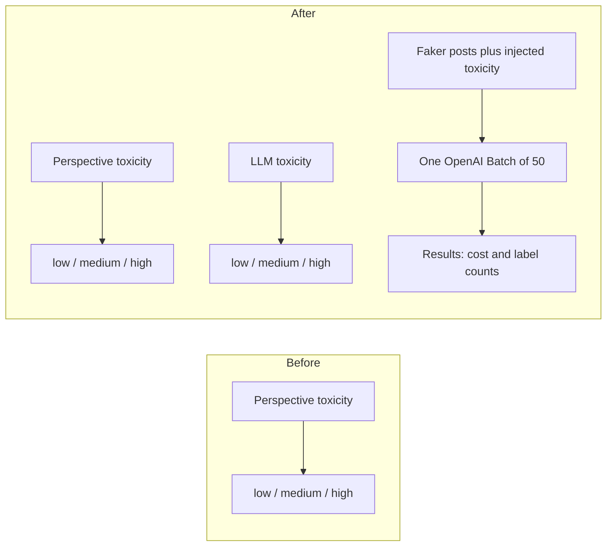

# Add an LLM toxicity classifier and smoke-test it on synthetic posts

## Remember
- Exact file paths always
- Exact commands with expected output
- DRY, YAGNI, TDD, frequent commits
- Delegated tasks must be impossible to misread.

## Overview

Feature generation already labels toxicity with the Perspective API as low, medium, or high. This work adds a second toxicity classifier that uses an LLM, with a system prompt, few-shot examples, and structured output, matching the other LLM feature classifiers. Perspective stays in place. A smoke run then builds 50 synthetic posts with Faker, injects toxic language into a random subset, labels them in one OpenAI Batch job, and writes elapsed time, estimated dollar cost, and the low/medium/high counts.

## Happy flow

An operator can call the new classifier the same way as the other LLM features. For the smoke path, the experiment script builds 50 synthetic posts, submits them as one OpenAI Batch job, and writes a results file with runtime cost and the label mix.

## Approach

Copy the existing LLM feature shape: one new feature module, then register it so platform feature generation can run it. Keep Perspective as the current production toxicity path and do not change curation. Smoke-test through the OpenAI Batch engine, not through live one-by-one chat calls. Use Faker for the 50 posts so the smoke run does not depend on a study CSV.

## Steps

### Step 1: Add the LLM toxicity feature and register it

→ [steps/step1.md](steps/step1.md)

Add a new feature module with a three-class prompt, few-shot examples, structured output models, and a single-text generate function. Register it next to the other LLM features. Cover it with mocked unit tests. Leave Perspective and curation unchanged.

### Step 2: Smoke-test 50 synthetic posts through OpenAI Batch

→ [steps/step2.md](steps/step2.md)

Add the dated experiment folder. Generate 50 Faker posts, inject toxic language into a random subset, label them as one OpenAI Batch of 50, and write the results file with runtime cost and the low/medium/high distribution.

## What "done" looks like

1. Feature generation has a registered LLM toxicity classifier that returns low, medium, or high.
2. That classifier has a system prompt, few-shot examples, and Pydantic models in the same shape as the other LLM features.
3. Perspective toxicity remains registered and curation still joins Perspective columns only.
4. `PYTHONPATH=. uv run pytest tests/data_platform/generate_features -q` exits 0.
5. The experiment folder can build 50 synthetic posts, inject toxicity into a subset, and submit one OpenAI Batch job.
6. `experiments/llm_based_toxicity_classifier_2026_09_05/RESULTS.md` reports elapsed time, estimated dollar cost, and the count of low, medium, and high labels from that 50-post run.
