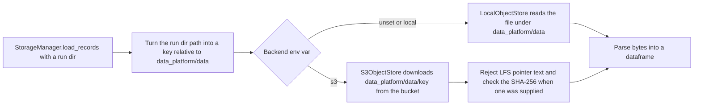

# Add a configurable S3 object store behind the data platform storage layer

## Remember
- Exact file paths always
- Exact commands with expected output
- DRY, YAGNI, frequent commits
- Do not add or run new automated tests. Use only the approved smoke checks in the step spec. Run the existing `uv run pytest` suite once at the end to confirm nothing regressed.
- Delegated tasks must be impossible to misread.

## Overview

`data_platform/utils/storage.py` reads and writes pipeline files only on local disk under `data_platform/data/`. Epic #180 moves the pinned Bluesky dataset to the `mirrorview-experimental-artifacts` S3 bucket, so the storage layer needs a second backend that reads and writes the same relative paths as S3 keys under the `data_platform/data/` prefix. The plan adds `data_platform/utils/object_store.py` with a local store and an S3 store behind one small interface, and it routes the six read and write methods of `StorageManager` through whichever store an environment variable selects. Local disk stays the default when the variable is unset, so nothing changes for developers or for the existing test suite.

The S3 store refuses four kinds of bad writes and reads. It rejects Git LFS pointer text, keys that escape the `data_platform/data/` prefix, uploads without a recorded SHA-256, and overwrites of an existing object unless the caller asks for one.

The plan is one PR for child issue #182 and depends on no sibling issue. The S3 objects uploaded by issue #181 make the live read smoke possible but are not a merge prerequisite.

## Happy flow

A developer sets one environment variable to `s3`, builds the Bluesky preprocessed storage manager as today, and calls the same load method with the pinned run directory. The storage manager turns the local path into a repo-relative S3 key, downloads the bytes, refuses pointer text, and returns the 200,000-row dataframe. With the variable unset, the same call reads the local parquet file.

## Approach

Keep the change to one new module and edits to two existing files. The object store interface has four operations, which is enough for the six storage methods named in the epic step. The local store writes and reads files under the data root, and the S3 store wraps the existing `lib/aws/s3.py` helper. Overwrite protection uses a conditional S3 put so the check and the write happen in one request. Every upload stores its SHA-256 as object metadata, and reads compare full bytes against a caller-supplied hash rather than trusting the S3 ETag. Run directory listing, run completion checks, and the "latest run" lookup stay on local disk in this PR, because the epic assigns the production backend flip to Step 3.

## Steps

### Step 1: Add the object store module, extend the S3 helper, and route storage reads and writes through it

Write `data_platform/utils/object_store.py`, add a conditional put, upload metadata, and an existence check to `lib/aws/s3.py`, and make `StorageManager` convert paths to keys and call the selected store. Verify with the four live smoke commands in `steps/step1.md`. The full spec is in `steps/step1.md`.

## What "done" looks like

1. `DATA_PLATFORM_STORAGE_BACKEND=s3` makes `BlueskyStorageManager(StorageStage.PREPROCESSED, "bluesky_7e2c4a91-3b5f-4d8e-a6c1-0f9b8d2e5a73").load_records(run_dir)` return 200,000 rows from `s3://mirrorview-experimental-artifacts/data_platform/data/bluesky/bluesky_7e2c4a91-3b5f-4d8e-a6c1-0f9b8d2e5a73/preprocessed/2026_09_03-23:51:30/posts.parquet`.
2. With the variable unset, the same call reads the local parquet file and the local path layout under `data_platform/data/` is unchanged.
3. Uploading Git LFS pointer bytes through the S3 store raises `ValueError` whose message contains `git-lfs pointer`.
4. Uploading to an existing S3 key without asking for an overwrite raises `FileExistsError`, and every upload records the SHA-256 of the body in object metadata.
5. `.gitattributes`, `.gitignore`, the LFS parquet files, and every file under `tests/` are unchanged, and `uv run pytest` still passes.
