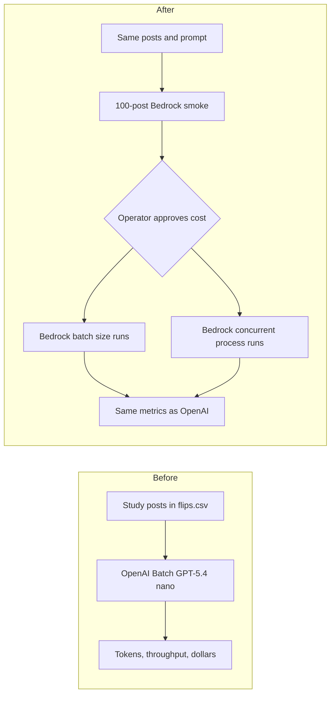

# Compare Bedrock batch throughput to the OpenAI batch runs

## Remember
- Exact file paths always
- Exact commands with expected output
- DRY, YAGNI, TDD, frequent commits
- Delegated tasks must be impossible to misread.

## Overview

The OpenAI work labeled study posts as news, opinion, or neither. The labels came from OpenAI's Batch API, using GPT-5.4 nano. Throughput means how many posts and tokens finish per second. The OpenAI runs also recorded token counts and estimated dollars. GPT-5.4 nano is not available on Amazon Bedrock. Amazon Nova Micro is the closest cheap, small text model on Bedrock for this classification task.

Bedrock has a batch inference API. Batch inference is Amazon's later-run job path. You upload a text file of prompts to S3, with one JSON object per line. Amazon runs the prompts, and you download the answers from S3. Batch token prices for Nova Micro are half of on-demand prices.

A one-request call to Nova Micro in `us-east-2` already succeeded, using the US Nova Micro profile. The call classified a sentence about a Federal Reserve rate increase as news. The lab IAM user can list Bedrock batch jobs. There is no IAM service role for Bedrock batch jobs yet. An IAM service role is a role that Bedrock assumes so it can read the input file and write the output file. In Step 1, we create the service role before any batch job can run.

Official AWS prices for Nova Micro in US East (Ohio), published 2026-09-01, are:

- On-demand. $0.035 per million input tokens, and $0.14 per million output tokens.
- Batch. $0.0175 per million input tokens, and $0.07 per million output tokens.

GPT-5.4 nano Batch prices in `data_platform/generate_features/OPENAI_BATCH_SMOKE_RESULTS.md` were $0.20 per million input tokens and $1.25 per million output tokens.

If each Bedrock request uses about the same tokens as each OpenAI request, about 332 input tokens and 18 output tokens, the matching Bedrock batch runs would cost about $0.35 in model tokens. A ceiling of twice $0.35, which is $0.70, covers extra prompt tokens from asking for JSON in the prompt. The 100-post smoke should cost about $0.001.

## Happy flow

An operator runs a 100-post Bedrock batch smoke on the news-or-opinion prompt and the `flips.csv` posts used for OpenAI. The smoke script writes posts per second, tokens per second, token totals, and estimated dollars. After the operator approves the cost of the larger runs, the operator repeats the OpenAI size runs and the OpenAI concurrent-process runs on Bedrock.

## Approach

Copy how the OpenAI engine submits a list of posts and waits for labels, and call Bedrock batch jobs instead of OpenAI files. Keep the OpenAI token, throughput, and dollar measures. Keep the live LLM feature classifiers on OpenAI. Stop after the 100-post smoke and wait for cost approval before any run of thousands of requests.

Bedrock batch jobs cannot return JSON that matches a schema the way OpenAI Batch can. We will ask the model for JSON in the prompt, then validate that JSON after the job finishes. Bedrock also has a batch endpoint that uses the OpenAI Batch API request format. Only OpenAI models hosted on Bedrock can use the OpenAI Batch API endpoint, and GPT-5.4 nano is not hosted on Bedrock. Jobs for Nova Micro go through Bedrock's native batch path.

## Steps

### Step 1: Confirm the Bedrock batch path in this account

Record the model, region, prices, S3 prefix, and IAM service role in `experiments/bedrock_batch_parallelization_2026_09_06/FINDINGS.md`. Create a narrowly scoped Bedrock batch service role if none exists, with permission to read and write one prefix on `s3://mirrorview-experimental-artifacts`. Stop if the account cannot create that role, pass that role to Bedrock, or submit a batch job.

### Step 2: Add a Bedrock batch engine and a 100-post smoke

Add a Bedrock batch engine next to `data_platform/generate_features/engines/openai_engine.py`. Run the news-or-opinion smoke from `data_platform/generate_features/smoke_openai_engine.py` on the first 100 posts of `shared/data/raw/study_phase_2_part_2/stimuli/flips.csv`. Cover the engine with mocked unit tests. Print the metrics that the OpenAI smoke script prints, plus estimated dollars at the Ohio batch rates.

### Step 3: Write the cost estimate and wait for approval

Use the 100-post smoke token counts to estimate the 9,500-post size run and the 40,000-post process-count run. Write the estimate into `experiments/bedrock_batch_parallelization_2026_09_06/COST_ESTIMATE.md`. Do not start those runs until the operator approves.

### Step 4: Repeat the OpenAI batch-size runs

After approval, submit one Bedrock batch job per size. The sizes are 100, 200, 300, 400, 500, 1,000, 2,000, and 5,000 posts, matching `data_platform/generate_features/OPENAI_BATCH_SMOKE_RESULTS.md`. Write the same table columns, including elapsed seconds, posts per second, tokens per second, mean input and output tokens per request, token totals, and estimated dollars.

### Step 5: Repeat the OpenAI process-count runs

After approval, run 2, 4, 6, and 8 concurrent Python processes. Each process submits a 2,000-post Bedrock batch job on the 2,000-post slice used in `experiments/openai_batch_parallelization_2026_09_05/run_experiment.py`. Write aggregate and per-process metrics with the same fields as `experiments/openai_batch_parallelization_2026_09_05/results.json`.

## What "done" looks like

1. `experiments/bedrock_batch_parallelization_2026_09_06/FINDINGS.md` records the chosen model, region, batch prices, S3 prefix, and IAM role, and states that a live batch job can be submitted in this account.
2. Feature generation has a Bedrock batch engine that labels a list of posts in one Bedrock batch job. Operators still run live LLM features on the OpenAI engine.
3. `PYTHONPATH=. uv run pytest tests/data_platform/generate_features -q` exits 0.
4. A 100-post smoke on `flips.csv` completes and prints tokens, throughput, and estimated dollars.
5. `COST_ESTIMATE.md` is written, and the size and process-count runs do not start until the operator approves.
6. After approval, the size runs and the process-count runs complete, and `experiments/bedrock_batch_parallelization_2026_09_06/RESULTS.md` reports the same metric columns as `data_platform/generate_features/OPENAI_BATCH_SMOKE_RESULTS.md`.

## Open decisions

- Confirm Amazon Nova Micro as the model. The other small model already listed in this account is Ministral 3B. The Qwen models already used in this repo are 32B and 80B, which are much larger than GPT-5.4 nano.
- Confirm that Step 1 may create a new IAM service role for Bedrock batch jobs.
- Confirm that live LLM features stay on OpenAI. The Bedrock engine is for the smoke and the throughput runs only.
- Confirm the spend ceiling of $0.70 for the matching OpenAI-sized runs, after the 100-post smoke revises the estimate.
