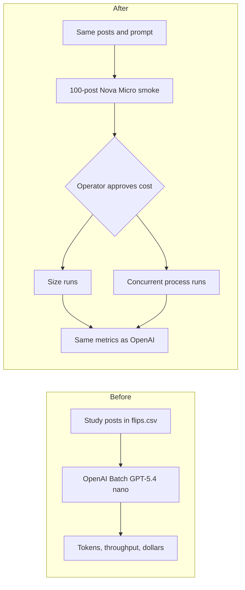

# Compare Bedrock batch throughput to the OpenAI batch runs

## Remember
- Exact file paths always
- Exact commands with expected output
- DRY, YAGNI, TDD, frequent commits
- Delegated tasks must be impossible to misread.

## Overview

The OpenAI work labeled study posts as news, opinion, or neither. The labels came from OpenAI's Batch API, using GPT-5.4 nano. Throughput means how many posts and tokens finish per second. The OpenAI runs also recorded token counts and estimated dollars. GPT-5.4 nano is not available on Amazon Bedrock. Amazon Nova Micro is the closest cheap, small text model on Bedrock for this classification task.

Bedrock has a native batch inference API that reads prompts from S3 and writes answers to S3 at half the on-demand token price. Submitting that job requires an IAM service role that Bedrock can assume, plus `iam:PassRole`. This work must not create a new IAM service role. The lab IAM user cannot pass a role to Bedrock. The simple version that runs therefore calls Nova Micro through the Converse API, using the AWS credentials already in the environment.

A one-request Converse call to Nova Micro in `us-east-2` already succeeded, using the US Nova Micro profile. The call classified a sentence about a Federal Reserve rate increase as news.

Official AWS prices for Nova Micro in US East (Ohio), published 2026-09-01, are:

- On-demand. $0.035 per million input tokens, and $0.14 per million output tokens.
- Batch. $0.0175 per million input tokens, and $0.07 per million output tokens.

This PR uses on-demand prices, because the live path is Converse. If each request uses about 332 input tokens and 18 output tokens, the matching OpenAI-sized runs would cost about $0.70. A ceiling of twice $0.70, which is $1.40, covers extra prompt tokens from asking for JSON in the prompt. The 100-post smoke should cost about $0.002.

## Happy flow

An operator runs a 100-post Nova Micro Converse smoke on the news-or-opinion prompt and the `flips.csv` posts used for OpenAI. The smoke script writes posts per second, tokens per second, token totals, and estimated dollars. After the operator approves the cost of the larger runs, the operator repeats the OpenAI size runs and the OpenAI concurrent-process runs on Bedrock.

## Approach

Copy how the OpenAI engine submits a list of posts and waits for labels. Call Nova Micro through Converse with the environment AWS credentials. Keep the OpenAI token, throughput, and dollar measures. Keep the live LLM feature classifiers on OpenAI. Stop after the 100-post smoke and wait for cost approval before any run of thousands of requests.

Bedrock Converse, like Bedrock batch jobs, will ask the model for JSON in the prompt, then validate that JSON after each response. Do not create IAM roles. Do not call `CreateModelInvocationJob` except as a recorded probe that is expected to fail with `iam:PassRole`.

This PR implements Steps 1 to 3. Steps 4 and 5 add the experiment runners and stay unexecuted until the operator approves `COST_ESTIMATE.md`.

## Steps

### Step 1: Confirm the Bedrock path in this account

→ [steps/step1.md](steps/step1.md)

Record the model, region, prices, credentials path, and the batch-job blocker in `experiments/bedrock_batch_parallelization_2026_09_06/FINDINGS.md`. Use the environment AWS credentials. Do not create an IAM service role.

### Step 2: Add a Bedrock Converse engine and a 100-post smoke

→ [steps/step2.md](steps/step2.md)

Add a Bedrock engine next to `data_platform/generate_features/engines/openai_engine.py`. Run the news-or-opinion smoke on the first 100 posts of `shared/data/raw/study_phase_2_part_2/stimuli/flips.csv`. Cover the engine with mocked unit tests. Print the metrics the OpenAI smoke prints, plus estimated dollars at the Ohio on-demand rates.

### Step 3: Write the cost estimate and wait for approval

→ [steps/step3.md](steps/step3.md)

Use the 100-post smoke token counts to estimate the 9,500-post size run and the 40,000-post process-count run. Write the estimate into `experiments/bedrock_batch_parallelization_2026_09_06/COST_ESTIMATE.md`. Do not start those runs in this PR.

### Step 4: Add the batch-size runner, do not execute it

→ [steps/step4.md](steps/step4.md)

Add a runner that can submit the OpenAI size list. Do not run 100 through 5,000 posts until the operator approves the cost estimate.

### Step 5: Add the process-count runner, do not execute it

→ [steps/step5.md](steps/step5.md)

Add a runner that can spawn 2, 4, 6, and 8 processes of 2,000 posts each. Do not execute those jobs until the operator approves the cost estimate.

## What "done" looks like

1. `experiments/bedrock_batch_parallelization_2026_09_06/FINDINGS.md` records Nova Micro, `us-east-2`, on-demand and batch prices, and the `iam:PassRole` blocker. It states that no new IAM role was created.
2. Feature generation has a Bedrock engine that labels a list of posts through Converse. Operators still run live LLM features on the OpenAI engine.
3. `PYTHONPATH=. uv run pytest tests/data_platform/generate_features -q` exits 0.
4. A 100-post smoke on `flips.csv` completes and prints tokens, throughput, and estimated dollars.
5. `COST_ESTIMATE.md` is written. The size and process-count jobs are not started in this PR.
6. Experiment runners for Steps 4 and 5 exist and refuse to start the large jobs unless an explicit approval flag is passed.

## Decisions already made

- Amazon Nova Micro is the model.
- Do not create a new IAM service role.
- Use the AWS credentials already in the environment.
- Live LLM features stay on OpenAI.
- Large matching runs wait for cost approval after the 100-post smoke.
