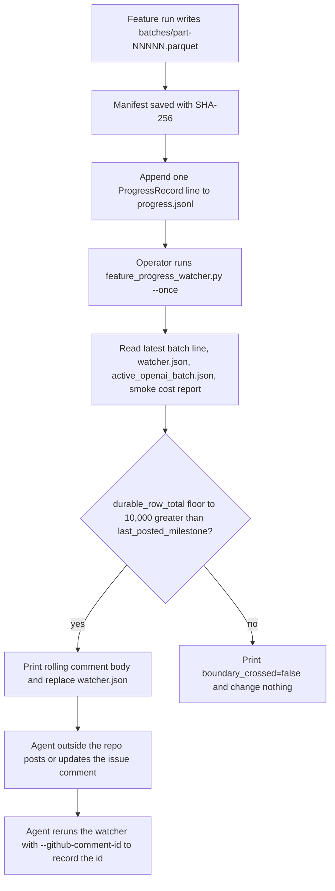

# Add durable progress reports and a restartable watcher CLI for feature runs

## Remember
- Exact file paths always
- Exact commands with expected output
- DRY, YAGNI, frequent commits
- Do not add or run new automated tests. Use the offline schema check and the live watcher proof in the step spec, and run the existing `uv run pytest -q` suite once at the end.
- Delegated tasks must be impossible to misread.

## Overview

Steps 8 through 14 of the epic each label 200,000 Bluesky posts for one LLM feature, and each feature issue must show progress every 10,000 durable rows. Today the Step 5 campaign writer appends one short line to `progress.jsonl` after each batch object lands, but that line has no campaign id, no feature name, no expected total, no percent, and no manifest hash, so a reader cannot build a progress report from it without also opening the manifest. Nothing in the repository tracks which 10,000 row boundary was already reported, so a restarted watcher would report the same boundary twice.

The plan adds one schema module and one small CLI next to the campaign code, and extends the two Step 5 modules. The schema module validates every batch progress line. The campaign writer fills that schema after each durable batch, with the cumulative row total taken from the manifest it just saved. The watcher CLI reads `progress.jsonl`, `watcher.json`, `active_openai_batch.json`, and the smoke cost report from S3, decides whether a new 10,000 row boundary was crossed, prints the markdown comment body, and replaces `watcher.json` with the boundary it just reported. The CLI never posts to GitHub. An operator agent outside the repository posts the printed body and records the comment id.

The plan is one PR for child issue #187 of epic #180. The authoritative spec is `docs/plans/2026-09-05_generate_bluesky_llm_features_4d8a7c/steps/step7.md`, and the shared layout lives in `docs/plans/2026-09-05_generate_bluesky_llm_features_4d8a7c/campaign_contract.md`.

## Happy flow

A feature run lands one batch object, and the writer appends one validated progress line with the cumulative total. Later, an operator runs the watcher once for that feature. The watcher reads the latest progress line and the watcher state, sees that the durable total passed a new multiple of 10,000, prints the comment body, and saves the boundary. The operator agent posts the body to the feature issue. A second watcher run before the next boundary prints that no boundary was crossed and changes nothing.

## Approach

Keep the progress line as a superset of what Step 5 already writes, so the resume and consolidation code in `generate_features.py` and any reader of the old fields keep working. The new required fields come from data the writer already has in hand when it saves the manifest, so no field is derived from process memory alone. The cumulative total is the sum of `row_count` over the manifest batch entries, and the manifest digest is the SHA-256 of the exact bytes the writer just uploaded.

The watcher is a short Typer command with a single `--once` mode. It reads S3 only, and its only write is the conditional replace of `watcher.json`. Boundary detection is arithmetic on two integers, the floor of the durable total to 10,000 and the last posted milestone, so a restart cannot repeat a boundary as long as `watcher.json` was saved. The seed helper for the live proof writes only under the disposable prefix and is deleted before merge.

## Decisions

- `ProgressRecord` carries the twelve fields the step spec requires plus the Step 5 fields (`ts`, `event`, `key`, `row_count`, `sha256`, `provider_batch_ids`, `rows_total`, `batches_total`) as optional fields with `event` defaulting to `batch`. The `final` line that `consolidate_final` writes stays as it is, and the watcher ignores every line whose `event` is not `batch`.
- `recorded_at` and the comment's `Updated` line use `lib.timestamp_utils.get_current_timestamp`, whose format is `YYYY_MM_DD-HH:MM:SS` in UTC. The step spec's example shows an ISO string, but `lib/timestamp_utils.py` forbids adding a second timestamp generator, and the spec locks only "UTC timestamp".
- `active_openai_batch_id` on the progress line is the `batch_id` of the S3 `active_openai_batch.json` at the moment the batch is recorded, or null when that object is absent. The comment shows the live value of that same object at watcher time, so an operator sees the job that is running now, not the one that just finished.
- The watcher uses the batch line with the largest `durable_row_total`. The boundary is `durable_row_total // 10000 * 10000`. A boundary is new when it is greater than `last_posted_milestone`, and skipping several boundaries between two runs yields one comment at the highest boundary.
- `--dry-render` is accepted so the step spec command lines run unchanged. The CLI never writes to GitHub in any mode, so `github_write_skipped=true` is printed on every run.
- `--github-comment-id` is an optional integer that the operator agent passes after it has posted the first comment. The watcher stores it in `watcher.json` and prints `github_comment_id_recorded=<id>`. Without it, `github_comment_id` stays null and the agent has no way to find its own comment on the next milestone.
- Estimated cost to date is `durable_row_total * estimated_full_run_usd_avg / full_run_post_count` from `smoke/cost_report.json` under the same feature paths. When that object is absent the comment says `unavailable`.
- The seed helper requires `--smoke-prefix`, refuses a prefix that does not contain `/_smoke/`, and overwrites its two objects so the proof can be rerun. It is committed during review and deleted in the last commit.
- No new pytest files, no edits under `tests/`, no GitHub client, no agent launcher.

## Steps

### Step 1: Add the progress schema, the enriched batch line, the watcher CLI, the seed helper, and the runbook

Add `progress_record.py` and `feature_progress_watcher.py` under `data_platform/generate_features/`, add the `watcher.json` key and helpers to `s3_feature_campaign.py`, fill `ProgressRecord` from `_record_batch` in `s3_feature_batches.py`, add the temporary seed helper, and write `runbooks/feature_progress_watcher.md` in the epic plan folder. Verify with the offline schema check, the seed and two watcher runs against the disposable prefix, and the S3 cleanup in `steps/step1.md`.

## What "done" looks like

1. `ProgressRecord(...)` with the eleven keyword arguments from `step7.md` constructs and prints `ProgressRecord schema OK`.
2. Every call of `write_batch` and `adopt_unrecorded_batch` appends one line to `progress.jsonl` that validates as `ProgressRecord`, holds `durable_row_total` equal to the sum of manifest `row_count` values, and still holds every Step 5 field.
3. `FeaturePaths.watcher_key` is `{feature prefix}watcher.json`, and `watcher.json` holds `github_comment_id` and `last_posted_milestone`.
4. The seed helper prints the four lines from `step7.md`, the first watcher run prints `boundary_crossed=true`, `boundary=10000`, `watcher_json_updated=true`, `github_write_skipped=true`, and the comment body between the `rolling_comment<<<` and `>>>rolling_comment` markers, and the second run prints `boundary_crossed=false`, `duplicate_boundary_suppressed=true`, `github_write_skipped=true` with `watcher.json` unchanged.
5. The live proof wrote only under `s3://mirrorview-experimental-artifacts/data_platform/data/_smoke/step7_progress_watcher/`, and that prefix is empty before merge.
6. `docs/plans/2026-09-05_generate_bluesky_llm_features_4d8a7c/runbooks/feature_progress_watcher.md` tells an operator how to run, restart, and record the comment id, without any `gh` write command.
7. `seed_progress_watcher_smoke.py` is deleted in the last commit, and the existing `uv run pytest -q` suite still passes with 631 tests and no test file changes.
