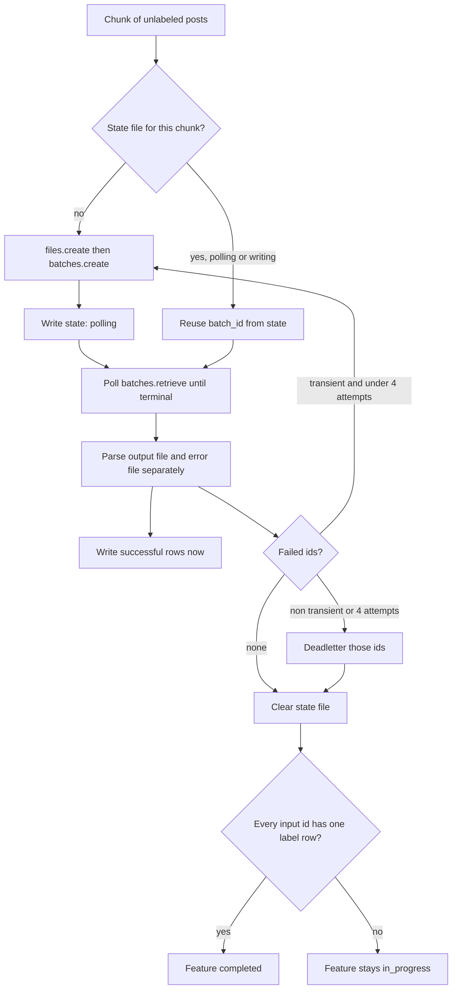

# Make OpenAI Batch feature labeling resume the same provider job after a crash and keep the rows that succeeded

## Remember
- Exact file paths always
- Exact commands with expected output
- DRY, YAGNI, frequent commits
- Do not add or run new automated tests. Use the approved offline check and live smoke commands in the step spec, and run the existing `uv run pytest -q` suite once at the end.
- Delegated tasks must be impossible to misread.

## Overview

The OpenAI Batch engine in `data_platform/generate_features/engines/openai_engine.py` uploads one input file, creates one provider batch, polls it, and only then returns rows. Nothing about the provider job is written to disk while it runs. A crash after `batches.create` therefore loses the `batch_id`, and the next run uploads and creates a second provider job for the same posts, so the same posts are charged twice. The engine also throws the whole batch away when a single request fails, because it raises as soon as the error file is not empty, and it retries every exception the same way, including schema and authentication failures that can never succeed on retry. Finally, `generate_features.py` decides that a feature is complete from the `failed_batches` counter, so a run with one early transient failure can never mark the feature complete even after every post is labeled.

The plan persists the provider job identity in a small state file before the first poll, reattaches to that job on the next run, keeps every successful row when other rows in the same provider batch fail, retries only transient failures with a budget of four attempts per record, and marks a feature complete only when every input id has exactly one label row. The state file contract is independent of storage, so Step 5 of the epic can store the same JSON object in S3.

The plan is one PR for child issue #184 of epic #180. The authoritative spec is `docs/plans/2026-09-05_generate_bluesky_llm_features_4d8a7c/steps/step4.md`.

## Happy flow

An operator runs `generate_bluesky_features.py` for one feature. For each 2,000 post chunk the engine uploads the requests, creates a provider batch, writes `active_openai_batch.json` state with the `input_file_id` and `batch_id`, and then polls. If the process dies while polling, the operator runs the same command with `--checkpoint`, and the engine finds the state file, polls the same `batch_id`, and never calls `files.create` or `batches.create` again for that job. When the provider batch finishes with some failed requests, the engine writes the successful rows right away and submits one small retry batch for the failed ids only.

## Approach

Add one small module that owns the state file, and split the engine's single submit and wait function into explicit submit, state write, poll or resume, and partial parse steps. The shared batch loop in `engines/base.py` gains one hook, `label_chunk`, that lets an engine write rows in the middle of a chunk and report per record failures with attempt counts. The default hook keeps today's behavior for the LangChain and thread pool engines, and the OpenAI engine overrides it with the resumable loop. The completion rule in `generate_features.py` stops reading the `failed_batches` counter and instead checks that no input record is still unlabeled and that the feature file holds no duplicate ids. Feature prompts, the registry, the CLI flags, campaign S3 layout, and the tests do not change.

## Steps

### Step 1: Persist provider job state, parse partial batch results, retry only transient failures, and complete on exact id coverage

Add `data_platform/generate_features/openai_batch_state.py`, refactor `openai_engine.py` into submit, persist, poll or resume, and parse paths, add the `label_chunk` hook to `engines/base.py`, change the completion rule in `generate_features.py`, and add the temporary `smoke_resume_openai_batch.py` helper. Verify with the offline wiring check and the two live smoke commands in `steps/step1.md`, then remove the temporary smoke files before merge.

## What "done" looks like

1. `active_openai_batch.json` state with `input_file_id`, `batch_id`, `logical_batch_index`, `pending_source_record_ids`, `attempt_count`, `state`, `campaign_id`, `feature_name`, and `submitted_at` is on disk before the first `batches.retrieve` call.
2. A second process that starts with a `polling` or `writing` state file polls the same `batch_id` and makes zero `files.create` and zero `batches.create` calls for that job.
3. A provider batch with two successful lines and one failed line yields two written rows and one failure, and the failure does not remove the two rows.
4. Only `APIConnectionError`, `InternalServerError`, `RateLimitError`, HTTP 429, and HTTP 5xx request errors are retried, each record at most four attempts in total. Any other failure goes to `deadletter.jsonl` after one attempt.
5. A feature is marked `completed` only when no input record is unlabeled and the feature file has no duplicate `source_record_id`. The `failed_batches` counter no longer blocks completion.
6. The existing `uv run pytest -q` suite still passes with 631 tests. No test file changes.
7. `smoke_resume_openai_batch.py` and `RESUME_SMOKE_EVIDENCE.md` are committed during review and deleted in a final commit before merge.
