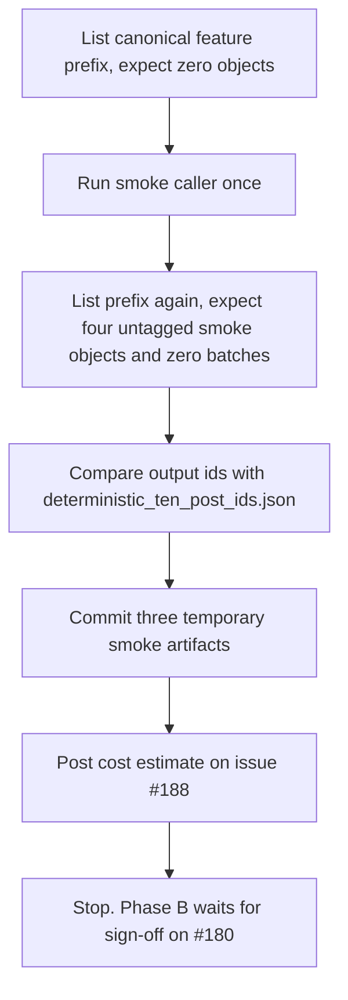

# Run the Phase A ten-post smoke for is_news_or_opinion and post its cost estimate

## Remember
- Exact file paths always
- Exact commands with expected output
- DRY, YAGNI, TDD, frequent commits
- Delegated tasks must be impossible to misread.

## Overview

Issue #188 (Step 8 of epic #180) generates `is_news_or_opinion` for 200,000 Bluesky posts in two phases. Phase A runs the ten-post smoke once, records the cost estimate, and stops. Phase B, the 200,000-post run, may start only after the parent issue #180 has explicit sign-off on the prerequisite PRs, all seven smoke results, and the aggregate cost estimate. The sign-off does not exist yet, so this plan covers Phase A only.

Phase A has no product code. The work is one run of the existing smoke caller, a set of read-only checks, three temporary Git artifacts for review, and one cost estimate comment on the issue.

The authoritative step spec is `docs/plans/2026-09-05_generate_bluesky_llm_features_4d8a7c/steps/step8.md`. The cross-step contract is `docs/plans/2026-09-05_generate_bluesky_llm_features_4d8a7c/campaign_contract.md`.

## Happy flow

An operator confirms the canonical S3 feature prefix is empty, runs the smoke caller once, confirms that only the four untagged `smoke/` objects exist, commits the three temporary review artifacts, and posts the cost estimate on issue #188.

## Approach

Use only the tooling that already exists on the stacked branch. The smoke caller performs the one submit, the deliberate interruption, and the resume by itself, and it writes the four canonical S3 smoke objects and the three Git copies. The plan adds read-only listings before and after the run so the review can see that the smoke ran exactly once and wrote nothing under `batches/`.

## Steps

### Step 1: Confirm the prefix is empty and run the smoke once

List the canonical feature prefix with boto3 and stop if any object exists. Then run the smoke caller exactly as `step8.md` shows, without a smoke prefix override.

### Step 2: Verify the S3 state and commit the temporary artifacts

List the prefix again, confirm the four untagged `smoke/` objects and zero `batches/` objects, and confirm the ten output ids match the committed deterministic sample. Append the observed output to the S3 checks file and commit the three temporary artifacts.

### Step 3: Post the cost estimate and hand off to Phase B

Post the model, token averages, smoke cost, and estimated 200,000-post cost on issue #188. Push the branch and return the PR title and body to the epic manager. Record what Phase B must do after sign-off.

## What "done" looks like

1. The canonical prefix `is_news_or_opinion/` holds exactly four untagged objects under `smoke/` and nothing else.
2. The ten `source_record_id` values in `smoke/output.parquet` equal `reports/smoke/deterministic_ten_post_ids.json`.
3. `resume_evidence.json` shows the same provider batch id before and after the interruption and zero upload or batch creation calls after the resume.
4. The three temporary artifacts under `reports/smoke/is_news_or_opinion/` are committed, and no Parquet or CSV file is committed.
5. Issue #188 has a comment with the estimated full-run cost.
6. The 200,000-post run has not started.
