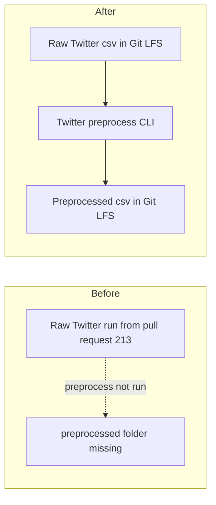

# Preprocess the dated Mirrorview Twitter collection and store it in Git LFS

## Remember
- Exact file paths always
- Exact commands with expected output
- DRY, YAGNI, TDD, frequent commits
- Delegated tasks must be impossible to misread.

## Overview

Pull request [213](https://github.com/METResearchGroup/mirrorView-task/pull/213) stored a completed Twitter recent-search run for 2026-09-05. That pull request stopped at raw files. This work runs Twitter preprocess on that same dataset and commits the filtered posts through the Git LFS csv rule already on that path. Feature generation, curation, and S3 stay out of scope.

## Happy flow

An operator pulls the raw Git LFS csv, then runs Twitter preprocess with the dated dataset id. Preprocess applies the current Twitter filters, drops posts already used as study stimuli, and writes one preprocessed run. The operator commits `posts.csv` through Git LFS and `metadata.json` as an ordinary git file.

## Approach

Reuse the Twitter preprocess command that already takes a dataset id. Do not add a preprocess YAML. Do not sample. The dated collection is a few thousand posts, not a dump of hundreds of thousands. Keep csv, because the dataset file already names csv and Git LFS already tracks csv on this dataset path. Do not change ingest or preprocess Python unless the live run proves a contract bug.

## Decisions

1. Run `data_platform/preprocessing/preprocess_twitter.py` with `--dataset-id twitter_fba4ddb2-fcf7-4a13-a7cc-0d98db44b547`. Do not add `--config`. Twitter preprocess has no config flag. The ingest YAML at `data_platform/ingestion/configs/twitter/mirrorview_2026-09-05.yaml` already names this dataset.
2. Keep csv. `dataset.json` already has `format: csv`. Storage writes `posts.csv`. `.gitattributes` already sends `data_platform/data/twitter/twitter_fba4ddb2-fcf7-4a13-a7cc-0d98db44b547/**/*.csv` through Git LFS. `.gitignore` already un-ignores that dataset, including csv.
3. Do not sample. Dump preprocess in pull requests [164](https://github.com/METResearchGroup/mirrorView-task/pull/164) and [162](https://github.com/METResearchGroup/mirrorView-task/pull/162) sampled because those dumps had hundreds of thousands of kept rows. This raw run has 6,901 unique posts.
4. Do not change `data_platform/preprocessing/preprocess_twitter.py`, `data_platform/preprocessing/runner.py`, or ingest code unless the live run hits a contract bug.
5. Feature generation, curation, and S3 stay out of scope.
6. Update `CHANGELOG.md` and the one architecture-runbook sentence that already names this dated Twitter run, so it also names the preprocessed csv.

## Steps

### Step 1: Pull the raw csv and run Twitter preprocess

Pull the Git LFS object for the raw `posts.csv` from pull request 213. Run Twitter preprocess with the dated dataset id. Confirm the new run is csv, lists the 2026-09-06 raw run as its source, and has a keep count at most 6,901. See [steps/step1.md](steps/step1.md).

### Step 2: Commit the preprocessed csv through Git LFS

Add the new preprocessed run. Confirm `posts.csv` is a Git LFS pointer. Commit `metadata.json` as ordinary git. Add a changelog line and a one-line architecture-runbook update. See [steps/step2.md](steps/step2.md).

## What "done" looks like

1. A completed preprocessed run exists under `data_platform/data/twitter/twitter_fba4ddb2-fcf7-4a13-a7cc-0d98db44b547/preprocessed/<timestamp>/`.
2. That run has `posts.csv` and `metadata.json`. `posts.csv` is Git LFS. `metadata.json` is ordinary git.
3. `metadata.json` `source_raw_runs` lists `raw/2026_09_06-19:05:35`. Output row count is at most 6,901.
4. Ingest Python, Twitter preprocess Python, the dated ingest YAML, and the raw run files are unchanged.
5. `PYTHONPATH=. uv run pytest tests/data_platform/preprocessing/test_preprocess_twitter.py -q` exits 0.
6. Feature generation, curation, and S3 are not in this pull request.
