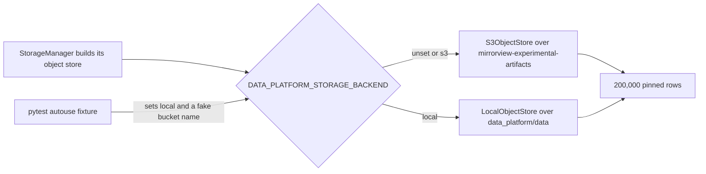

# Make S3 the default data platform storage backend and drop the Bluesky pipeline parquet files from Git LFS

## Remember
- Exact file paths always
- Exact commands with expected output
- DRY, YAGNI, frequent commits
- Do not add or run new automated tests. Use the approved live smoke checks in the step spec, and run the existing `uv run pytest -q` suite as described there.
- Delegated tasks must be impossible to misread.

## Overview

The data platform can already read and write the `mirrorview-experimental-artifacts` S3 bucket when `DATA_PLATFORM_STORAGE_BACKEND=s3`, and every object of the pinned Bluesky dataset is in that bucket with a verified SHA-256. Local disk is still the default backend, and the 25 parquet files of the pinned Bluesky dataset are still tracked by Git LFS. This plan flips the default backend to S3, keeps `DATA_PLATFORM_STORAGE_BACKEND=local` as the developer override, and removes the 25 parquet files from git and Git LFS tracking without rewriting history. The four JSON manifests of the dataset stay in git as ordinary text files.

The test suite never sets the backend variable today, so the flip alone would send 106 existing tests to S3. On a machine with AWS credentials, those tests would write fixture data into the production bucket. The plan therefore pins every test under `tests/data_platform/` to local disk and to a fake bucket name before the default changes. No test outside `tests/data_platform/` builds a storage manager or resolves an object store.

The plan is one PR for child issue #183 of epic #180. It depends on the merged work of issues #181 and #182, which sit below it in the same branch stack.

## Happy flow

An operator with AWS credentials and no `DATA_PLATFORM_STORAGE_BACKEND` variable builds the Bluesky preprocessed storage manager and loads the latest run. The storage manager resolves the S3 store, downloads the pinned `posts.parquet` object, and returns 200,000 rows. A developer who sets the variable to `local` and has the parquet files on disk gets the same rows from the local copy.

## Approach

Change one default value, add one test fixture, and edit two git config files. The default flip lives in `resolve_object_store` alone, so the S3 store, the local store, and `StorageManager` do not change. The fixture lands before the flip, so no commit on the branch leaves the suite pointed at the production bucket. The parquet files leave the git index with `git rm --cached`, the Bluesky pipeline LFS rule leaves `.gitattributes`, and `.gitignore` stops un-ignoring the parquet paths while it keeps the JSON manifests tracked. The working tree copies stay on disk so the local override keeps working for anyone who already pulled the LFS blobs. Reddit and Bluesky dump LFS rules are untouched, and history is not rewritten.

## Steps

### Step 1: Pin tests to local disk, flip the default backend to S3, and untrack the pinned Bluesky parquet files

Add an autouse fixture in the data platform test conftest, change the default backend in `resolve_object_store`, update `.gitattributes` and `.gitignore`, and remove the 25 parquet files from the index. Verify with the live smoke commands and the three production safety checks in `steps/step1.md`.

## What "done" looks like

1. With `DATA_PLATFORM_STORAGE_BACKEND` unset and AWS credentials present, `BlueskyStorageManager(StorageStage.PREPROCESSED, "bluesky_7e2c4a91-3b5f-4d8e-a6c1-0f9b8d2e5a73").load_records(latest=True)` returns 200,000 rows from S3.
2. With `DATA_PLATFORM_STORAGE_BACKEND=local`, `resolve_object_store` returns a `LocalObjectStore`.
3. `git lfs ls-files` lists no path under `data_platform/data/bluesky/bluesky_7e2c4a91-3b5f-4d8e-a6c1-0f9b8d2e5a73/`, and `git ls-files` lists no parquet file under that directory.
4. `dataset.json`, both `metadata.json` files, and `s3_migration_inventory.json` under that directory stay tracked as ordinary files.
5. The Reddit and Bluesky dump LFS rules and files are unchanged, and no history is rewritten.
6. `uv run pytest -q` passes with 631 tests, both with AWS credentials present and with credentials stripped, and the bucket listing under `data_platform/data/` after the run matches the 28 inventory keys under that prefix exactly.
7. `data_platform/scripts/verify_bluesky_s3_migration.py` still reports 53 of 53 objects present.
