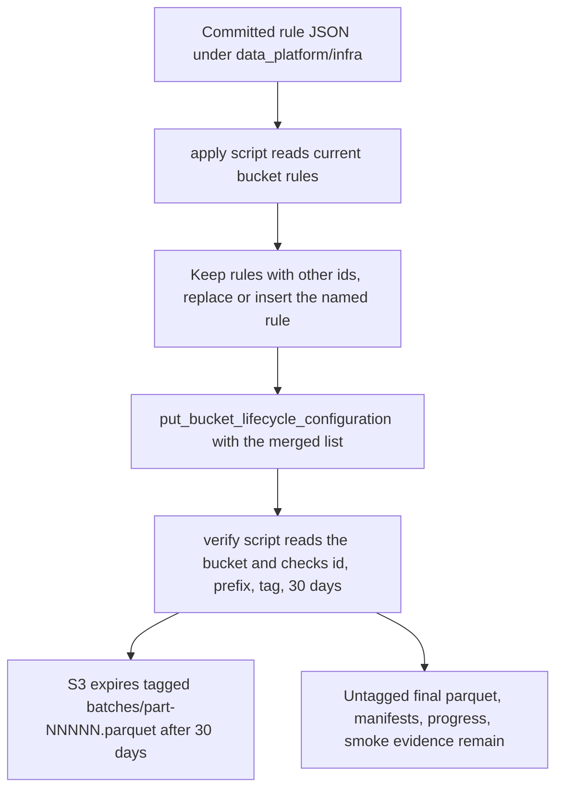

# Expire tagged intermediate data platform S3 batches after 30 days

## Remember
- Exact file paths always
- Exact commands with expected output
- DRY, YAGNI, frequent commits
- Do not add or run automated tests. Use the live smoke checks in the step spec.
- Delegated tasks must be impossible to misread.

## Overview

Step 5 of the epic writes every campaign batch object `batches/part-NNNNN.parquet` with the S3 object tag `intermediate-artifact=true`. Nothing removes those objects once a feature has its final parquet and manifest, so the `mirrorview-experimental-artifacts` bucket keeps 700 batch objects for seven features until someone deletes them by hand.

The plan adds one S3 lifecycle rule to the bucket that expires an object 30 days after creation when both of two conditions hold. The object key starts with `data_platform/data/`, and the object carries the tag `intermediate-artifact=true`. Final parquet files, manifests, progress records, smoke evidence, the pinned preprocessed input, and every other untagged object never match the rule, so they remain in the bucket.

The rule is committed as JSON under `data_platform/infra/` next to two small scripts. The apply script installs the rule without disturbing any other rule on the bucket, and the verify script reads the bucket back and checks the installed rule against the committed JSON. The bucket has no lifecycle configuration today, which was confirmed with a read-only call before planning.

The plan is one PR for child issue #196 of epic #180. The authoritative spec is `docs/plans/2026-09-05_generate_bluesky_llm_features_4d8a7c/steps/step16.md`, and the tagging rules live in `docs/plans/2026-09-05_generate_bluesky_llm_features_4d8a7c/campaign_contract.md`.

## Happy flow

An operator exports the lab AWS credentials and runs the apply script once. The script reads the current lifecycle rules from the bucket, keeps every rule with a different id, inserts or replaces the one named rule from the committed JSON, and writes the merged list back. The operator then runs the verify script, which prints one `OK` line when the installed rule has the locked id, prefix, tag, and 30-day expiration. From then on S3 deletes each tagged batch object 30 days after it was written.

## Approach

Keep the rule in one committed JSON file so reviewers can read the exact filter and expiration that will run in the bucket, and make both scripts load that file rather than repeating the values in code. The apply script merges by rule id because `put_bucket_lifecycle_configuration` replaces the whole configuration, so a plain put would silently delete any rule another project adds later. Rerunning apply replaces the named rule in place and never adds a second copy.

The scripts call boto3 directly and do not extend `lib/aws/s3.py`, because lifecycle configuration is bucket administration and not object storage. The live check uploads two short-lived objects under one disposable smoke prefix, one tagged and one untagged, reads their tags back, and deletes both. The check does not wait 30 days and does not tag any existing object.

## Decisions

- The rule shape is copied verbatim from `step16.md`. One rule, id `expire-data-platform-intermediate-artifacts`, status `Enabled`, `Filter.And.Prefix` `data_platform/data/`, one tag `intermediate-artifact` = `true`, `Expiration.Days` 30. Nothing else is in the JSON.
- The apply script treats `NoSuchLifecycleConfiguration` as an empty rule list, so the first run on a bucket with no configuration succeeds.
- The apply script keeps a preserved rule exactly as S3 returned it and does not reorder rules. The named rule replaces the existing rule with the same id at the same position, or is appended when absent.
- The apply script prints the ids of the rules it found before it writes, so the run log shows what was preserved.
- The verify script loads the committed JSON and compares the installed rule's status, prefix, tag set, and expiration days against it. It prints the exact `OK` line from `step16.md` or one `FAIL` line and exit code 1.
- The verify script imports the bucket, region, rule id, and JSON loader from the apply script. `data_platform/scripts/verify_bluesky_s3_migration.py` already imports from a sibling script in a folder without `__init__.py`, so no `__init__.py` is added.
- The `aws` CLI is not installed in this environment. Every CLI command in `step16.md` is replaced with the equivalent boto3 call from a throwaway Python snippet that is not committed.
- No pytest files, no edits under `tests/`, no changes to IAM, bucket versioning, `lib/aws/s3.py`, `object_store.py`, `storage.py`, or anything under `generate_features/`.

## Steps

### Step 1: Add the lifecycle JSON, the apply script, and the verify script, then apply and smoke in the lab bucket

Commit `data_platform_s3_lifecycle.json`, `apply_data_platform_s3_lifecycle.py`, and `verify_data_platform_s3_lifecycle.py` under `data_platform/infra/`. Apply the rule twice to prove the merge is idempotent, verify it, upload and read back one tagged and one untagged smoke object under the disposable prefix, delete both, and confirm the pinned preprocessed object carries no tag. The exact commands and expected output are in `steps/step1.md`.

## What "done" looks like

1. `data_platform/infra/data_platform_s3_lifecycle.json` contains exactly the one rule from `step16.md`.
2. `PYTHONPATH=. uv run python data_platform/infra/apply_data_platform_s3_lifecycle.py` prints `applied lifecycle rule expire-data-platform-intermediate-artifacts on mirrorview-experimental-artifacts` and exits 0, and a second run leaves the bucket with the same single rule.
3. `PYTHONPATH=. uv run python data_platform/infra/verify_data_platform_s3_lifecycle.py` prints `OK: rule expire-data-platform-intermediate-artifacts prefix=data_platform/data/ tag=intermediate-artifact=true expiration_days=30` and exits 0.
4. `get_bucket_lifecycle_configuration` on `mirrorview-experimental-artifacts` returns one enabled rule with the locked id, prefix, tag, and 30-day expiration, and no other rule was removed.
5. The tagged smoke object read back `intermediate-artifact=true`, the untagged smoke object read back an empty tag set, both were deleted, and the prefix `data_platform/data/bluesky/_lifecycle_smoke_2026_09_05/` lists zero objects.
6. The pinned object `preprocessed/2026_09_03-23:51:30/posts.parquet` has an empty tag set.
7. No file outside `data_platform/infra/` and this plan folder changed.
