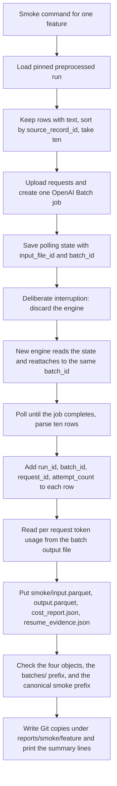

# Add smoke tooling and cost aggregation for the Bluesky LLM feature campaign

## Remember
- Exact file paths always
- Exact commands with expected output
- DRY, YAGNI, frequent commits
- Do not add or run new automated tests. Use the offline check and the live smoke commands in the step spec, and run the existing `uv run pytest -q` suite once at the end.
- Delegated tasks must be impossible to misread.

## Overview

Steps 8 through 14 of the epic each label 200,000 Bluesky posts for one LLM feature. Before any of those runs starts, each feature must label the same ten posts once, record what that cost, and prove that a run interrupted after the provider job was submitted can resume without paying for a second provider job. Today nothing in the repository does that. The Step 5 campaign mode writes production batch objects, so it cannot be used for a smoke, and the older `smoke_openai_engine.py` labels 100 study posts from a CSV with no S3 output and no per feature cost report.

The plan adds three modules next to the campaign code. The first selects the ten smoke posts with one fixed rule, so every feature labels the same ids. The second holds the pricing math, the per feature cost report shape, and the command that sums seven feature reports into one parent estimate. The third is the smoke caller itself. It labels the ten posts through the Step 4 OpenAI engine, performs one deliberate interruption after the provider job is submitted and resumes by reattaching to the same job, writes four untagged objects under the feature's `smoke/` prefix, verifies them, and writes the Git copies of the cost report, the resume evidence, and the S3 check results.

The plan is one PR for child issue #186 of epic #180. The authoritative spec is `docs/plans/2026-09-05_generate_bluesky_llm_features_4d8a7c/steps/step6.md`, and the shared layout lives in `docs/plans/2026-09-05_generate_bluesky_llm_features_4d8a7c/campaign_contract.md`.

## Happy flow

An operator runs the smoke command for one feature. The command loads the pinned preprocessed run, picks the ten smoke posts, uploads the ten requests, creates one OpenAI Batch job, and saves the job ids to the engine state file. The command then stops using that engine, which is the deliberate interruption. A fresh engine reads the state file, reattaches to the same job without uploading or creating anything, waits for it to finish, and returns the ten label rows. The command writes the input, output, cost report, and resume evidence to S3 under `smoke/`, checks them, writes the Git copies, and prints the token averages, the token maximums, and the estimated cost of 200,000 posts.

## Approach

Keep the smoke caller on the public engine surface that Step 4 and Step 5 already expose. The interruption is a stop after `submit_active_batch` has saved the `polling` state, and the resume is a second `OpenAIBatchEngine.label_chunk` call on a new engine that finds that state. A small wrapper around the OpenAI client counts `files.create` and `batches.create` calls, so the resume evidence can state that the resumed engine made zero of either call while it reattached to the same `batch_id`. The engine code is not changed.

Token maximums per request cannot come from the batch level usage, so the caller downloads the batch output file once more and reads the `usage` block of each request line. The batch level usage from `engine.last_batch.usage` is recorded too, and the averages come from the per request values divided by the request count.

S3 writes go through the Step 5 `CampaignObjectStore.put_new` with `If-None-Match: *` and no tags. The caller writes under the canonical `{feature}/smoke/` prefix by default and under `{smoke_prefix}/{feature}/smoke/` when `--smoke-prefix` is passed, and it refuses a smoke prefix that overlaps the canonical feature prefix. The Step 6 tooling proof in this PR uses only the disposable prefix.

## Decisions

- Batch pricing for `gpt-5.4-nano` is read from the Batch tab of `https://developers.openai.com/api/docs/pricing` on the day of the smoke. On 2026-09-06 that is $0.10 per million input tokens and $0.625 per million output tokens. Those values are module defaults that the smoke command can override with two flags, and every cost report records the values and the URL it used.
- The estimated full run cost multiplies 200,000 posts by the per post cost, once with the average tokens per request and once with the maximum tokens per request. Cached input tokens are priced as normal input tokens, which overstates cost slightly.
- The ten post selection reuses `load_pinned_preprocessed_records`, which already validates the run through the platform model in about four seconds, so no second loader is written.
- The engine state file for the smoke lives in a temporary directory that the command removes on exit. The resume happens inside the same invocation, so the state does not need to survive the process. A real crash of the smoke command itself orphans one ten post provider job, which costs well under one cent.
- `s3_feature_campaign.py` gains only the four smoke object keys on `FeaturePaths`. No other Step 5 code changes.
- The aggregate command reads exactly the seven OpenAI features from `FEATURE_REGISTRY` and fails with the list of missing report files when any is absent.
- No `APPROVED.txt`, no approval marker, and no code that posts to GitHub or starts agents.

## Steps

### Step 1: Add the deterministic sample, the cost report module, the smoke caller, and the aggregate command

Add `deterministic_smoke_sample.py`, `campaign_cost_report.py`, and `smoke_bluesky_campaign.py` under `data_platform/generate_features/`, add the smoke object keys to `FeaturePaths`, and commit `reports/smoke/deterministic_ten_post_ids.json` in the epic plan folder. Verify with the offline sample check, one live smoke for `is_news_or_opinion` under the disposable prefix, the aggregate command against temporary copies of that report, and the S3 cleanup listed in `steps/step1.md`.

## What "done" looks like

1. `load_deterministic_ten_post_ids('bluesky_7e2c4a91-3b5f-4d8e-a6c1-0f9b8d2e5a73', '2026_09_03-23:51:30')` returns ten sorted ids, and the same ids are committed in `docs/plans/2026-09-05_generate_bluesky_llm_features_4d8a7c/reports/smoke/deterministic_ten_post_ids.json`.
2. `smoke_bluesky_campaign.py` labels those ten posts for one feature, submits exactly one provider job, interrupts after the submit, resumes on the same `batch_id` with zero new `files.create` or `batches.create` calls, and prints the ten summary lines from `step6.md`.
3. The four smoke objects exist untagged under the smoke prefix in use, `output.parquet` holds exactly ten rows with the Q44 columns, and no object exists under that prefix's `batches/`.
4. The per feature cost report records the pricing URL, both prices, average and maximum input and output tokens, and the estimated full run cost under both the average and the maximum assumption.
5. `campaign_cost_report.py --aggregate` reads seven per feature reports, sums both estimates, writes `parent_cost_aggregate.json`, and prints the four lines from `step6.md`.
6. The live proof wrote only under `s3://mirrorview-experimental-artifacts/data_platform/data/_smoke/step6_campaign_smoke/`, that prefix is empty before merge, and the canonical `is_news_or_opinion/smoke/` prefix holds no objects.
7. The existing `uv run pytest -q` suite still passes with 631 tests, and no test file changes.
8. Only the three modules, the `FeaturePaths` extension, the ids JSON, this plan folder, and the CHANGELOG entry are committed. The live smoke's local output under `reports/smoke/is_news_or_opinion/` is not committed.
