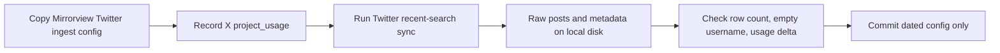

# Run an 8,000-post Twitter recent-search collection with a dated Mirrorview config

## Remember
- Exact file paths always
- Exact commands with expected output
- DRY, YAGNI, TDD, frequent commits
- Delegated tasks must be impossible to misread.

## Overview

Issue [#170](https://github.com/METResearchGroup/mirrorView-task/issues/170) adds one dated Twitter ingest config and runs a recent-search sync for 8,000 posts. Blocker [#169](https://github.com/METResearchGroup/mirrorView-task/issues/169) already landed in [#173](https://github.com/METResearchGroup/mirrorView-task/pull/173), so this run bills Posts: Read only.

This Cloud Agent can authenticate to X. `GET https://api.x.com/2/usage/tweets` returned HTTP 200 for project `2061451038012448768` (`project_cap` 3,000,000, `project_usage` 10, reset day 16).

## Happy flow

An operator adds a dated copy of the existing Mirrorview Twitter ingest config, records X usage, runs Twitter sync, then checks that the raw run reached 8,000 rows (or stopped cleanly at the 7-day recent-search window) with empty usernames and a matching Posts: Read usage delta. Git receives only the new config. Raw posts stay on the machine that ran the sync.

## Approach

Reuse the existing Mirrorview Twitter keyword collection. Change only identity, date, and the 8,000-post cap. Do not change ingest code, the undated Mirrorview config, preprocess, features, or curate. Treat this planning folder as the planning artifact; implementing issue 170 does not add more files under `docs/plans/`.

## Decisions

1. **Twitter access is confirmed** in this Cloud Agent environment. `X_BEARER_TOKEN` is present. The usage endpoint succeeded. This run can execute here after plan approval.
2. **Raw data is local and gitignored.** Sync writes `data_platform/data/twitter/{new_dataset_id}/raw/{timestamp}/posts.csv`, `metadata.json`, and `dataset.json`. `.gitignore` excludes `data_platform/data/**` and `*.csv`. Git LFS tracks only the Bluesky dump dataset `bluesky_7e2c4a91-3b5f-4d8e-a6c1-0f9b8d2e5a73` and the Reddit dump dataset `reddit_3d8a2c41-9b17-4e6f-a5d0-8c1b2e4f6079`. Twitter ingest does not upload to S3. `docs/runbooks/DATA_INGESTION_PIPELINE_ARCHITECTURE.md` says not to commit live API sync files. **The pull request commits the dated YAML only. The 8,000 posts are not committed, not Git LFS, and not S3.** They live on the disk of the machine that ran the sync. This Cloud Agent disk is ephemeral: if the VM is destroyed, those files are gone unless copied elsewhere first.
3. **Empty `username` is success**, not a bug. [#173](https://github.com/METResearchGroup/mirrorView-task/pull/173) dropped user expansions so ingest does not bill User: Read.
4. **Cost ceiling is about $40** at $0.005 per post for 8,000 posts. Credit on 2026-09-05 was $100. Current `project_usage` is 10 of 3,000,000.
5. **A 7-day recent-search shortfall is allowed.** If the keyword set cannot fill 8,000 posts inside the window, stop cleanly and record the shortfall in the implementation pull request.

## Steps

### Step 1: Add the dated Twitter ingest config

Copy `data_platform/ingestion/configs/twitter/mirrorview.yaml` to `data_platform/ingestion/configs/twitter/mirrorview_2026-09-05.yaml`. Assign a new `twitter_<uuid>`, set name `mirrorview_2026-09-05`, date `2026-09-05`, and `max_posts: 8000`. Leave keywords, language, excludes, dedupe policy, and `limit_per_task` unchanged. Do not edit `mirrorview.yaml`. See [steps/step1.md](steps/step1.md) after approval.

### Step 2: Record usage and run the 8,000-post sync

Record `project_usage` from `GET https://api.x.com/2/usage/tweets`. Run `PYTHONPATH=. uv run python data_platform/ingestion/sync_twitter.py --config data_platform/ingestion/configs/twitter/mirrorview_2026-09-05.yaml`. Do not change `data_platform/ingestion/sync_twitter.py` or `data_platform/ingestion/twitter_client.py`. See [steps/step2.md](steps/step2.md) after approval.

### Step 3: Verify the raw run and open a YAML-only pull request

Confirm `metadata.json` `row_count` is 8,000 or document the 7-day shortfall. Confirm every `username` is empty. Confirm the usage delta matches the row count at Posts: Read only. Commit and push only the dated config. Put run evidence (paths, row count, usage before/after, any shortfall) in the pull request body. Do not add preprocess, features, curate, Git LFS exceptions, or S3 upload. See [steps/step3.md](steps/step3.md) after approval.

## What "done" looks like

1. `data_platform/ingestion/configs/twitter/mirrorview_2026-09-05.yaml` exists with a new `twitter_<uuid>`, name `mirrorview_2026-09-05`, date `2026-09-05`, `max_posts: 8000`, and every other field matching `data_platform/ingestion/configs/twitter/mirrorview.yaml`.
2. Twitter sync has completed or stopped cleanly at the 7-day window. Raw files exist at `data_platform/data/twitter/{new_dataset_id}/raw/{timestamp}/posts.csv` plus `metadata.json` on the machine that ran the sync.
3. `username` is empty for every raw row.
4. `GET https://api.x.com/2/usage/tweets` `project_usage` increased by about the row count, with no User: Read billing.
5. The implementation pull request contains the dated YAML and does not contain raw posts, Git LFS pointer files, or extra `docs/plans/` edits.
6. `PYTHONPATH=. uv run pytest tests/data_platform/ingestion/test_ingest_yaml_keys.py -q` exits 0.
