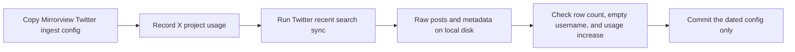

# Collect 8,000 Twitter posts with a Mirrorview ingest config dated 2026-09-05

## Remember
- Exact file paths always
- Exact commands with expected output
- DRY, YAGNI, TDD, frequent commits
- Delegated tasks must be impossible to misread.

## Overview

GitHub issue [170](https://github.com/METResearchGroup/mirrorView-task/issues/170) asks us to copy the existing Mirrorview Twitter ingest config, and to give the copy a new dataset id and the date 2026-09-05. The same issue then asks us to collect 8,000 posts from X recent search. Issue [169](https://github.com/METResearchGroup/mirrorView-task/issues/169) already merged in pull request [173](https://github.com/METResearchGroup/mirrorView-task/pull/173), so the collection bills only Posts Read at $0.005 per post.

X is the company formerly called Twitter. Posts Read is the X API charge for fetching a post. The Cloud Agent environment already has a working X token. A GET to `https://api.x.com/2/usage/tweets` returned HTTP 200 for project `2061451038012448768`, with a monthly cap of 3,000,000 and current usage of 10.

## Happy flow

An operator adds the dated config and records X usage. The operator then runs Twitter sync and checks that the raw files have 8,000 rows, or a documented shortfall inside the 7-day search window. Usernames are empty, and the usage increase matches the row count at Posts Read only. Commit only the new config file. The post files stay on the machine that ran the sync.

## Approach

Copy the existing Mirrorview keyword list. Change identity, date, the 8,000 post run cap, and the limit for each keyword so the run can reach 8,000 posts. Do not change ingest code, the undated Mirrorview config, preprocess, features, or curate. Keep this folder as the planning record. When you open the implementation pull request for issue 170, do not add more files under `docs/plans/`.

## Decisions

The Cloud Agent environment can run the live collection. `X_BEARER_TOKEN` is present, and the usage endpoint succeeded.

Raw post files stay on local disk, and git ignores them. Twitter sync writes `data_platform/data/twitter/{new_dataset_id}/raw/{timestamp}/posts.csv`, `metadata.json`, and `dataset.json`. Git ignores `data_platform/data/**` and `*.csv`. Git LFS tracks only the Bluesky dump dataset `bluesky_7e2c4a91-3b5f-4d8e-a6c1-0f9b8d2e5a73` and the Reddit dump dataset `reddit_3d8a2c41-9b17-4e6f-a5d0-8c1b2e4f6079`. The Twitter ingest scripts do not upload to S3. `docs/runbooks/DATA_INGESTION_PIPELINE_ARCHITECTURE.md` says not to commit live API sync files. The implementation pull request commits the dated config only. The 8,000 posts are not committed, are not stored in Git LFS, and are not stored in S3. They live on the disk of the machine that ran the sync. The Cloud Agent disk is deleted when the virtual machine is destroyed, so copy the files elsewhere first if you need to keep them.

Empty `username` is the expected success check. Pull request 173 dropped user expansions so ingest does not bill User Read. User Read is the X API charge for fetching a user profile.

The cost ceiling is about $40 at $0.005 per post for 8,000 posts. Credit on 2026-09-05 was $100. Current `project_usage` is 10 of 3,000,000.

Option A is locked. `data_platform/ingestion/sync_twitter.py` caps each keyword at `limit_per_task`, then stops at `max_posts`. `data_platform/ingestion/configs/twitter/mirrorview.yaml` has 73 keywords. A `limit_per_task` of 25 would cap the run at 1,825 posts. Set `limit_per_task` to 110, because 73 times 110 is 8,030, so the run can hit 8,000 and then stop. Do not add keywords. Do not change `sync_twitter.py`.

A shortfall inside the 7-day recent search window is still allowed after that cap change. If the keyword set cannot fill 8,000 posts inside the window, stop cleanly and record the shortfall in the implementation pull request.

## Steps

### Step 1: Add the dated Twitter ingest config

Copy `data_platform/ingestion/configs/twitter/mirrorview.yaml` to `data_platform/ingestion/configs/twitter/mirrorview_2026-09-05.yaml`. Assign a new `twitter_<uuid>` and set name `mirrorview_2026-09-05`. Set date `2026-09-05`. Set `max_posts` to 8000 and `limit_per_task` to 110. Leave keywords, language, excludes, and dedupe policy unchanged. See [steps/step1.md](steps/step1.md).

### Step 2: Record usage and run the sync for 8,000 posts

Record `project_usage` from `GET https://api.x.com/2/usage/tweets`. Run `PYTHONPATH=. uv run python data_platform/ingestion/sync_twitter.py --config data_platform/ingestion/configs/twitter/mirrorview_2026-09-05.yaml`. Do not change `data_platform/ingestion/sync_twitter.py` or `data_platform/ingestion/twitter_client.py`. See [steps/step2.md](steps/step2.md).

### Step 3: Verify the raw run and open a pull request that contains only the config

Confirm `metadata.json` `row_count` is 8,000, or document the 7-day shortfall. Confirm every `username` is empty. Confirm the usage increase matches the row count at Posts Read only. Commit and push only the dated config. Put run evidence in the pull request body. See [steps/step3.md](steps/step3.md).

## What "done" looks like

1. `data_platform/ingestion/configs/twitter/mirrorview_2026-09-05.yaml` exists with a new `twitter_<uuid>`, name `mirrorview_2026-09-05`, date `2026-09-05`, `max_posts: 8000`, and `limit_per_task: 110`. Every other field matches `data_platform/ingestion/configs/twitter/mirrorview.yaml`.
2. Twitter sync has completed, or it stopped cleanly at the 7-day window. Raw `row_count` is 8,000, or a documented shortfall. Files exist at `data_platform/data/twitter/{new_dataset_id}/raw/{timestamp}/posts.csv` plus `metadata.json` on the machine that ran the sync.
3. `username` is empty for every raw row.
4. `GET https://api.x.com/2/usage/tweets` `project_usage` increased by about the row count, with no User Read billing.
5. The implementation pull request contains the dated config. It does not contain raw posts, Git LFS pointer files, or extra `docs/plans/` edits.
6. `PYTHONPATH=. uv run pytest tests/data_platform/ingestion/test_ingest_yaml_keys.py -q` exits 0.
