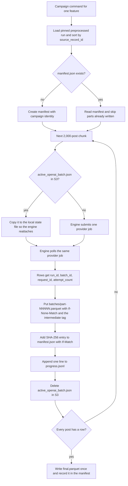

# Write each completed 2,000-post label batch to S3 as an immutable Parquet object and resume from S3 state

## Remember
- Exact file paths always
- Exact commands with expected output
- DRY, YAGNI, frequent commits
- Do not add or run new automated tests. Use the offline check and the live smoke commands in the step spec, and run the existing `uv run pytest -q` suite once at the end.
- Delegated tasks must be impossible to misread.

## Overview

Feature generation today writes every label row into one growing feature file under a timestamped local run folder, tracks progress in a `metadata.json` file, and keeps the in-flight OpenAI Batch state in a local JSON file next to the feature file. That layout works for small runs, and it does not give the 200,000-post Bluesky campaign what it needs. A campaign needs one fixed S3 prefix per feature that seven parallel agents can write without touching each other, batch objects that are never rewritten, a manifest with SHA-256 digests that later steps can verify, an append-only progress log that a watcher can read, and the in-flight provider job state in S3 so a run that moves to another machine still reattaches to the same provider job.

The plan adds a campaign mode to the existing Bluesky feature CLI. The operator passes `--campaign-id` and `--preprocessed-run` with exactly one feature and `--batch-size 2000`. The command loads the pinned preprocessed run, sorts the posts by `source_record_id`, splits them into fixed 2,000-post chunks, and labels each chunk with the resumable OpenAI Batch engine from Step 4. After each provider job completes, the command adds the run id, provider batch id, request id, and attempt count to every row, writes the chunk as one new `batches/part-NNNNN.parquet` object tagged `intermediate-artifact=true`, records the SHA-256 of that object in `manifest.json`, and appends one line to `progress.jsonl`. When every post has a row, the command writes one `final.parquet`. Re-running the same command resumes from the manifest and never rewrites an existing batch object.

The plan is one PR for child issue #185 of epic #180. The authoritative spec is `docs/plans/2026-09-05_generate_bluesky_llm_features_4d8a7c/steps/step5.md`, and the shared layout and schema live in `docs/plans/2026-09-05_generate_bluesky_llm_features_4d8a7c/campaign_contract.md`.

## Happy flow

An operator runs the campaign command for one feature. The command finds no manifest, so it creates one, and then it labels chunk 0. When the provider job for chunk 0 completes, the command writes `batches/part-00000.parquet`, updates the manifest, and appends a progress line. The process is killed during chunk 1. The operator runs the same command again. The command reads the manifest, sees that part 0 exists, finds the in-flight provider job in `active_openai_batch.json`, reattaches to it without creating a second provider job, and continues with part 1.

## Approach

Add two modules next to the existing feature generator. The first owns the S3 layout and the small mutable files. It builds the per-feature prefix, wraps the few S3 calls the campaign needs (conditional put, conditional replace, get with ETag, delete, list), and provides the read, append, and conditional replace pattern for `manifest.json`, `progress.jsonl`, `errors.jsonl`, and `active_openai_batch.json`. The second owns the immutable outputs. It adds the provenance columns to label rows, validates the label subset and the provenance columns separately, writes one batch object, and consolidates the final file. The orchestrator gains one campaign entry point that drives the Step 4 engine chunk by chunk and calls the batch writer after each durable provider job. The shared CLI gains the two flags and the campaign guards, and the Bluesky script passes them through. Legacy mode does not change.

The OpenAI engine from Step 4 stays read-only in this step. It writes its state file to a local run directory. The campaign entry point mirrors that local file to S3 whenever the engine waits between polls and again when rows arrive, seeds the local file from S3 before each chunk, and deletes the S3 copy only after the batch object and manifest entry are durable. The engine's `sleep_fn` constructor argument is the only hook the campaign uses, so the engine needs no code change.

## Decisions

- Chunk boundaries come from the global sorted id list, so `part-NNNNN` always holds the same 2,000 ids across restarts. A chunk that already has a batch object is skipped. Ids that exhaust their four attempts are written to `errors.jsonl` and the batch object holds the rows that succeeded.
- The `request_id` column holds the request's `custom_id` inside the provider batch (`task-NNNNN`). The engine does not expose the provider's own per-request id, and the engine is read-only in this step. `batch_id` plus `request_id` still identifies the request in the provider's output file.
- The `final.parquet` gate is that the set of ids across all batch objects equals the set of input ids. For the pinned run that is 200,000 ids across 100 batch objects.
- Rows in `{feature}/smoke/output.parquet`, when that object exists, count as labeled. Their ids are not sent to the provider, and their rows are merged into the batch object of the chunk that holds those ids, in global id order. Step 6 writes that object; this step only reads it.
- The campaign writes S3 directly with boto3 through a small wrapper in the new module, because the shared object store from Step 2 has no `If-Match`, object tag, or delete support, and `lib/aws/s3.py` is outside the files this step may change.
- The campaign mode is S3 only. It does not honor `DATA_PLATFORM_STORAGE_BACKEND=local`.

## Steps

### Step 1: Add campaign mode with immutable S3 batch objects, manifest, progress log, and S3 provider state

Add `data_platform/generate_features/s3_feature_campaign.py` and `data_platform/generate_features/s3_feature_batches.py`, add the campaign entry point to `generate_features.py`, add the flags and guards to `platform_cli.py` and the pass-through to `generate_bluesky_features.py`, add the provenance model and campaign config to `models.py`, and add the temporary `smoke_write_s3_batch.py` helper. Verify with the offline path check and the two live smoke commands in `steps/step1.md`, clean the disposable S3 prefix, and remove the temporary smoke files before merge.

## What "done" looks like

1. `feature_prefix` and `run_id_for_feature` return the exact prefix and run id from the contract for `bluesky_2026_09_03_235130_llm_features_v1` and `is_news_or_opinion`.
2. Each completed chunk writes exactly one new `batches/part-NNNNN.parquet` object with `If-None-Match: *` and the object tag `intermediate-artifact=true`. A second write to the same key raises and writes nothing.
3. Every row in a batch object and in `final.parquet` has exactly the columns `source_record_id`, `run_id`, `batch_id`, `request_id`, `attempt_count`, `label_timestamp`, and the feature's label field.
4. `manifest.json` holds the campaign identity and an ordered batch list with SHA-256 hex digests of the object bytes, and every replace uses `If-Match` with the prior ETag.
5. `progress.jsonl` gains one line per durable batch, and `errors.jsonl` gains one line per record that exhausted its attempts, both through read, append, and conditional replace.
6. `active_openai_batch.json` exists in S3 while a provider job is in flight and is deleted only after the batch object and manifest entry are written. A restart with the same flags reattaches to that job.
7. Re-running the same campaign command resumes from the manifest, continues at the next unwritten part index, and never rewrites a prior batch object.
8. The live smoke wrote only under `s3://mirrorview-experimental-artifacts/data_platform/data/_smoke/step5_batch_writer/`, that prefix is empty before merge, and the canonical feature `batches/` prefix holds no objects.
9. The existing `uv run pytest -q` suite still passes with 631 tests. No test file changes.
10. `smoke_write_s3_batch.py` and `BATCH_SMOKE_EVIDENCE.md` are committed during review and deleted in a final commit before merge.
