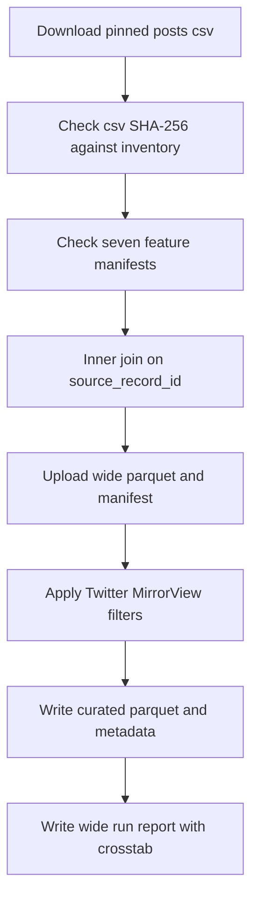

# Join seven Twitter LLM features and write the MirrorView export

## Remember
- Exact file paths always
- Exact commands with expected output
- DRY, YAGNI, frequent commits
- Use only the approved live runtime checks. Do not add or run automated tests.
- Delegated tasks must be impossible to misread.

## Overview

Operators need one Twitter table with 21 columns and a MirrorView curated export. The pull request adds one consolidator script that joins seven verified feature files to the pinned preprocessed csv, uploads the wide table, applies the existing Twitter MirrorView filters, and records the curated row count plus the stance by toxicity table.

## Happy flow

An operator runs the consolidator with the pinned dataset id, preprocessed run, and campaign id. The script checks hashes, writes the wide table, writes a timestamped MirrorView export, and prints the curated counts.

## Approach

Keep Twitter csv loading and Twitter column order inside the new consolidator. Do not call the Bluesky wide-table builder, because that reader expects parquet posts and the Bluesky 200000-row contract. Leave Bluesky constants unchanged. Leave Twitter MirrorView filter semantics unchanged. Do not add pytest.

## Decisions

- Pinned identities live in `/workspace/docs/plans/2026-09-07_generate_twitter_llm_features_e3c91a/campaign_contract.md`.
- Path helper calls use platform `twitter` and the pinned dataset id. Do not call the missing Bluesky path helper on `FeaturePaths`.
- The left table is S3 csv `posts.csv`. Verify SHA-256 against `/workspace/data_platform/data/twitter/twitter_fba4ddb2-fcf7-4a13-a7cc-0d98db44b547/s3_preprocessed_inventory.json`.
- Join on `CAST(source_record_id AS VARCHAR)`. Sort `source_record_id ASC`. Expected wide rows are 6374.
- Wide columns are the 21 names in the campaign contract, in that order. Forbidden extra columns include `author_id`, `toxicity_prob`, `toxicity_tier`, any `is_toxic_tiered` field, `label_timestamp`, and `run_id`.
- Feature label aliases stay as in the contract: `is_news_or_opinion.category` becomes `news_or_opinion_category`, and `llm_toxicity_tiered.toxicity_tier` becomes `llm_toxicity_tier`.
- The Twitter dataset file still says format csv, so the Twitter storage manager would write `mirrorview.csv`. Issue 235 requires `mirrorview.parquet`. Use `TwitterStorageManager("curated", dataset_id)` to create the run directory and write `metadata.json`. Upload parquet bytes to `curated/<timestamp>/mirrorview.parquet`. Do not change `dataset.json`.
- Curated files live under the dataset `curated/` stage, not under `wide/curated/`. Do not use the Bluesky storage manager.
- The report must include curated row count and a `political_stance` by `llm_toxicity_tier` table for rows that survive the filters. Stance rows are `left` and `right`. Toxicity columns are `low`, `medium`, and `high`.
- Do not edit `consolidate.py`. Copy the DuckDB feature-join pattern into the new module with Twitter columns and `read_csv` for posts.
- Implement-from-spec Phase 4 is the live runtime checks in the step files. Do not add files under `tests/`.

## Steps

### Step 1: Add the Twitter consolidator

Add `/workspace/data_platform/curate/consolidate_twitter_llm_campaign.py` with csv left-table load, manifest checks, 21-column join, wide upload, and MirrorView curation. See [steps/step1.md](steps/step1.md).

### Step 2: Run the live checks and write the report

Run the consolidator and the parquet column check. Write `/workspace/docs/plans/2026-09-07_generate_twitter_llm_features_e3c91a/reports/wide_run_report.md` with curated row count and the stance by toxicity table. See [steps/step2.md](steps/step2.md).

## What "done" looks like

1. Wide `features.parquet` has 6374 rows and 21 columns in contract order, with no nulls in the seven label columns.
2. Wide `manifest.json` links all seven feature manifests and the preprocessed csv SHA-256.
3. MirrorView curation writes `curated/<timestamp>/mirrorview.parquet` and `metadata.json` through the Twitter curated-stage manager.
4. The wide run report is committed with curated row count and the stance by toxicity table for valid curated rows.
5. Filter YAML semantics are unchanged.
6. No pytest file was added or run. Bluesky wide-row and column constants are unchanged.
