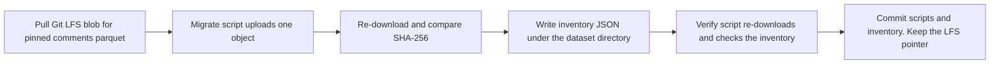

# Copy the pinned Reddit preprocessed comments parquet to S3

## Remember
- Exact file paths always
- Exact commands with expected output
- DRY, YAGNI, frequent commits
- Use only the approved live smoke checks. Do not add or run automated tests.
- Delegated tasks must be impossible to misread.

## Overview

Campaign workers for the Reddit LLM feature work need the pinned preprocessed comments file in the `mirrorview-experimental-artifacts` bucket. The file already lives in Git LFS under dataset `reddit_3d8a2c41-9b17-4e6f-a5d0-8c1b2e4f6079` and preprocessed run `2026_09_03-23:39:28`. The work uploads that one parquet file, checks SHA-256 against the local bytes, and commits an inventory JSON under the dataset directory. Git LFS keeps the local copy. The dataset manifest, raw Reddit files, dumps, Bluesky files, and pipeline storage code stay unchanged.

The package is one independently mergeable pull request for child issue [220](https://github.com/METResearchGroup/mirrorView-task/issues/220). The pull request is part of parent issue [218](https://github.com/METResearchGroup/mirrorView-task/issues/218). The parent issue stays open. Sibling issues stay out of the pull request.

## Happy flow

An operator pulls the Git LFS blob for the pinned comments parquet, runs the Reddit migrate script, then runs the Reddit verify script. The bucket holds one object at the repo-relative key. The inventory JSON lists that object, the pinned preprocessed run, and a SHA-256 of the full bytes. Git still tracks the parquet as an LFS pointer.

## Approach

Copy the Bluesky LFS to S3 migrate and verify scripts, then cut them down to one Reddit object. Reuse the existing S3 helper with no edits. The S3 key is the repo-relative path with forward slashes. Hash full object bytes with SHA-256. Never treat the S3 ETag as a content hash. Abort if the local file still starts with Git LFS pointer text after the scoped pull.

Do not add a shared migrate library. Do not upload a second Reddit file. Do not change how the pipeline reads storage. Temporary smoke files under `experiments/reddit_s3_preprocessed_smoke_2026_09_07/` may exist during review and must be deleted before the last commit.

## Decisions

- Upload scope is one file: `data_platform/data/reddit/reddit_3d8a2c41-9b17-4e6f-a5d0-8c1b2e4f6079/preprocessed/2026_09_03-23:39:28/comments.parquet`.
- Bucket is `mirrorview-experimental-artifacts` in `us-east-2`.
- Inventory path is `data_platform/data/reddit/reddit_3d8a2c41-9b17-4e6f-a5d0-8c1b2e4f6079/s3_preprocessed_inventory.json`. The JSON includes `preprocessed_run` set to `2026_09_03-23:39:28` and `object_count` set to 1.
- Content type for the parquet upload is `application/octet-stream`.
- After upload, the migrate script re-downloads the object and compares SHA-256. `HeadObject` is extra smoke in the AWS CLI, not the hash.
- Live smoke matches the Bluesky copy in issue 180. The epic has no pytest. Do not add or run files under `tests/`.
- Changelog is updated after the pull request exists.

## Steps

### Step 1: Add Reddit preprocessed migrate and verify scripts

Add `data_platform/scripts/migrate_reddit_preprocessed_to_s3.py` and `data_platform/scripts/verify_reddit_preprocessed_s3.py`. The migrate script pulls LFS for the scoped path, rejects pointer text, uploads one object, re-downloads for SHA-256, and writes the inventory JSON. The verify script reads the inventory and re-downloads the listed key. See [steps/step1.md](steps/step1.md).

### Step 2: Run live smoke and commit the inventory

Export lab AWS credentials, pull the scoped LFS blob, confirm parquet magic, run migrate, run verify, run `HeadObject`, confirm the LFS pointer remains, and confirm the inventory JSON. Commit the inventory after a successful upload. Delete any temporary smoke directory before the last product commit. See [steps/step2.md](steps/step2.md).

## What "done" looks like

1. The pinned comments parquet exists at `s3://mirrorview-experimental-artifacts/data_platform/data/reddit/reddit_3d8a2c41-9b17-4e6f-a5d0-8c1b2e4f6079/preprocessed/2026_09_03-23:39:28/comments.parquet`.
2. `s3_preprocessed_inventory.json` is committed under the pinned dataset directory with `object_count` 1, `preprocessed_run` `2026_09_03-23:39:28`, and a 64-character lowercase SHA-256. The S3 key starts with `data_platform/` and does not contain `data_platform/data_platform/`.
3. Git still tracks that parquet as an LFS pointer. `dataset.json`, raw Reddit files, dumps, Bluesky files, `.gitattributes`, and `StorageManager` are unchanged.
4. Migrate stdout ends like `uploaded 1 object to s3://mirrorview-experimental-artifacts/`. Verify stdout is `OK: 1/1 objects present with matching sha256`.
5. No automated test files were added or run.
