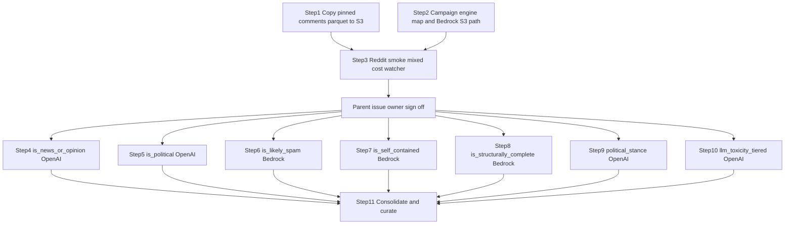

# Generate seven mixed-engine S3-backed LLM features for 400,000 Reddit comments

## Remember
- Exact file paths always
- Exact commands with expected output
- DRY and YAGNI
- Use only the approved smoke checks. Do not add or run automated tests.
- Frequent commits
- Delegated tasks must be impossible to misread.

## Overview

Generate seven LLM features for the pinned 400,000-comment Reddit dataset from PR #162. Upload only the preprocessed `comments.parquet` to the `mirrorview-experimental-artifacts` S3 bucket while keeping Git LFS for local development. Reuse the Bluesky epic S3 default backend, OpenAI Batch resume, 2,000-row Parquet campaign writer, progress watcher, and 30-day lifecycle rule for tagged batch objects.

Four features run on OpenAI Batch with `gpt-5.4-nano`. Three features run on Amazon Bedrock Converse with `us.amazon.nova-micro-v1:0`. Each feature run writes 200 immutable 2,000-row Parquet batch objects, a final feature Parquet file, a hash manifest, progress records, and a permanent run report. A final step joins the seven outputs with the complete preprocessed comment records and runs the MirrorView curation export.

## Happy flow

An operator merges Steps 1 through 3, then runs seven feature agents after explicit sign-off on the parent GitHub issue. Each agent runs the same ten-comment smoke sample once through `smoke_reddit_campaign.py` and posts its cost estimate to its feature issue. The parent issue records the mixed-engine aggregate estimate and waits for one owner approval before the agents process the remaining comments.

## Approach

Use the fixed dataset `reddit_3d8a2c41-9b17-4e6f-a5d0-8c1b2e4f6079` and preprocessed run `2026_09_03-23:39:28`. Record the input hash so a later dataset requires a separate campaign.

Store campaign artifacts under `s3://mirrorview-experimental-artifacts/data_platform/data/`. Use campaign id `reddit_2026_09_03_233928_llm_features_v1` and one isolated prefix per feature so parallel agents cannot change the same metadata. Keep one blocking provider job per OpenAI feature agent, persist provider job IDs in `active_openai_batch.json` before polling, and resume the existing provider job after an interruption. Bedrock features use `active_bedrock_job.json` as the resume cursor with one process and eight threads per part.

Smoke writes untagged evidence under `{feature}/smoke/` and never writes production `batches/part-*.parquet`. After parent approval, the first production job labels 1,990 new comments for OpenAI features, or processes one 2,000-comment part for Bedrock features. Those rows are combined with the ten unchanged smoke output rows into `part-00000.parquet` where the schedule requires it. The remaining parts each label 2,000 comments.

Bedrock content-filter failures are recorded in `errors.jsonl` with reason `bedrock_content_filter`, then retried through OpenAI Batch inside the same feature command. The manifest keeps `engine_type=bedrock` and adds an `openai_content_filter_retry` block. Other Bedrock failures stay failed.

Each feature issue is one future pull request. Temporary Git smoke inputs, outputs, cost records, and resume evidence are committed for review and removed before merge. S3 smoke evidence under `{feature}/smoke/` remains. The permanent run report records the S3 locations, hashes, model and prompt identity, costs, throughput, retries, validation checks, and label counts.

See `campaign_contract.md` for the full dependency graph, S3 layout, engine map, and schemas.

## Decisions

- Pinned identities, S3 layout, engine map, schemas, and the dependency graph live in `campaign_contract.md`.
- Each feature pull request runs one shared ten-comment smoke, then waits for aggregate parent-issue cost approval before the full 400,000-comment run.
- Human approval is recorded on the parent GitHub issue only. No repository approval file.
- Do not add or run automated tests. Use only the approved smoke and basic runtime checks defined in the step specs.
- Do not change global feature registry defaults. The campaign engine map overrides engines per feature for this campaign only.
- Do not add a new lifecycle issue. The existing 30-day rule already covers objects tagged `intermediate-artifact=true` under `data_platform/data/`.
- The watcher CLI never posts to GitHub. An external agent posts prepared markdown.

## Steps

### Step 1: Copy the pinned Reddit preprocessed comments parquet to S3

Upload `comments.parquet` for dataset `reddit_3d8a2c41-9b17-4e6f-a5d0-8c1b2e4f6079` and run `2026_09_03-23:39:28` to the matching S3 key, verify the object with SHA-256, and keep the Git LFS copy and `dataset.json` with format `parquet`. No dependencies.

### Step 2: Add a campaign engine map and Bedrock S3 campaign path

Add a per-campaign engine map that routes four features to OpenAI Batch and three to Bedrock Converse without changing global registry defaults. Add Bedrock campaign resume state at `active_bedrock_job.json`, record `engine_type` on `manifest.json` and local `metadata.json`, and require `platform=reddit` and `dataset_id` when resolving feature paths. No dependencies. A fake bucket is acceptable during development.

### Step 3: Add Reddit campaign smoke, mixed-engine cost aggregate, and watcher platform flags

Add `smoke_reddit_campaign.py` with the shared ten-comment sample, a mixed-engine cost aggregate command, and watcher CLI flags `--platform` and `--dataset-id`. Depends on Steps 1 and 2.

### Step 4: Generate is_news_or_opinion for 400,000 Reddit comments

Run the approved smoke and full generation flow for `is_news_or_opinion` on OpenAI Batch. Publish its final Parquet file, manifest, progress history, validation results, and permanent run report. Depends on Steps 1, 2, and 3, plus parent issue sign-off. May run in parallel with Steps 5 through 10 after sign-off.

### Step 5: Generate is_political for 400,000 Reddit comments

Run the approved smoke and full generation flow for `is_political` on OpenAI Batch. Publish its final Parquet file, manifest, progress history, validation results, and permanent run report. Depends on Steps 1, 2, and 3, plus parent issue sign-off. May run in parallel with Steps 4 and 6 through 10 after sign-off.

### Step 6: Generate is_likely_spam for 400,000 Reddit comments

Run the approved smoke and full generation flow for `is_likely_spam` on Bedrock Converse with one process and eight threads per part. Publish its final Parquet file, manifest, progress history, validation results, and permanent run report. Depends on Steps 1, 2, and 3, plus parent issue sign-off. May run in parallel with Steps 4, 5, and 7 through 10 after sign-off. At most three Bedrock feature agents may run at once.

### Step 7: Generate is_self_contained for 400,000 Reddit comments

Run the approved smoke and full generation flow for `is_self_contained` on Bedrock Converse with one process and eight threads per part. Publish its final Parquet file, manifest, progress history, validation results, and permanent run report. Depends on Steps 1, 2, and 3, plus parent issue sign-off. May run in parallel with Steps 4 through 6 and 8 through 10 after sign-off. At most three Bedrock feature agents may run at once.

### Step 8: Generate is_structurally_complete for 400,000 Reddit comments

Run the approved smoke and full generation flow for `is_structurally_complete` on Bedrock Converse with one process and eight threads per part. Publish its final Parquet file, manifest, progress history, validation results, and permanent run report. Depends on Steps 1, 2, and 3, plus parent issue sign-off. May run in parallel with Steps 4 through 7 and 9 and 10 after sign-off. At most three Bedrock feature agents may run at once.

### Step 9: Generate political_stance for 400,000 Reddit comments

Run the approved smoke and full generation flow for `political_stance` on OpenAI Batch. Publish its final Parquet file, manifest, progress history, validation results, and permanent run report. Depends on Steps 1, 2, and 3, plus parent issue sign-off. May run in parallel with Steps 4 through 8 and 10 after sign-off.

### Step 10: Generate llm_toxicity_tiered for 400,000 Reddit comments

Run the approved smoke and full generation flow for `llm_toxicity_tiered` on OpenAI Batch. Keep its output distinct from the Perspective API toxicity feature, and publish its final Parquet file, manifest, progress history, validation results, and permanent run report. Depends on Steps 1, 2, and 3, plus parent issue sign-off. May run in parallel with Steps 4 through 9 after sign-off.

### Step 11: Consolidate seven Reddit LLM features and write the MirrorView curated export

Join the seven verified feature outputs to all nine preprocessed comment columns by `source_record_id` through `consolidate_reddit_llm_campaign.py`. Require exactly 400,000 unique records with no missing feature values, publish the wide artifact, hash manifest, validation results, and permanent report, then run `data_platform/curate/configs/reddit/mirrorview.yaml`. Depends on Steps 4 through 10.

## What "done" looks like

1. The pinned preprocessed `comments.parquet` is available from S3 with a verified hash, and Git LFS still holds the local copy.
2. Seven feature issues each produce exactly 400,000 unique, valid LLM labels across 200 batch objects and one permanent run report.
3. OpenAI features resume without duplicate provider jobs or duplicate charges. Bedrock features resume from `active_bedrock_job.json` without exceeding three parallel agents or six Bedrock processes.
4. Each issue reports progress every 10,000 durable records and records estimated and actual cost.
5. One wide Parquet artifact contains the nine pinned comment columns and all seven LLM feature outputs, and the MirrorView curation export is written from `reddit/mirrorview.yaml`.
6. Intermediate batches expire after 30 days under the existing lifecycle rule, while final artifacts and audit records remain in S3.
