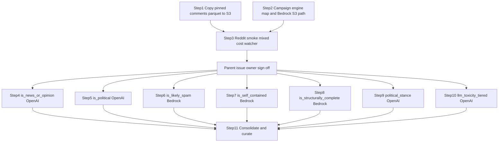

# Generate seven mixed-engine S3-backed LLM features for 400,000 Reddit comments

No feature agent should touch production batches until the repository owner signs off on the mixed-engine cost in the parent GitHub issue, because a mistaken full run on 400,000 comments is expensive to unwind.

## Remember
- Exact file paths always
- Exact commands with expected output
- DRY and YAGNI
- Use only the approved smoke checks. Do not add or run automated tests.
- Frequent commits
- Delegated tasks must be impossible to misread.

## Overview

The campaign labels PR #162's pinned 400,000 Reddit comments with seven LLM features, reusing the Bluesky epic's S3 backend, OpenAI Batch resume, 2,000-row Parquet writer, progress watcher, and 30-day lifecycle rule for tagged batch objects. Reddit differs in two ways: operators upload only preprocessed `comments.parquet` to `mirrorview-experimental-artifacts` while Git LFS keeps the local copy, and four features run on OpenAI Batch (`gpt-5.4-nano`) while three run on Bedrock Converse (`us.amazon.nova-micro-v1:0`). Each feature writes 200 immutable batch objects, `final.parquet`, a SHA-256 manifest, progress records, and a permanent run report. Step 11 joins all seven outputs to the nine preprocessed comment columns and runs the MirrorView curation export.

## Happy flow

The operator merges Steps 1 through 3, then each of seven feature agents runs the same ten-comment smoke once through `smoke_reddit_campaign.py` and posts a per-feature cost estimate. The parent issue holds the mixed-engine aggregate until the repository owner approves production labeling, and only then may agents process the remaining 399,990 comments per feature.

## Approach

Pin dataset `reddit_3d8a2c41-9b17-4e6f-a5d0-8c1b2e4f6079` and preprocessed run `2026_09_03-23:39:28`, and record the input hash so a different dataset forces a new campaign id.

Campaign artifacts live under `s3://mirrorview-experimental-artifacts/data_platform/data/` with campaign id `reddit_2026_09_03_233928_llm_features_v1` and one isolated prefix per feature, so parallel agents never overwrite each other's metadata. OpenAI features keep one blocking Batch job per agent, persist provider job IDs in `active_openai_batch.json` before polling, and resume the same job after interruption. Bedrock features resume through `active_bedrock_job.json` with one process and eight threads per 2,000-row part, and at most three Bedrock agents may run at once because throughput experiments showed throttling above four eight-thread processes.

Smoke writes untagged evidence under `{feature}/smoke/` and never writes production `batches/part-*.parquet`. After parent approval, `part-00000` folds ten unchanged smoke rows with 1,990 new labels (OpenAI) or one full Bedrock part, and parts `part-00001` through `part-00199` each add 2,000 new labels.

When Bedrock blocks a comment on content filter, the operator records `bedrock_content_filter` in `errors.jsonl` and retries that id through OpenAI Batch inside the same feature command, which adds OpenAI cost that smoke estimates may undercount. The manifest keeps `engine_type=bedrock` and adds an `openai_content_filter_retry` block; other Bedrock failures stay failed.

Each feature issue maps to one pull request. Temporary Git smoke artifacts are committed for review and deleted before merge, while S3 smoke evidence under `{feature}/smoke/` remains. The permanent run report records S3 locations, hashes, model and prompt identity, costs, throughput, retries, validation checks, and label counts.

See `campaign_contract.md` for the dependency graph, S3 layout, engine map, and schemas.

## Decisions

- Pinned identities, S3 layout, engine map, schemas, and the dependency graph live in `campaign_contract.md`.
- Each feature pull request runs one shared ten-comment smoke, then waits for parent-issue cost approval before the 400,000-comment run.
- The repository owner records approval on the parent GitHub issue only; there is no `APPROVED.txt` or other repository gate.
- Steps 4 through 10 use live smoke and basic runtime checks only; do not add automated tests.
- The campaign engine map overrides engines per feature for `reddit_2026_09_03_233928_llm_features_v1` only; do not change global `FEATURE_REGISTRY` defaults.
- The existing 30-day lifecycle rule already expires objects tagged `intermediate-artifact=true` under `data_platform/data/`; do not open a new lifecycle issue.
- The watcher CLI prints prepared markdown and never posts to GitHub; an external agent posts feature-issue comments.

## Steps

### Step 1: Copy the pinned Reddit preprocessed comments parquet to S3

Upload `comments.parquet` for dataset `reddit_3d8a2c41-9b17-4e6f-a5d0-8c1b2e4f6079` and run `2026_09_03-23:39:28` to the matching S3 key, verify the object with SHA-256, and keep the Git LFS copy and `dataset.json` with format `parquet`. No dependencies.

### Step 2: Add a campaign engine map and Bedrock S3 campaign path

Add a per-campaign engine map that routes four features to OpenAI Batch and three to Bedrock Converse without changing global registry defaults. Add Bedrock campaign resume state at `active_bedrock_job.json`, record `engine_type` on `manifest.json` and local `metadata.json`, and require `platform=reddit` and `dataset_id` when resolving feature paths. No dependencies. A fake bucket is acceptable during development.

### Step 3: Add Reddit campaign smoke, mixed-engine cost aggregate, and watcher platform flags

Add `smoke_reddit_campaign.py` with the shared ten-comment sample, a mixed-engine cost aggregate command, and watcher CLI flags `--platform` and `--dataset-id`. Depends on Steps 1 and 2.

### Step 4: Generate is_news_or_opinion for 400,000 Reddit comments

Run the approved smoke and full generation flow for `is_news_or_opinion` on OpenAI Batch. Publish its final Parquet file, manifest, progress history, validation results, and permanent run report. Depends on Steps 1, 2, and 3, plus parent issue sign-off. May run in parallel with Steps 5 through 10 after sign-off.

### Step 5: Generate is_political for 400,000 Reddit comments

Run the approved smoke and full generation flow for `is_political` on OpenAI Batch. Publish its final Parquet file, manifest, progress history, validation results, and permanent run report. Depends on Steps 1, 2, and 3, plus parent issue sign-off. May run in parallel with Steps 4 and 6 through 10 after sign-off.

### Step 6: Generate is_likely_spam for 400,000 Reddit comments

Run the approved smoke and full generation flow for `is_likely_spam` on Bedrock Converse with one process and eight threads per part. Publish its final Parquet file, manifest, progress history, validation results, and permanent run report. Depends on Steps 1, 2, and 3, plus parent issue sign-off. May run in parallel with Steps 4, 5, and 7 through 10 after sign-off. At most three Bedrock feature agents may run at once.

### Step 7: Generate is_self_contained for 400,000 Reddit comments

Run the approved smoke and full generation flow for `is_self_contained` on Bedrock Converse with one process and eight threads per part. Publish its final Parquet file, manifest, progress history, validation results, and permanent run report. Depends on Steps 1, 2, and 3, plus parent issue sign-off. May run in parallel with Steps 4 through 6 and 8 through 10 after sign-off. At most three Bedrock feature agents may run at once.

### Step 8: Generate is_structurally_complete for 400,000 Reddit comments

Run the approved smoke and full generation flow for `is_structurally_complete` on Bedrock Converse with one process and eight threads per part. Publish its final Parquet file, manifest, progress history, validation results, and permanent run report. Depends on Steps 1, 2, and 3, plus parent issue sign-off. May run in parallel with Steps 4 through 7 and 9 and 10 after sign-off. At most three Bedrock feature agents may run at once.

### Step 9: Generate political_stance for 400,000 Reddit comments

Run the approved smoke and full generation flow for `political_stance` on OpenAI Batch. Publish its final Parquet file, manifest, progress history, validation results, and permanent run report. Depends on Steps 1, 2, and 3, plus parent issue sign-off. May run in parallel with Steps 4 through 8 and 10 after sign-off.

### Step 10: Generate llm_toxicity_tiered for 400,000 Reddit comments

Run the approved smoke and full generation flow for `llm_toxicity_tiered` on OpenAI Batch. Keep its output distinct from the Perspective API toxicity feature, and publish its final Parquet file, manifest, progress history, validation results, and permanent run report. Depends on Steps 1, 2, and 3, plus parent issue sign-off. May run in parallel with Steps 4 through 9 after sign-off.

### Step 11: Consolidate seven Reddit LLM features and write the MirrorView curated export

Join the seven verified feature outputs to all nine preprocessed comment columns by `source_record_id` through `consolidate_reddit_llm_campaign.py`. Require exactly 400,000 unique records with no missing feature values, publish the wide artifact, hash manifest, validation results, and permanent report, then run `data_platform/curate/configs/reddit/mirrorview.yaml`. Depends on Steps 4 through 10.

## What "done" looks like

1. The pinned preprocessed `comments.parquet` is available from S3 with a verified hash, and Git LFS still holds the local copy.
2. Seven feature issues each produce exactly 400,000 unique, valid LLM labels across 200 batch objects and one permanent run report.
3. OpenAI features resume without duplicate provider jobs or duplicate charges. Bedrock features resume from `active_bedrock_job.json` without exceeding three parallel agents or six Bedrock processes.
4. Each issue reports progress every 10,000 durable records and records estimated and actual cost.
5. One wide Parquet artifact contains the nine pinned comment columns and all seven LLM feature outputs, and the MirrorView curation export is written from `reddit/mirrorview.yaml`.
6. Intermediate batches expire after 30 days under the existing lifecycle rule, while final artifacts and run metadata remain in S3.
