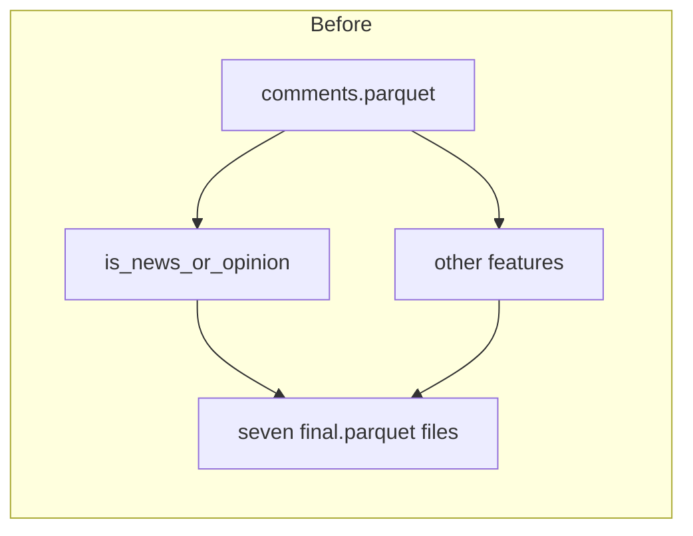
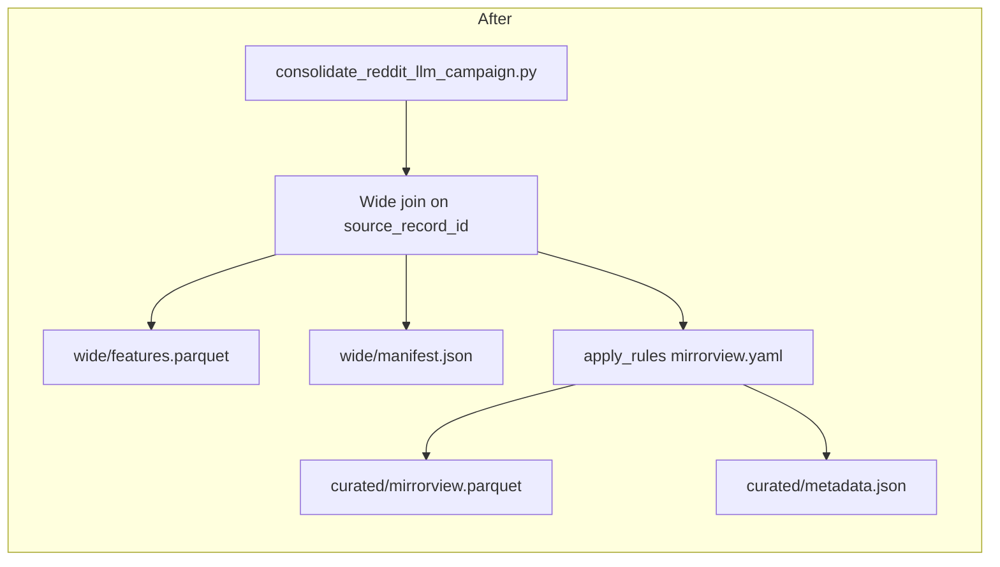

# Step 11: Consolidate seven Reddit LLM features and write the MirrorView curated export

## Goal

MirrorView curation needs one wide table with all seven LLM columns and no missing rows, so the implementer joins seven verified `final.parquet` files to nine preprocessed comment columns on `source_record_id`, validates exactly 400,000 unique rows, uploads `wide/features.parquet`, and runs `data_platform/curate/configs/reddit/mirrorview.yaml`. Unlike Steps 4 through 10, the pull request may change consolidation code and commits `reports/wide_run_report.md` with a `political_stance` by `llm_toxicity_tier` crosstab.

## Dependencies

Do not start until all seven feature run reports are merged and each lists the final S3 URI and manifest digest used as input here. See `docs/plans/2026-09-07_generate_reddit_llm_features_c7a14e/campaign_contract.md`.

| Dependency | Requirement |
|------------|-------------|
| Step 4 + `reports/is_news_or_opinion_run_report.md` | Final `is_news_or_opinion/final.parquet` verified at 400000 rows |
| Step 5 + `reports/is_political_run_report.md` | Final `is_political/final.parquet` verified at 400000 rows |
| Step 6 + `reports/is_likely_spam_run_report.md` | Final `is_likely_spam/final.parquet` verified at 400000 rows |
| Step 7 + `reports/is_self_contained_run_report.md` | Final `is_self_contained/final.parquet` verified at 400000 rows |
| Step 8 + `reports/is_structurally_complete_run_report.md` | Final `is_structurally_complete/final.parquet` verified at 400000 rows |
| Step 9 + `reports/political_stance_run_report.md` | Final `political_stance/final.parquet` verified at 400000 rows |
| Step 10 + `reports/llm_toxicity_tiered_run_report.md` | Final `llm_toxicity_tiered/final.parquet` verified; no Perspective run |

Each merged feature report must list the final S3 URI and manifest digest used as inputs here.

## Main caller and implementation work

**Main caller:** `data_platform/curate/consolidate_reddit_llm_campaign.py` (new sibling of `consolidate_bluesky_llm_campaign.py`).

**Task:** read pinned preprocessed `comments.parquet` and seven `final.parquet` files from S3, build the wide table, validate row completeness, upload `wide/features.parquet` and `wide/manifest.json`, apply `data_platform/curate/configs/reddit/mirrorview.yaml` to the wide table, write `curated/<timestamp>/mirrorview.parquet` and `metadata.json` through `RedditStorageManager("curated", dataset_id)`, and commit `reports/wide_run_report.md`.

**Out of scope:** Re-running any feature campaign, changing feature prompts or engines, changing MirrorView YAML filter semantics, relabeling feature columns, automated tests, temporary smoke artifacts, or edits to completed feature run reports.

## Pinned identities

| Field | Value |
|-------|-------|
| Dataset id | `reddit_3d8a2c41-9b17-4e6f-a5d0-8c1b2e4f6079` |
| Preprocessed run | `2026_09_03-23:39:28` |
| Campaign id | `reddit_2026_09_03_233928_llm_features_v1` |
| Join key | `source_record_id` |
| Expected row count | `400000` |
| Deterministic sort | `ORDER BY source_record_id ASC` |

Feature root:

`s3://mirrorview-experimental-artifacts/data_platform/data/reddit/reddit_3d8a2c41-9b17-4e6f-a5d0-8c1b2e4f6079/features/reddit_2026_09_03_233928_llm_features_v1/`

Preprocessed input:

`s3://mirrorview-experimental-artifacts/data_platform/data/reddit/reddit_3d8a2c41-9b17-4e6f-a5d0-8c1b2e4f6079/preprocessed/2026_09_03-23:39:28/comments.parquet`

Feature inputs (`final.parquet` only):

| Feature | S3 object |
|---------|-----------|
| `is_news_or_opinion` | `.../is_news_or_opinion/final.parquet` |
| `is_political` | `.../is_political/final.parquet` |
| `is_likely_spam` | `.../is_likely_spam/final.parquet` |
| `is_self_contained` | `.../is_self_contained/final.parquet` |
| `is_structurally_complete` | `.../is_structurally_complete/final.parquet` |
| `political_stance` | `.../political_stance/final.parquet` |
| `llm_toxicity_tiered` | `.../llm_toxicity_tiered/final.parquet` |

Wide outputs (untagged):

| Object | Path |
|--------|------|
| Wide parquet | `.../wide/features.parquet` |
| Wide manifest | `.../wide/manifest.json` |

Curated outputs (dataset stage, not under `wide/`):

| Object | Path pattern |
|--------|--------------|
| Curated parquet | `s3://mirrorview-experimental-artifacts/data_platform/data/reddit/reddit_3d8a2c41-9b17-4e6f-a5d0-8c1b2e4f6079/curated/<timestamp>/mirrorview.parquet` |
| Curated metadata | `s3://mirrorview-experimental-artifacts/data_platform/data/reddit/reddit_3d8a2c41-9b17-4e6f-a5d0-8c1b2e4f6079/curated/<timestamp>/metadata.json` |

Repository permanent report:

`/workspace/docs/plans/2026-09-07_generate_reddit_llm_features_c7a14e/reports/wide_run_report.md`

## Wide-table schema

The wide file must contain exactly sixteen columns in this order.

### Nine preprocessed columns

`comment_fullname`, `record_id`, `author`, `body`, `created_at`, `sync_timestamp`, `text`, `author_handle`, `source_record_id`

Do not include Bluesky or Twitter post columns such as `uri`, `url`, `like_count`, `repost_count`, `reply_count`, or `quote_count`.

### Seven aliased label columns

| Wide column | Source feature | Source column | Accepted values |
|-------------|----------------|---------------|-----------------|
| `news_or_opinion_category` | `is_news_or_opinion` | `category` | `news`, `opinion`, `neither` |
| `is_political` | `is_political` | `is_political` | boolean |
| `is_likely_spam` | `is_likely_spam` | `is_likely_spam` | boolean |
| `is_self_contained` | `is_self_contained` | `is_self_contained` | boolean |
| `is_structurally_complete` | `is_structurally_complete` | `is_structurally_complete` | boolean |
| `political_stance` | `political_stance` | `political_stance` | `left`, `right`, `neutral`, `unclear` |
| `llm_toxicity_tier` | `llm_toxicity_tiered` | `toxicity_tier` | `low`, `medium`, `high` |

Forbidden wide columns: `toxicity_prob`, `toxicity_tier`, any `is_toxic_tiered` field, `label_timestamp`, `run_id`, or duplicate feature-id columns.

Join rule: inner join preprocessed comments to each feature file on `CAST(source_record_id AS VARCHAR)`. Deduplicate feature rows by latest `label_timestamp` per `source_record_id` before joining.

## MirrorView curation

Rules file: `data_platform/curate/configs/reddit/mirrorview.yaml`. Use the same AND filters as Bluesky MirrorView. Do not change YAML semantics in this step.

| Filter | Value |
|--------|-------|
| `news_or_opinion_category` | `opinion` |
| `is_political` | `true` |
| `is_likely_spam` | `false` |
| `political_stance` | `left` or `right` |
| `is_self_contained` | `true` |
| `is_structurally_complete` | `true` |

Apply filters in YAML order through `apply_rules`. Write the filtered dataframe with `RedditStorageManager("curated", dataset_id)`, not `BlueskyStorageManager` and not under `wide/curated/`. The export filename comes from the YAML `output.stem` (`mirrorview.parquet`).

The wide manifest may record curated output keys and digests. The permanent report must include curated row count, per-filter before and passing counts, curated object URIs and SHA-256 digests, and a `political_stance` by `llm_toxicity_tier` crosstab for `left` and `right` rows only.

## Files to inspect (read-only)

| Path | Why |
|------|-----|
| `/workspace/docs/plans/2026-09-07_generate_reddit_llm_features_c7a14e/campaign_contract.md` | Wide schema and input paths |
| `/workspace/data_platform/curate/consolidate_bluesky_llm_campaign.py` | Shipped sibling that joins, curates, and uploads |
| `/workspace/data_platform/curate/consolidate.py` | Existing DuckDB join pattern and campaign column maps |
| `/workspace/data_platform/curate/apply_rules.py` | MirrorView filter application |
| `/workspace/data_platform/curate/curate_reddit.py` | Dataset-stage curated export layout for Reddit |
| `/workspace/data_platform/curate/runner.py` | Metadata and hash patterns |
| `/workspace/data_platform/models/sync.py` | `PreprocessedRedditCommentModel` column names |
| `/workspace/data_platform/generate_features/registry.py` | Raw feature output schemas |
| `/workspace/data_platform/curate/configs/reddit/mirrorview.yaml` | Locked filter semantics |
| `/workspace/docs/plans/2026-09-07_generate_reddit_llm_features_c7a14e/reports/*_run_report.md` | Input URIs and manifest digests from Steps 4 through 10 |
| `/workspace/docs/plans/2026-09-05_generate_bluesky_llm_features_4d8a7c/reports/wide_run_report.md` | Report shape for wide plus curated sections |
| `/workspace/AGENTS.md` | AWS credential export, `PYTHONPATH=.` |

## Files allowed to change

- `/workspace/data_platform/curate/consolidate.py` (add Reddit preprocessed column list, expected row count 400000, and Reddit wide join helpers)
- `/workspace/data_platform/curate/consolidate_reddit_llm_campaign.py` (new CLI)
- `/workspace/docs/plans/2026-09-07_generate_reddit_llm_features_c7a14e/reports/wide_run_report.md` (permanent report only)
- S3 objects under `.../wide/` and `.../curated/<timestamp>/`

## Files forbidden to change

- `/workspace/docs/plans/2026-09-07_generate_reddit_llm_features_c7a14e/plan.md`
- `/workspace/data_platform/generate_features/**`
- `/workspace/data_platform/curate/configs/reddit/mirrorview.yaml`
- `/workspace/docs/plans/2026-09-07_generate_reddit_llm_features_c7a14e/reports/*_run_report.md` except cross-links inside the wide report
- `/workspace/tests/**`
- `/workspace/CHANGELOG.md`
- Feature S3 prefixes (read-only inputs)
- Any temporary smoke paths under `reports/smoke/`

## Locked contracts

See `campaign_contract.md` when present. `wide/manifest.json` must link all seven per-feature `manifest.json` files plus the preprocessed input hash. Use SHA-256 only; never ETag. Wide objects stay untagged.

## Ordered implementation work

1. Verify each of the seven feature manifests matches its `final.parquet` SHA-256 and row count 400000.
2. Load only pinned preprocessed run `2026_09_03-23:39:28` (`comments.parquet`).
3. Build wide dataframe with exactly sixteen columns.
4. Sort by `source_record_id` ascending before writing Parquet.
5. Apply `mirrorview.yaml` through `apply_rules` and upload curated parquet and metadata with `RedditStorageManager("curated", dataset_id)`.
6. Write `wide/features.parquet` and `wide/manifest.json`.
7. Write `reports/wide_run_report.md` with curated row count and stance by toxicity crosstab.
8. Run runtime validation commands below.

## Exact commands and expected output

```bash
export AWS_ACCESS_KEY_ID="$LAB_AWS_ACCESS_KEY_ID"
export AWS_SECRET_ACCESS_KEY="$LAB_AWS_ACCESS_KEY_SECRET"
uv sync
```

### Build wide artifact, curate, and upload (available after this step's implementation)

```bash
PYTHONPATH=. uv run python data_platform/curate/consolidate_reddit_llm_campaign.py \
  --dataset-id reddit_3d8a2c41-9b17-4e6f-a5d0-8c1b2e4f6079 \
  --preprocessed-run 2026_09_03-23:39:28 \
  --campaign-id reddit_2026_09_03_233928_llm_features_v1 \
  --output-s3-uri s3://mirrorview-experimental-artifacts/data_platform/data/reddit/reddit_3d8a2c41-9b17-4e6f-a5d0-8c1b2e4f6079/features/reddit_2026_09_03_233928_llm_features_v1/wide/features.parquet
```

Expected stdout includes:

- Seven input manifest digests accepted
- `wide_rows=400000`
- `wide_columns=16`
- `manifest=s3://.../wide/manifest.json`
- `sort_key=source_record_id ASC`
- `curated_rows=<n>`
- `curated=s3://.../curated/<timestamp>/mirrorview.parquet`
- `curated_crosstab_political_stance_by_llm_toxicity_tier=` followed by JSON for `left` and `right` by `low`, `medium`, `high`

### Runtime validation (wide table)

```bash
export AWS_ACCESS_KEY_ID="$LAB_AWS_ACCESS_KEY_ID"
export AWS_SECRET_ACCESS_KEY="$LAB_AWS_ACCESS_KEY_SECRET"

PYTHONPATH=. uv run python - <<'PY'
import duckdb

wide = "s3://mirrorview-experimental-artifacts/data_platform/data/reddit/reddit_3d8a2c41-9b17-4e6f-a5d0-8c1b2e4f6079/features/reddit_2026_09_03_233928_llm_features_v1/wide/features.parquet"
comments = "s3://mirrorview-experimental-artifacts/data_platform/data/reddit/reddit_3d8a2c41-9b17-4e6f-a5d0-8c1b2e4f6079/preprocessed/2026_09_03-23:39:28/comments.parquet"

expected_cols = [
    "comment_fullname", "record_id", "author", "body", "created_at",
    "sync_timestamp", "text", "author_handle", "source_record_id",
    "news_or_opinion_category", "is_political", "is_likely_spam",
    "is_self_contained", "is_structurally_complete", "political_stance",
    "llm_toxicity_tier",
]
con = duckdb.connect()
cols = [r[0] for r in con.execute(f"DESCRIBE SELECT * FROM read_parquet('{wide}')").fetchall()]
assert cols == expected_cols, cols

stats = con.execute(f"""
SELECT
  COUNT(*) AS n,
  COUNT(DISTINCT source_record_id) AS uniq,
  SUM(CASE WHEN llm_toxicity_tier IS NULL THEN 1 ELSE 0 END) AS null_tox
FROM read_parquet('{wide}')
""").fetchone()
print(stats)
assert stats[0] == 400000 and stats[1] == 400000 and stats[2] == 0

missing = con.execute(f"""
SELECT COUNT(*)
FROM read_parquet('{comments}') p
LEFT JOIN read_parquet('{wide}') w USING (source_record_id)
WHERE w.source_record_id IS NULL
""").fetchone()[0]
assert missing == 0
print("wide validation ok")
PY
```

Expected: `wide validation ok` and exit code 0.

### Manifest check

```bash
aws s3 cp s3://mirrorview-experimental-artifacts/data_platform/data/reddit/reddit_3d8a2c41-9b17-4e6f-a5d0-8c1b2e4f6079/features/reddit_2026_09_03_233928_llm_features_v1/wide/manifest.json -
```

Expected: JSON with wide parquet SHA-256, row count 400000, sixteen-column list, links to all seven feature manifests, and a `curated` block when curation ran in the same CLI call.

## Acceptance criteria

- Wide Parquet and manifest exist at `wide/features.parquet` and `wide/manifest.json`, both untagged.
- Exactly 400000 unique rows, sixteen exact columns, no null feature values.
- Rows sorted by `source_record_id` ascending.
- No Perspective columns or artifacts.
- Curated parquet and metadata exist under `curated/<timestamp>/` for the dataset id, not under `wide/curated/`.
- `reports/wide_run_report.md` committed with input hashes, wide output hash, curated row count, filter step counts, curated object digests, and `political_stance` by `llm_toxicity_tier` crosstab.
- No automated tests added or run.

## Failure conditions

- Any missing or unverified feature `final.parquet` input.
- Join on `comment_fullname` without aligning `source_record_id`, or outer join leaving null features.
- Row count other than 400000 or duplicate `source_record_id` values.
- Missing, renamed, or extra columns in the wide output.
- Bluesky-only columns (`uri`, `url`, engagement counts) present in the wide file.
- Raw `toxicity_tier` wide column instead of `llm_toxicity_tier`.
- Manifest missing links to all seven feature manifests.
- Curated export written under `wide/curated/` or through the wrong storage manager.
- Changed MirrorView YAML filter semantics or relabeled feature columns.
- Using `campaigns/` prefix, `reddit_llm_features_wide.parquet`, or `manifest.sha256.json`.
- Accepting ETag instead of SHA-256 for manifest verification.
- Temporary smoke artifacts added to this PR.
- Any LLM or OpenAI Batch call in this PR.
- Any automated test added or run.

## PR artifact and commit rules

- Commit consolidation code and `reports/wide_run_report.md` only.
- PR title: `Consolidate seven Reddit LLM features and write the MirrorView curated export`
- Do not edit `plan.md` or other step specs.

## GitHub issue body

Join seven verified Reddit LLM feature `final.parquet` files to pinned preprocessed `comments.parquet` on `source_record_id`. Write untagged `wide/features.parquet` and `wide/manifest.json` for campaign `reddit_2026_09_03_233928_llm_features_v1` with 400000 rows and sixteen columns. Apply `data_platform/curate/configs/reddit/mirrorview.yaml` and write `curated/<timestamp>/mirrorview.parquet` plus `metadata.json` through `RedditStorageManager("curated", dataset_id)`. The work depends on Steps 4 through 10 merged with verified `final.parquet` at 400000 rows each.

Plan step: `docs/plans/2026-09-07_generate_reddit_llm_features_c7a14e/steps/step11.md`

Done when:

- `wide/features.parquet` has exactly 400000 rows, sixteen columns, and no missing feature values.
- `wide/manifest.json` links all seven feature manifests and the preprocessed input hash.
- MirrorView curation writes `curated/<timestamp>/mirrorview.parquet` and `metadata.json`.
- `reports/wide_run_report.md` is committed with curated row count and `political_stance` by `llm_toxicity_tier` crosstab.

## Pull request description

# Consolidate seven Reddit LLM features and write the MirrorView curated export

Fixes #<child>

Part of #<parent>

## Summary

Adds `consolidate_reddit_llm_campaign.py` to join seven verified `final.parquet` files to pinned preprocessed comments, upload `wide/features.parquet` with a SHA-256 manifest, and write a MirrorView curated export for dataset `reddit_3d8a2c41-9b17-4e6f-a5d0-8c1b2e4f6079`.

The caller verifies each feature manifest, inner-joins on `source_record_id`, sorts ascending, writes untagged `wide/features.parquet` and `wide/manifest.json`, applies existing MirrorView AND filters, and writes `curated/<timestamp>/mirrorview.parquet` with `metadata.json` under the dataset curated stage.

## Purpose

Analysts need one sixteen-column wide table with no missing labels before MirrorView filters run, so the implementer validates 400,000 unique `source_record_id` rows, applies `reddit/mirrorview.yaml` without changing filter semantics, and commits `reports/wide_run_report.md` with a stance-by-toxicity crosstab.

Out of scope: re-running features, editing YAML semantics, Perspective columns, smoke artifacts, and automated tests.

## Architecture

Components:

- `consolidate_reddit_llm_campaign.py`: CLI entry point. Verifies inputs, orchestrates join, curation, and uploads.
- `consolidate.py`: DuckDB wide join helpers and Reddit sixteen-column contract.
- `apply_rules.py`: loads `mirrorview.yaml` and returns filtered dataframe plus per-step counts.
- `RedditStorageManager`: writes curated parquet and metadata under `curated/<timestamp>/`.
- `CampaignObjectStore`: reads feature inputs and writes wide objects under the campaign prefix.

Existing flow (seven separate feature outputs):



New flow:



## Interfaces

### CLI

`PYTHONPATH=. uv run python data_platform/curate/consolidate_reddit_llm_campaign.py`

Flags:

- `--dataset-id`: `reddit_3d8a2c41-9b17-4e6f-a5d0-8c1b2e4f6079`
- `--preprocessed-run`: `2026_09_03-23:39:28`
- `--campaign-id`: `reddit_2026_09_03_233928_llm_features_v1`
- `--output-s3-uri`: full URI ending in `wide/features.parquet`
- `--curate-config`: optional. Defaults to `data_platform/curate/configs/reddit/mirrorview.yaml`

### Data / schema contracts

| Field | Type | Notes |
| ----- | ---- | ----- |
| Wide rows | int | Exactly 400000 |
| Wide columns | sixteen names | Nine preprocessed plus seven labels; see step spec |
| Sort | string | `source_record_id ASC` |
| `wide/manifest.json` | JSON | SHA-256 for wide parquet, preprocessed hash, seven feature manifest links |
| Curated parquet | Parquet | MirrorView-filtered subset of wide rows |
| Curated metadata | JSON | Rules hash, filter step counts, stance by toxicity crosstab |

### Configuration

- `data_platform/curate/configs/reddit/mirrorview.yaml`: locked AND filters. Not edited in the pull request.
- `LAB_AWS_ACCESS_KEY_ID` / `LAB_AWS_ACCESS_KEY_SECRET`: export as standard AWS variables before S3 access.

## How to run

```bash
export AWS_ACCESS_KEY_ID="$LAB_AWS_ACCESS_KEY_ID"
export AWS_SECRET_ACCESS_KEY="$LAB_AWS_ACCESS_KEY_SECRET"
uv sync
```

```bash
PYTHONPATH=. uv run python data_platform/curate/consolidate_reddit_llm_campaign.py \
  --dataset-id reddit_3d8a2c41-9b17-4e6f-a5d0-8c1b2e4f6079 \
  --preprocessed-run 2026_09_03-23:39:28 \
  --campaign-id reddit_2026_09_03_233928_llm_features_v1 \
  --output-s3-uri s3://mirrorview-experimental-artifacts/data_platform/data/reddit/reddit_3d8a2c41-9b17-4e6f-a5d0-8c1b2e4f6079/features/reddit_2026_09_03_233928_llm_features_v1/wide/features.parquet
```

Expected: stdout shows seven accepted manifest digests, `wide_rows=400000`, `wide_columns=16`, manifest URI, `curated_rows=<n>`, curated URI, and JSON crosstab. DuckDB validation script in the step spec prints `wide validation ok`.
