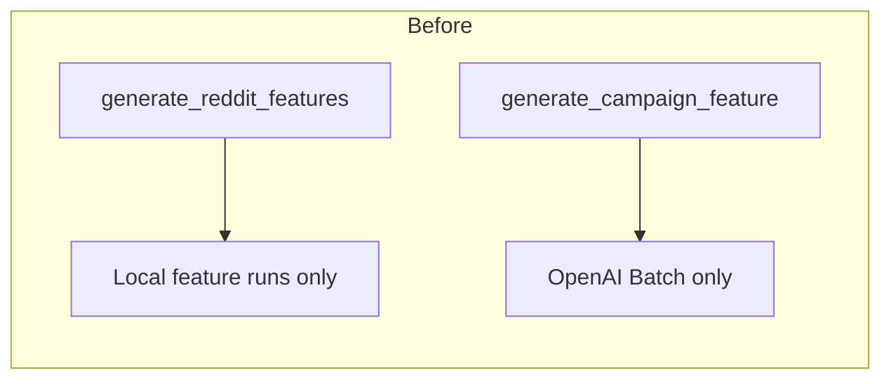
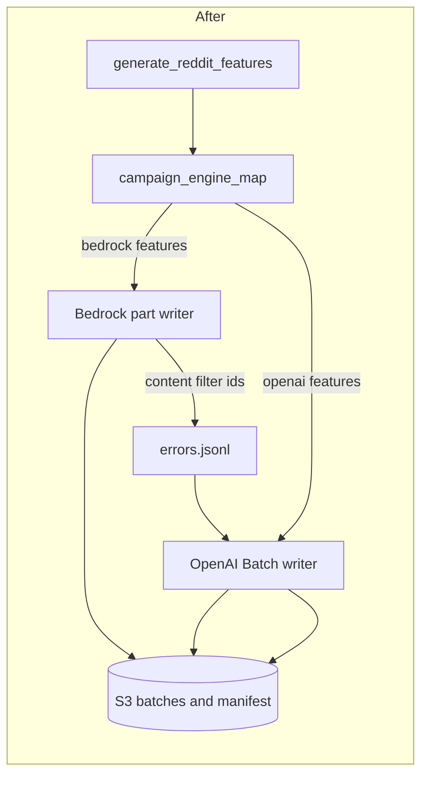

# Step 2: Add a campaign engine map and Bedrock S3 campaign path

## Goal

Reddit needs three Bedrock features without changing Bluesky defaults, so the implementer adds a campaign-only engine map, a Bedrock resume cursor at `active_bedrock_job.json`, and OpenAI Batch retry for Bedrock content-filter blocks, then wires `generate_reddit_features.py` with `campaign_id` and `preprocessed_run`. The pull request ships product code and does not run the full 400,000-comment job.

## Dependencies

- **Step 1 merged (recommended):** preprocessed `comments.parquet` on S3 at the pinned key. Local LFS copy is enough for offline checks in this PR.
- Bluesky campaign behavior must remain unchanged. `FEATURE_REGISTRY` default `engine_type` values stay as they are today.

Pinned identities:

| Field | Value |
|-------|-------|
| Platform | `reddit` |
| Dataset id | `reddit_3d8a2c41-9b17-4e6f-a5d0-8c1b2e4f6079` |
| Pinned preprocessed run | `2026_09_03-23:39:28` |
| Preprocessed row count | `400000` |
| Campaign id | `reddit_2026_09_03_233928_llm_features_v1` |
| Batch size | `2000` |
| Expected batch count | `200` (`part-00000` through `part-00199`) |
| OpenAI model id | `gpt-5.4-nano` (Batch API) |
| Bedrock model id | value from `lib.constants.DEFAULT_BEDROCK_NOVA_MICRO` |
| Bedrock `max_concurrency` | `8` per campaign part |
| Feature agents | one OS process per feature (unchanged orchestration pattern) |

## Main caller and implementation scope

**Main caller after this PR merges (Bedrock feature example):**

```bash
cd /workspace
export AWS_ACCESS_KEY_ID="$LAB_AWS_ACCESS_KEY_ID"
export AWS_SECRET_ACCESS_KEY="$LAB_AWS_ACCESS_KEY_SECRET"

PYTHONPATH=. uv run python data_platform/generate_features/generate_reddit_features.py \
  --dataset-id reddit_3d8a2c41-9b17-4e6f-a5d0-8c1b2e4f6079 \
  --preprocessed-run 2026_09_03-23:39:28 \
  --campaign-id reddit_2026_09_03_233928_llm_features_v1 \
  --features is_likely_spam \
  --batch-size 2000
```

**Main caller after this PR merges (OpenAI feature example):**

```bash
PYTHONPATH=. uv run python data_platform/generate_features/generate_reddit_features.py \
  --dataset-id reddit_3d8a2c41-9b17-4e6f-a5d0-8c1b2e4f6079 \
  --preprocessed-run 2026_09_03-23:39:28 \
  --campaign-id reddit_2026_09_03_233928_llm_features_v1 \
  --features is_political \
  --batch-size 2000
```

**One implementation scope for this PR:** add a campaign-only engine map for `reddit_2026_09_03_233928_llm_features_v1`, extend `generate_campaign_feature` and `platform_cli` campaign validation for OpenAI or Bedrock per map entry, generalize Bedrock Converse to use each `FeatureSpec` `system_prompt` and `llm_output_schema`, add Bedrock campaign batch writing with `active_bedrock_job.json` resume, implement content-filter recording and OpenAI retry for Bedrock features, record `engine_type` on manifests and local metadata, and wire Reddit campaign CLI and Python API.

**Out of scope for this PR:** full `400000` row production runs, Step 3 smoke and cost tooling, watcher platform flags (Step 3), wide seven-feature join, lifecycle rules, and any GitHub posting from repository code.

## Files to inspect (read-only)

| Path | Why |
|------|-----|
| `/workspace/data_platform/generate_features/generate_features.py` | `CAMPAIGN_ENGINE_TYPE`, `generate_campaign_feature`, manifest identity checks |
| `/workspace/data_platform/generate_features/platform_cli.py` | Campaign flags and engine validation |
| `/workspace/data_platform/generate_features/s3_feature_campaign.py` | `FeaturePaths.for_campaign`, manifest helpers, active OpenAI state |
| `/workspace/data_platform/generate_features/s3_feature_batches.py` | Immutable batch writer, `LabelRowMetadataModel` validation |
| `/workspace/data_platform/generate_features/engines/bedrock_engine.py` | Hardcoded news or opinion JSON instruction and content-filter mapping |
| `/workspace/data_platform/generate_features/engines/openai_engine.py` | Batch completion hook and resume |
| `/workspace/data_platform/generate_features/generate_reddit_features.py` | Reddit CLI wrapper to extend |
| `/workspace/data_platform/generate_features/generate_bluesky_features.py` | Reference campaign CLI and Python API |
| `/workspace/data_platform/generate_features/models.py` | `FeatureSpec`, `CampaignRunConfig`, `LabelRowMetadataModel` |
| `/workspace/data_platform/generate_features/registry.py` | Seven LLM features (exclude `is_toxic_tiered` thread_pool feature) |
| `/workspace/data_platform/generate_features/metadata.py` | Local `metadata.json` writer |
| `/workspace/data_platform/generate_features/feature_progress_watcher.py` | `FeaturePaths.canonical` callers to fix |
| `/workspace/data_platform/generate_features/smoke_bluesky_campaign.py` | `FeaturePaths.canonical` callers to fix |
| `/workspace/data_platform/curate/consolidate_bluesky_llm_campaign.py` | `FeaturePaths.canonical` callers to fix |
| `/workspace/docs/plans/2026-09-05_generate_bluesky_llm_features_4d8a7c/campaign_contract.md` | Reference S3 layout and row metadata columns |

## Files allowed to change

- `/workspace/data_platform/generate_features/campaign_engine_map.py` (new; Reddit campaign engine map only)
- `/workspace/data_platform/generate_features/generate_features.py` (mixed-engine `generate_campaign_feature`, manifest `engine_type`, Bedrock path)
- `/workspace/data_platform/generate_features/platform_cli.py` (campaign engine validation, Reddit campaign flags)
- `/workspace/data_platform/generate_features/s3_feature_campaign.py` (`active_bedrock_job.json` key helper, manifest `engine_type`, optional `FeaturePaths.canonical` alias)
- `/workspace/data_platform/generate_features/s3_feature_batches.py` (Bedrock batch integration if needed; error reason field)
- `/workspace/data_platform/generate_features/engines/bedrock_engine.py` (dynamic prompt and schema; content-filter as failure not label)
- `/workspace/data_platform/generate_features/engines/bedrock_campaign.py` (new if cleaner than bloating `generate_features.py`; serial 2000-row parts and resume cursor)
- `/workspace/data_platform/generate_features/generate_reddit_features.py` (campaign CLI and Python API)
- `/workspace/data_platform/generate_features/metadata.py` (record `engine_type` on local metadata)
- `/workspace/data_platform/generate_features/feature_progress_watcher.py` (migrate `FeaturePaths.canonical` to `for_campaign` with explicit platform and dataset id, or use restored alias)
- `/workspace/data_platform/generate_features/smoke_bluesky_campaign.py` (same `FeaturePaths` fix only)
- `/workspace/data_platform/curate/consolidate_bluesky_llm_campaign.py` (same `FeaturePaths` fix only)
- `/workspace/docs/plans/2026-09-07_generate_reddit_llm_features_c7a14e/steps/step2.md` (this file only if correcting the spec during implementation)

## Files forbidden to change

- `/workspace/data_platform/utils/storage.py` default backend behavior
- `/workspace/data_platform/data/bluesky/**`
- `/workspace/data_platform/scripts/migrate_reddit_preprocessed_to_s3.py` (Step 1)
- `/workspace/tests/**`
- `/workspace/data_platform/generate_features/registry.py` default `engine_type` values
- Feature prompt modules under `data_platform/generate_features/*/generate_feature.py`
- `/workspace/webapp/**`
- `/workspace/experiments/**`
- Step 3 smoke modules (not written yet)
- Any repository code that launches Cursor agents or posts to GitHub

## Locked contracts

### Campaign-only engine map

Add a map keyed by campaign id, used only when `campaign_id == reddit_2026_09_03_233928_llm_features_v1`. Do not change `FEATURE_REGISTRY` entries. Bluesky campaign `bluesky_2026_09_03_235130_llm_features_v1` continues to use OpenAI for every LLM feature.

| Feature | Campaign engine |
|---------|-----------------|
| `is_news_or_opinion` | `openai` |
| `is_political` | `openai` |
| `political_stance` | `openai` |
| `llm_toxicity_tiered` | `openai` |
| `is_likely_spam` | `bedrock` |
| `is_self_contained` | `bedrock` |
| `is_structurally_complete` | `bedrock` |

`generate_campaign_feature` resolves the campaign engine from this map. `platform_cli` campaign mode accepts a feature when the map entry is `openai` or `bedrock`. Do not run `is_toxic_tiered` (thread_pool) in this campaign.

### Feature root

`s3://mirrorview-experimental-artifacts/data_platform/data/reddit/reddit_3d8a2c41-9b17-4e6f-a5d0-8c1b2e4f6079/features/reddit_2026_09_03_233928_llm_features_v1/`

### Per-feature layout

For `{feature}` in the seven-feature set:

```text
s3://mirrorview-experimental-artifacts/data_platform/data/reddit/reddit_3d8a2c41-9b17-4e6f-a5d0-8c1b2e4f6079/features/reddit_2026_09_03_233928_llm_features_v1/{feature}/
  active_openai_batch.json          # OpenAI features and Bedrock content-filter retry jobs
  active_bedrock_job.json           # Bedrock features only; separate resume cursor
  batches/part-00000.parquet
  batches/part-00001.parquet
  ...
  batches/part-00199.parquet
  final.parquet
  manifest.json
  progress.jsonl
  errors.jsonl
```

Batch object keys are immutable. A full feature run writes exactly `200` batch objects totaling `400000` rows. Batch size is `2000`. Bedrock labels one part at a time with `max_concurrency=8` inside that part. OpenAI features reuse existing Batch resume through `active_openai_batch.json`.

### Production batch schedule (after Step 3 smoke and parent approval)

| Part | Provider job size | Row composition |
|------|-------------------|-----------------|
| `part-00000` | `1990` new comments | Ten unchanged smoke output rows plus `1990` new labeled rows |
| `part-00001` through `part-00199` | `2000` new comments each | All new labeled rows |

`manifest.json` batch entry for `part_index=0` may list both the smoke provider `batch_id` and the first production provider `batch_id` for the ten smoke rows.

### Run id

Every row carries `run_id` = `reddit_2026_09_03_233928_llm_features_v1:{feature}`.

### Row metadata columns

Every label row in `batches/part-*.parquet` and `final.parquet` must include the six `LabelRowMetadataModel` fields plus the feature label field:

| Column | Value |
|--------|-------|
| `source_record_id` | pinned input id |
| `run_id` | `reddit_2026_09_03_233928_llm_features_v1:{feature}` |
| `batch_id` | provider batch or job id for the row |
| `request_id` | provider request id for the row |
| `attempt_count` | integer 1 through 4 |
| `label_timestamp` | UTC from `lib.timestamp_utils.get_current_timestamp` |
| `{label_field}` | feature-specific raw label column |

Do not add an `engine_type` column to parquet. `engine_type` lives on `manifest.json` and local `metadata.json` only.

### manifest.json identity

Add `engine_type` to manifest identity fields checked on resume. Allowed values: `openai`, `bedrock`.

Base identity fields (unchanged): `campaign_id`, `dataset_id`, `preprocessed_run`, `feature`, `model_id`, `prompt_hash`, `batch_size`, `expected_row_count`, `run_id`, `engine_type`.

After Bedrock content-filter retries complete, `manifest.json` keeps `engine_type` = `bedrock` and adds:

```json
"openai_content_filter_retry": {
  "count": <integer>,
  "model_id": "gpt-5.4-nano",
  "provider_batch_ids": ["<batch-id>", "..."]
}
```

Other permanent failures stay in `errors.jsonl` and contribute to `failed_row_count` on `final.parquet`. Do not write a fake label for content-filter failures on boolean features.

### errors.jsonl content-filter records

When Bedrock blocks a comment, append an error record with a stable `reason` field:

```json
{
  "source_record_id": "<id>",
  "reason": "bedrock_content_filter",
  "engine_type": "bedrock",
  "detail": "<provider message excerpt>",
  "recorded_at": "<UTC timestamp>"
}
```

The same campaign command then submits those ids to OpenAI Batch, writes additional batch objects for successful retries, updates `openai_content_filter_retry` on the manifest, and runs `consolidate_final` when all parts are done.

### active_bedrock_job.json

Persist Bedrock resume state at `{feature}/active_bedrock_job.json` for Bedrock-mapped features only. Minimum fields:

| Field | Meaning |
|-------|---------|
| `logical_batch_index` | Zero-based part index in progress |
| `pending_source_record_ids` | Ordered ids still expected for this part |
| `completed_source_record_ids` | Ids already written for this part |
| `state` | `running`, `writing`, or `terminal` |

Use the same conditional atomic replace pattern as `active_openai_batch.json`. Delete only after the part rows are durably written to an immutable batch object and recorded in `manifest.json`. Never store Bedrock cursor state in `active_openai_batch.json`.

### Bedrock Converse behavior

- Build the system message from `spec.system_prompt` plus a JSON instruction derived from `spec.llm_output_schema`, not the hardcoded news or opinion template.
- On content filter, raise or return a typed failure so the campaign writer records `bedrock_content_filter` in `errors.jsonl`. Do not map content filter to `neither` or any boolean false default.
- Reuse `LabelRowMetadataModel` validation and batch size `2000`.

### FeaturePaths callers

`FeaturePaths.for_campaign(campaign_id, feature, platform=..., dataset_id=...)` is the primary helper. Migrate `FeaturePaths.canonical` callers in watcher, smoke, and consolidate code to pass `platform` and `dataset_id`, or restore a `canonical` classmethod alias that forwards to `for_campaign` with explicit arguments. Watcher, smoke, and consolidate must not default to Bluesky when `platform` is `reddit`.

### Input order

Load comments from preprocessed run `2026_09_03-23:39:28`. Sort by ascending `source_record_id`. Split into `2000` row parts in that order.

### Lifecycle tag

When uploading under `batches/`, set S3 object tag `intermediate-artifact=true`. Do not set that tag on `final.parquet`, `manifest.json`, `progress.jsonl`, or `errors.jsonl`.

## Ordered implementation work

1. Add `campaign_engine_map.py` with the locked Reddit map and a resolver used by `generate_campaign_feature` and `platform_cli`.
2. Extend manifest creation and `MANIFEST_IDENTITY_FIELDS` with `engine_type`. Record `engine_type` in local `metadata.json`.
3. Generalize `bedrock_engine.py` to build JSON instructions from each `FeatureSpec` schema and treat content filter as a failure path.
4. Implement Bedrock campaign part labeling with serial `2000` row parts, `max_concurrency=8`, and `active_bedrock_job.json` read, write, and delete.
5. Implement content-filter flow: write `errors.jsonl` with `reason=bedrock_content_filter`, submit those ids through OpenAI Batch, append retry batch manifest entries, set `openai_content_filter_retry` on the manifest.
6. Keep OpenAI campaign path unchanged for map entries with `openai` and for content-filter retries on Bedrock features.
7. Wire `generate_reddit_features.py` Python API and CLI with `campaign_id` and `preprocessed_run` matching `generate_bluesky_features.py`.
8. Fix `FeaturePaths` callers (`feature_progress_watcher.py`, `smoke_bluesky_campaign.py`, `consolidate_bluesky_llm_campaign.py`).
9. Run offline and fake-bucket smoke commands below. Optionally run one tiny live Bedrock or OpenAI proof on a disposable prefix. Do not write under the pinned campaign `batches/` prefix during this step.

## Exact live smoke and basic check commands with expected output

### Offline engine map check

```bash
cd /workspace

PYTHONPATH=. uv run python -c "
from data_platform.generate_features.campaign_engine_map import campaign_engine_type
assert campaign_engine_type('reddit_2026_09_03_233928_llm_features_v1', 'is_news_or_opinion') == 'openai'
assert campaign_engine_type('reddit_2026_09_03_233928_llm_features_v1', 'is_political') == 'openai'
assert campaign_engine_type('reddit_2026_09_03_233928_llm_features_v1', 'is_likely_spam') == 'bedrock'
assert campaign_engine_type('reddit_2026_09_03_233928_llm_features_v1', 'political_stance') == 'openai'
assert campaign_engine_type('bluesky_2026_09_03_235130_llm_features_v1', 'is_political') == 'openai'
print('campaign_engine_map OK')
"
```

Expected stdout:

```text
campaign_engine_map OK
```

### Offline FeaturePaths check for Reddit

```bash
PYTHONPATH=. uv run python -c "
from data_platform.generate_features.s3_feature_campaign import FeaturePaths
p = FeaturePaths.for_campaign(
    'reddit_2026_09_03_233928_llm_features_v1',
    'is_political',
    platform='reddit',
    dataset_id='reddit_3d8a2c41-9b17-4e6f-a5d0-8c1b2e4f6079',
)
assert '/reddit/reddit_3d8a2c41' in p.prefix
assert p.prefix.endswith('features/reddit_2026_09_03_233928_llm_features_v1/is_political/')
print('reddit FeaturePaths OK')
"
```

Expected stdout:

```text
reddit FeaturePaths OK
```

### Fake-bucket Bedrock part write check (no production prefix)

Use a disposable prefix only. Do not write under the pinned campaign feature `batches/` prefix.

```bash
cd /workspace
export AWS_ACCESS_KEY_ID="$LAB_AWS_ACCESS_KEY_ID"
export AWS_SECRET_ACCESS_KEY="$LAB_AWS_ACCESS_KEY_SECRET"

DISPOSABLE_PREFIX=s3://mirrorview-experimental-artifacts/data_platform/data/_smoke/reddit_step2_bedrock/

PYTHONPATH=. uv run python -c "
from data_platform.generate_features.s3_feature_campaign import FeaturePaths
from data_platform.generate_features.campaign_engine_map import campaign_engine_type
feature = 'is_likely_spam'
assert campaign_engine_type('reddit_2026_09_03_233928_llm_features_v1', feature) == 'bedrock'
paths = FeaturePaths.from_root_uri('${DISPOSABLE_PREFIX}', feature)
assert paths.active_state_key.endswith('active_openai_batch.json') or True
print('disposable_prefix=' + '${DISPOSABLE_PREFIX}')
print('bedrock_feature=' + feature)
print('active_bedrock_job_key=' + paths.prefix + 'active_bedrock_job.json')
"
```

Expected stdout includes `disposable_prefix=`, `bedrock_feature=is_likely_spam`, and `active_bedrock_job_key=` ending in `active_bedrock_job.json`.

Optional tiny live proof (requires AWS Bedrock access): label ten rows under the disposable prefix with `max_concurrency=8`, confirm one `part-00000.parquet` write, `manifest.json` has `engine_type=bedrock`, and `active_bedrock_job.json` is absent after the part completes.

### Confirm pinned campaign batches prefix untouched

```bash
aws s3 ls s3://mirrorview-experimental-artifacts/data_platform/data/reddit/reddit_3d8a2c41-9b17-4e6f-a5d0-8c1b2e4f6079/features/reddit_2026_09_03_233928_llm_features_v1/is_political/batches/ 2>&1 || true
```

Expected: `An error occurred (NoSuchKey)` or empty listing. No `part-*.parquet` under the pinned campaign prefix from this step.

### Disposable prefix cleanup (required before merge)

```bash
export AWS_ACCESS_KEY_ID="$LAB_AWS_ACCESS_KEY_ID"
export AWS_SECRET_ACCESS_KEY="$LAB_AWS_ACCESS_KEY_SECRET"

aws s3 rm s3://mirrorview-experimental-artifacts/data_platform/data/_smoke/reddit_step2_bedrock/ --recursive
aws s3 ls s3://mirrorview-experimental-artifacts/data_platform/data/_smoke/reddit_step2_bedrock/ --recursive
```

Expected: `aws s3 rm` reports deleted objects or no objects found. `aws s3 ls` prints no lines.

## Acceptance criteria

- Campaign engine map applies only to `reddit_2026_09_03_233928_llm_features_v1`. Bluesky campaign behavior is unchanged.
- `generate_reddit_features.py` accepts `--campaign-id` and `--preprocessed-run` and returns the S3 feature prefix URI in campaign mode.
- Bedrock features write immutable `batches/part-*.parquet`, `manifest.json`, `progress.jsonl`, and `final.parquet` with the same layout as OpenAI features.
- `manifest.json` and local `metadata.json` record `engine_type`. No parquet `engine_type` column exists.
- `active_bedrock_job.json` resumes Bedrock parts separately from `active_openai_batch.json`.
- Bedrock content-filter failures write `errors.jsonl` with `reason=bedrock_content_filter`, then retry through OpenAI Batch with manifest `openai_content_filter_retry` metadata.
- Boolean Bedrock features never receive a content-filter label value.
- `FeaturePaths` callers pass `platform` and `dataset_id` for Reddit. No implicit Bluesky default on Reddit paths.
- Step 2 smoke writes only under `s3://mirrorview-experimental-artifacts/data_platform/data/_smoke/reddit_step2_bedrock/` when live proof is used.
- Disposable S3 prefix is empty before merge.
- No automated tests were added or run.
- Full `400000` row production labeling did not run in this PR.

## Failure conditions

- `FEATURE_REGISTRY` default `engine_type` values change.
- `generate_campaign_feature` accepts only OpenAI for the Reddit campaign.
- Bedrock still hardcodes news or opinion JSON for every feature.
- Content filter writes a label instead of an `errors.jsonl` record for boolean features.
- Missing `engine_type` on `manifest.json` or local `metadata.json`.
- `engine_type` column added to parquet.
- Bedrock and OpenAI resume cursors share one state file.
- Overwriting an existing `part-NNNNN.parquet` key.
- Step 2 live smoke writes any object under the pinned campaign `batches/` prefix.
- Disposable prefix not empty before merge.
- Any edit under `/workspace/tests/**`.
- `storage.py` default backend changes.

## PR artifact and commit rules

- One independently mergeable PR for this step only.
- Do not fold Step 3 smoke tooling into this PR.
- Before merge: empty the disposable S3 prefix and confirm the pinned campaign `batches/` prefixes are untouched.
- PR title: `Add Reddit campaign engine map and Bedrock S3 campaign path`
- PR body must list the engine map, confirmation that no full `400000` row run occurred, and confirmation that disposable smoke used only the `_smoke/reddit_step2_bedrock/` prefix when live proof ran.

## GitHub issue body

Add mixed-engine campaign mode for Reddit LLM features on campaign `reddit_2026_09_03_233928_llm_features_v1`. Four features label through OpenAI Batch. Three features label through Bedrock Converse with S3 batch resume via `active_bedrock_job.json`. Bedrock content-filter failures record `bedrock_content_filter` in `errors.jsonl` and retry through OpenAI Batch. Wire `generate_reddit_features.py` campaign flags and fix `FeaturePaths` callers for Reddit platform and dataset id.

Plan step: `docs/plans/2026-09-07_generate_reddit_llm_features_c7a14e/steps/step2.md`

Done when:

- Campaign engine map resolves per feature without changing `FEATURE_REGISTRY` defaults.
- Bedrock and OpenAI features share the same S3 batch layout with `engine_type` on manifest and local metadata only.
- Content-filter retry flow writes errors then OpenAI batches and updates manifest retry metadata.
- Offline smoke commands in the step file pass and no pinned campaign `batches/` objects were written.

## Pull request description

# Add Reddit campaign engine map and Bedrock S3 campaign path

Fixes #<child>

Part of #<parent>

## Summary

Adds mixed-engine S3 campaign mode for Reddit LLM features on campaign `reddit_2026_09_03_233928_llm_features_v1`. Four features label through OpenAI Batch with the existing resume path. Three features label through Bedrock Converse with serial `2000` row parts and `active_bedrock_job.json` resume. Bedrock content-filter failures record `bedrock_content_filter` in `errors.jsonl` and retry through OpenAI Batch before final consolidation.

`generate_reddit_features.py` accepts `--campaign-id` and `--preprocessed-run` like the Bluesky entry point. `manifest.json` and local `metadata.json` record `engine_type`. Parquet rows keep the six `LabelRowMetadataModel` fields without an `engine_type` column.

## Purpose

Reddit has `400000` comments to label across seven LLM features, and OpenAI Batch handles four while Bedrock Converse handles three boolean structure features at lower on-demand cost. The campaign engine map applies only to `reddit_2026_09_03_233928_llm_features_v1`, so Bluesky stays on OpenAI. Full production labeling and smoke tooling are out of scope for the pull request.

## Architecture

Components:

- `campaign_engine_map.py` resolves `openai` or `bedrock` per feature for `reddit_2026_09_03_233928_llm_features_v1` only.
- `generate_campaign_feature` routes to OpenAI Batch or Bedrock campaign writers based on the map.
- `bedrock_engine.py` and the Bedrock campaign writer label one part at a time with `max_concurrency=8`, use each `FeatureSpec` prompt and schema, and record content-filter failures.
- `openai_engine.py` stays the primary path for OpenAI-mapped features and Bedrock content-filter retries.
- `s3_feature_campaign.py` and `s3_feature_batches.py` share the same immutable batch, manifest, progress, and final layout for both engines.
- `generate_reddit_features.py` exposes the Reddit CLI and Python API for campaign mode.

Existing flow:



New flow:



## Interfaces

### Campaign engine map

Campaign id `reddit_2026_09_03_233928_llm_features_v1`:

| Feature | Engine |
|---------|--------|
| `is_news_or_opinion` | `openai` |
| `is_political` | `openai` |
| `political_stance` | `openai` |
| `llm_toxicity_tiered` | `openai` |
| `is_likely_spam` | `bedrock` |
| `is_self_contained` | `bedrock` |
| `is_structurally_complete` | `bedrock` |

### manifest.json additions

| Field | Type | Notes |
|-------|------|-------|
| `engine_type` | `openai` or `bedrock` | Identity field checked on resume |
| `openai_content_filter_retry` | object or absent | Present on Bedrock features after OpenAI retry of filtered ids |

### errors.jsonl filter record

| Field | Notes |
|-------|-------|
| `reason` | `bedrock_content_filter` |
| `source_record_id` | failed comment id |
| `engine_type` | `bedrock` |

### S3 state files

| File | Owner |
|------|-------|
| `active_bedrock_job.json` | Bedrock features during an in-flight part |
| `active_openai_batch.json` | OpenAI features and Bedrock content-filter retry batches |

### CLI

```bash
PYTHONPATH=. uv run python data_platform/generate_features/generate_reddit_features.py \
  --dataset-id reddit_3d8a2c41-9b17-4e6f-a5d0-8c1b2e4f6079 \
  --preprocessed-run 2026_09_03-23:39:28 \
  --campaign-id reddit_2026_09_03_233928_llm_features_v1 \
  --features is_political \
  --batch-size 2000
```

## How to run

```bash
export AWS_ACCESS_KEY_ID="$LAB_AWS_ACCESS_KEY_ID"
export AWS_SECRET_ACCESS_KEY="$LAB_AWS_ACCESS_KEY_SECRET"
PYTHONPATH=. uv run python -c "from data_platform.generate_features.campaign_engine_map import campaign_engine_type; print(campaign_engine_type('reddit_2026_09_03_233928_llm_features_v1', 'is_political'))"
```

Expected: prints `openai`.

Run offline `FeaturePaths` and engine map checks from the step file. Optional live proof uses only `s3://mirrorview-experimental-artifacts/data_platform/data/_smoke/reddit_step2_bedrock/`. Do not run the full `400000` comment campaign in this PR.
