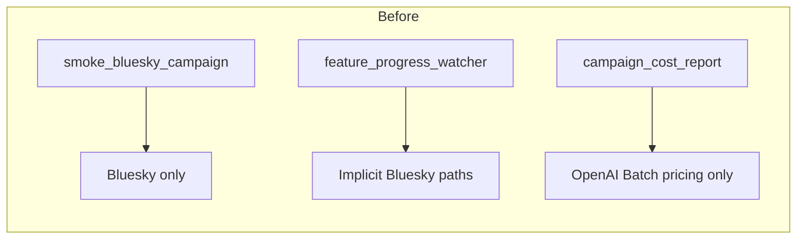
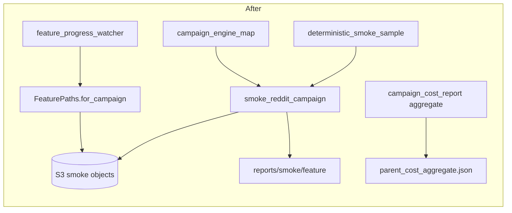

# Step 3: Add Reddit campaign smoke, mixed-engine cost aggregate, and watcher platform flags

## Goal

Add reusable smoke tooling for the deterministic ten-comment sample shared by all seven Reddit LLM features. Record mixed-engine pricing and token usage, scale cost estimates to `400000` comments, and aggregate all seven features into `parent_cost_aggregate.json`. Extend the progress watcher with `--platform` and `--dataset-id` so Reddit campaign paths resolve correctly. Perform one deliberate interrupt-and-resume proof inside the smoke caller. The step delivers tooling only and does not run full `400000` labeling per feature.

## Dependencies

- **Step 1 merged:** preprocessed `comments.parquet` on S3 at the pinned key (local LFS copy is enough for sample selection).
- **Step 2 merged:** campaign engine map, Bedrock S3 campaign path, mixed-engine `generate_campaign_feature`, and `FeaturePaths` fixes for Reddit.

Pinned identities:

| Field | Value |
|-------|-------|
| Platform | `reddit` |
| Dataset id | `reddit_3d8a2c41-9b17-4e6f-a5d0-8c1b2e4f6079` |
| Pinned preprocessed run | `2026_09_03-23:39:28` |
| Preprocessed row count | `400000` |
| Campaign id | `reddit_2026_09_03_233928_llm_features_v1` |
| Full-run scale for cost math | `400000` (not `200000`) |
| Smoke sample size | `10` comments |
| Batch size (production, later) | `2000` |
| Expected production parts (later) | `200` |

## Main caller and implementation scope

**Main caller after this PR merges (per-feature smoke):**

```bash
cd /workspace
export AWS_ACCESS_KEY_ID="$LAB_AWS_ACCESS_KEY_ID"
export AWS_SECRET_ACCESS_KEY="$LAB_AWS_ACCESS_KEY_SECRET"

PYTHONPATH=. uv run python data_platform/generate_features/smoke_reddit_campaign.py \
  --campaign-id reddit_2026_09_03_233928_llm_features_v1 \
  --dataset-id reddit_3d8a2c41-9b17-4e6f-a5d0-8c1b2e4f6079 \
  --preprocessed-run 2026_09_03-23:39:28 \
  --feature is_political
```

**Parent aggregate caller after all seven per-feature reports exist:**

```bash
PYTHONPATH=. uv run python data_platform/generate_features/campaign_cost_report.py \
  --aggregate \
  --campaign-id reddit_2026_09_03_233928_llm_features_v1 \
  --smoke-reports-dir docs/plans/2026-09-07_generate_reddit_llm_features_c7a14e/reports/smoke \
  --output docs/plans/2026-09-07_generate_reddit_llm_features_c7a14e/reports/smoke/parent_cost_aggregate.json \
  --full-run-row-count 400000
```

**Watcher caller after this PR merges:**

```bash
PYTHONPATH=. uv run python data_platform/generate_features/feature_progress_watcher.py \
  --campaign-id reddit_2026_09_03_233928_llm_features_v1 \
  --feature is_political \
  --platform reddit \
  --dataset-id reddit_3d8a2c41-9b17-4e6f-a5d0-8c1b2e4f6079 \
  --once
```

**One implementation scope for this PR:** implement `smoke_reddit_campaign.py` sharing helpers with `smoke_bluesky_campaign.py` and `deterministic_smoke_sample.py`, extend the sample loader to accept a platform spec (not only `BLUESKY_SPEC`), extend `campaign_cost_report.py` for mixed OpenAI Batch and Bedrock on-demand pricing at `400000` row scale, add watcher `--platform` and `--dataset-id` using `FeaturePaths.for_campaign`, and run tooling proof for one feature under a disposable S3 prefix.

**Out of scope for this PR:** generating all `400000` rows per feature, posting to GitHub from repository code, file-based approval gates, wide seven-feature join, and lifecycle infrastructure.

## Files to inspect (read-only)

| Path | Why |
|------|-----|
| `/workspace/data_platform/generate_features/smoke_bluesky_campaign.py` | Reference smoke flow, interrupt resume, S3 checks |
| `/workspace/data_platform/generate_features/deterministic_smoke_sample.py` | Ten-row selector to generalize |
| `/workspace/data_platform/generate_features/campaign_cost_report.py` | OpenAI Batch aggregate today |
| `/workspace/data_platform/generate_features/smoke_bedrock_engine.py` | Bedrock on-demand rates `0.035` / `0.14` per million tokens |
| `/workspace/data_platform/generate_features/smoke_openai_engine.py` | OpenAI Batch rate pattern |
| `/workspace/data_platform/generate_features/s3_feature_campaign.py` | Smoke object keys and `FeaturePaths.for_campaign` |
| `/workspace/data_platform/generate_features/s3_feature_batches.py` | Row metadata validation |
| `/workspace/data_platform/generate_features/feature_progress_watcher.py` | Watcher to extend |
| `/workspace/data_platform/generate_features/campaign_engine_map.py` | Per-feature engine for mixed cost (from Step 2) |
| `/workspace/data_platform/generate_features/generate_reddit_features.py` | Reddit platform spec |
| `/workspace/data_platform/generate_features/registry.py` | Seven LLM features |
| `/workspace/docs/plans/2026-09-05_generate_bluesky_llm_features_4d8a7c/steps/step6.md` | Reference smoke step depth |

## Files allowed to change

- `/workspace/data_platform/generate_features/smoke_reddit_campaign.py` (new)
- `/workspace/data_platform/generate_features/deterministic_smoke_sample.py` (accept platform spec; add Reddit helpers)
- `/workspace/data_platform/generate_features/campaign_cost_report.py` (mixed-engine pricing and `400000` scale)
- `/workspace/data_platform/generate_features/feature_progress_watcher.py` (`--platform`, `--dataset-id`, `FeaturePaths.for_campaign`)
- `/workspace/data_platform/generate_features/s3_feature_campaign.py` (extend only if smoke paths need Reddit-specific helpers)
- `/workspace/docs/plans/2026-09-07_generate_reddit_llm_features_c7a14e/reports/smoke/deterministic_ten_comment_ids.json` (new during PR; committed)
- `/workspace/docs/plans/2026-09-07_generate_reddit_llm_features_c7a14e/reports/smoke/{feature}/` (temporary Git copies during review; deleted before merge)
- `/workspace/docs/plans/2026-09-07_generate_reddit_llm_features_c7a14e/steps/step3.md` (this file only if correcting the spec during implementation)

## Files forbidden to change

- `/workspace/data_platform/utils/storage.py`
- `/workspace/data_platform/data/bluesky/**`
- `/workspace/data_platform/generate_features/registry.py` default `engine_type` values
- `/workspace/data_platform/generate_features/campaign_engine_map.py` unless a minimal export is required for cost math (prefer import-only)
- `/workspace/tests/**`
- Feature prompt modules
- `/workspace/webapp/**`
- `/workspace/experiments/**`
- Any repository code that posts GitHub comments or launches Cursor agents
- Any `APPROVED.txt` or file-based approval gate

## Locked contracts

### Shared deterministic ten-comment sample

All seven features must label the same ten `source_record_id` values. Selection rule:

1. Load rows from preprocessed run `2026_09_03-23:39:28` for dataset `reddit_3d8a2c41-9b17-4e6f-a5d0-8c1b2e4f6079`.
2. Keep rows with non-empty `text`.
3. Sort by ascending `source_record_id`.
4. Take the first ten rows.

Write the selected ids to `docs/plans/2026-09-07_generate_reddit_llm_features_c7a14e/reports/smoke/deterministic_ten_comment_ids.json` during the PR.

### Pricing and token estimates

Use the engine from the Step 2 campaign map per feature.

OpenAI Batch features (`is_news_or_opinion`, `is_political`, `political_stance`, `llm_toxicity_tiered`):

- input USD per million tokens: `0.10`
- output USD per million tokens: `0.625`
- record pricing source URL from existing `campaign_cost_report.py`

Bedrock on-demand features (`is_likely_spam`, `is_self_contained`, `is_structurally_complete`):

- input USD per million tokens: `0.035`
- output USD per million tokens: `0.14`
- match `smoke_bedrock_engine.py` constants

Each per-feature cost report records:

- pricing source URL
- `engine_type` used for the smoke run
- input and output USD per million tokens
- average input tokens per request
- average output tokens per request
- maximum input tokens among the ten requests
- maximum output tokens among the ten requests
- `full_run_row_count` = `400000`
- estimated full-run cost for `400000` comments using both average and max token assumptions

### Per-feature smoke evidence path

Each feature smoke writes Git copies under:

`docs/plans/2026-09-07_generate_reddit_llm_features_c7a14e/reports/smoke/{feature}/`

Expected files per feature (temporary during review; deleted before merge):

- `{feature}_cost_report.json`
- `{feature}_resume_evidence.json`
- `{feature}_s3_checks.txt`

S3 smoke evidence under the primary feature prefix remains after Git cleanup when operators run full Phase A later. Step 3 tooling proof does not write primary `{feature}/smoke/` unless explicitly running without a disposable prefix override during later production phases.

### Parent aggregate command

After all seven per-feature cost reports exist:

```bash
PYTHONPATH=. uv run python data_platform/generate_features/campaign_cost_report.py \
  --aggregate \
  --campaign-id reddit_2026_09_03_233928_llm_features_v1 \
  --smoke-reports-dir docs/plans/2026-09-07_generate_reddit_llm_features_c7a14e/reports/smoke \
  --output docs/plans/2026-09-07_generate_reddit_llm_features_c7a14e/reports/smoke/parent_cost_aggregate.json \
  --full-run-row-count 400000
```

`parent_cost_aggregate.json` sums all seven features with separate subtotals for OpenAI and Bedrock engine types.

Human approval is recorded on the parent GitHub issue only. No repository file gates full generation.

### S3 smoke evidence layout

When `smoke_reddit_campaign.py` runs without a disposable `--smoke-prefix` override (later production Phase A), each feature writes exactly these untagged objects under `{feature}/smoke/`:

| Object | Path |
|--------|------|
| Input sample | `.../{feature}/smoke/input.parquet` |
| Output labels | `.../{feature}/smoke/output.parquet` |
| Cost report | `.../{feature}/smoke/cost_report.json` |
| Resume evidence | `.../{feature}/smoke/resume_evidence.json` |

Smoke never writes `batches/part-*.parquet` or any other production batch object.

Step 3 tooling proof must not write primary `{feature}/smoke/`. Use the disposable prefix only.

### Deliberate interruption and resume (inside smoke caller only)

`smoke_reddit_campaign.py` performs one deliberate interrupt after provider submit and before finalize, then resumes without creating a second provider job for the same in-flight work. It writes `resume_evidence.json` to S3 and a Git copy under `reports/smoke/{feature}/`. Later production feature runs must not repeat this procedure.

### Watcher platform flags

Add required `--platform` and `--dataset-id` options (or defaults that match explicit Reddit arguments when passed). Resolve paths with:

`FeaturePaths.for_campaign(campaign_id, feature, platform=platform, dataset_id=dataset_id)`

The watcher reads S3 only, writes `watcher.json` conditionally, prints the rolling comment body, and never posts to GitHub.

### Production batch schedule (later, after parent approval)

After parent approval, the first production job labels `1990` new comments. Its successful rows combine with the ten unchanged smoke output rows into immutable `batches/part-00000.parquet` (`2000` rows total). The next `199` jobs each label `2000` comments and each write one batch object (`part-00001` through `part-00199`). Total: `200` batch objects and `400000` rows.

Preserve original smoke `batch_id` and `request_id` in the ten rows folded into `part-00000`.

### S3 checks during smoke

Each feature smoke verifies (against the smoke prefix in use):

- `smoke/input.parquet`, `smoke/output.parquet`, `smoke/cost_report.json`, and `smoke/resume_evidence.json` exist and are untagged
- `smoke/output.parquet` has exactly ten rows with full `LabelRowMetadataModel` columns
- no objects exist under `batches/` yet
- interrupt-and-resume proof recorded in `smoke/resume_evidence.json`

Step 3 tooling proof runs these checks under the disposable prefix only.

## Ordered implementation work

1. Extend `deterministic_smoke_sample.py` to accept a `FeaturePlatformSpec` (add `REDDIT_SPEC` path) and commit `deterministic_ten_comment_ids.json`.
2. Implement `smoke_reddit_campaign.py` by reusing shared helpers from `smoke_bluesky_campaign.py` where possible. Label ten comments with the correct engine per `campaign_engine_map`.
3. Record token usage from the active engine (`engine.last_batch.usage` for OpenAI, `engine.last_usage` for Bedrock). Compute average, max, and full-run cost at `400000` rows.
4. Extend `campaign_cost_report.py --aggregate` to read mixed-engine per-feature reports and write `parent_cost_aggregate.json`.
5. Add `--platform` and `--dataset-id` to `feature_progress_watcher.py` and route through `FeaturePaths.for_campaign`.
6. Run live tooling proof for one feature under the disposable prefix only. Commit smoke tooling and `deterministic_ten_comment_ids.json`. Delete temporary Git copies under `reports/smoke/{feature}/` before merge. Empty the disposable S3 prefix before merge.

## Exact live smoke and basic check commands with expected output

### Offline deterministic sample check

```bash
cd /workspace

PYTHONPATH=. uv run python -c "
from data_platform.generate_features.generate_reddit_features import REDDIT_SPEC
from data_platform.generate_features.deterministic_smoke_sample import load_deterministic_ten_post_ids_for_spec
ids = load_deterministic_ten_post_ids_for_spec(
    REDDIT_SPEC,
    'reddit_3d8a2c41-9b17-4e6f-a5d0-8c1b2e4f6079',
    '2026_09_03-23:39:28',
)
assert len(ids) == 10
assert ids == sorted(ids)
print('deterministic_ten_comment_ids OK')
print('first_id=' + ids[0])
"
```

Expected stdout:

```text
deterministic_ten_comment_ids OK
first_id=<reddit-source-record-id>
```

### Live single-feature tooling proof (requires AWS and provider credentials; available after this step's implementation)

Use the disposable smoke prefix only. Do not write under the pinned campaign feature `smoke/` or `batches/` prefixes.

```bash
cd /workspace
export AWS_ACCESS_KEY_ID="$LAB_AWS_ACCESS_KEY_ID"
export AWS_SECRET_ACCESS_KEY="$LAB_AWS_ACCESS_KEY_SECRET"

DISPOSABLE_PREFIX=s3://mirrorview-experimental-artifacts/data_platform/data/_smoke/reddit_step3_campaign_smoke/

PYTHONPATH=. uv run python data_platform/generate_features/smoke_reddit_campaign.py \
  --campaign-id reddit_2026_09_03_233928_llm_features_v1 \
  --dataset-id reddit_3d8a2c41-9b17-4e6f-a5d0-8c1b2e4f6079 \
  --preprocessed-run 2026_09_03-23:39:28 \
  --feature is_political \
  --smoke-prefix "$DISPOSABLE_PREFIX" \
  --output-dir docs/plans/2026-09-07_generate_reddit_llm_features_c7a14e/reports/smoke/is_political
```

Expected stdout:

```text
smoke_prefix=s3://mirrorview-experimental-artifacts/data_platform/data/_smoke/reddit_step3_campaign_smoke/
engine_type=openai
smoke_rows=10
avg_input_tokens=<number>
max_input_tokens=<number>
avg_output_tokens=<number>
max_output_tokens=<number>
estimated_full_run_usd_avg=<number>
estimated_full_run_usd_max=<number>
full_run_row_count=400000
s3_smoke_output_ok=true
s3_smoke_resume_evidence_ok=true
no_batches_prefix_objects=true
primary_smoke_prefix_touched=false
cost_report=docs/plans/2026-09-07_generate_reddit_llm_features_c7a14e/reports/smoke/is_political/is_political_cost_report.json
```

### Watcher offline path check

```bash
PYTHONPATH=. uv run python -c "
from data_platform.generate_features.feature_progress_watcher import resolve_feature_paths
paths = resolve_feature_paths(
    'reddit_2026_09_03_233928_llm_features_v1',
    'is_political',
    smoke_prefix=None,
    platform='reddit',
    dataset_id='reddit_3d8a2c41-9b17-4e6f-a5d0-8c1b2e4f6079',
)
assert '/reddit/reddit_3d8a2c41' in paths.prefix
print('watcher paths OK')
"
```

Expected stdout:

```text
watcher paths OK
```

### Disposable prefix cleanup (required before merge)

```bash
export AWS_ACCESS_KEY_ID="$LAB_AWS_ACCESS_KEY_ID"
export AWS_SECRET_ACCESS_KEY="$LAB_AWS_ACCESS_KEY_SECRET"

aws s3 rm s3://mirrorview-experimental-artifacts/data_platform/data/_smoke/reddit_step3_campaign_smoke/ --recursive
aws s3 ls s3://mirrorview-experimental-artifacts/data_platform/data/_smoke/reddit_step3_campaign_smoke/ --recursive
```

Expected: `aws s3 rm` reports deleted objects or no objects found. `aws s3 ls` prints no lines.

Verify primary `is_political/smoke/` was not written during Step 3 tooling proof:

```bash
aws s3 ls s3://mirrorview-experimental-artifacts/data_platform/data/reddit/reddit_3d8a2c41-9b17-4e6f-a5d0-8c1b2e4f6079/features/reddit_2026_09_03_233928_llm_features_v1/is_political/smoke/ 2>&1 || true
```

Expected: `An error occurred (NoSuchKey)` or empty listing.

### Aggregate command shape (used after all seven smokes in later phases)

```bash
cd /workspace

PYTHONPATH=. uv run python data_platform/generate_features/campaign_cost_report.py \
  --aggregate \
  --campaign-id reddit_2026_09_03_233928_llm_features_v1 \
  --smoke-reports-dir docs/plans/2026-09-07_generate_reddit_llm_features_c7a14e/reports/smoke \
  --output docs/plans/2026-09-07_generate_reddit_llm_features_c7a14e/reports/smoke/parent_cost_aggregate.json \
  --full-run-row-count 400000
```

Expected stdout:

```text
features_included=7
openai_features=4
bedrock_features=3
total_estimated_full_run_usd_avg=<number>
total_estimated_full_run_usd_max=<number>
full_run_row_count=400000
parent_cost_aggregate.json written
```

## Acceptance criteria

- `smoke_reddit_campaign.py` and mixed-engine `campaign_cost_report.py --aggregate` exist and run.
- Deterministic ten-comment selector returns the same ids for every feature.
- Smoke tooling writes cost, resume, and S3 check artifacts to the `reports/smoke/{feature}/` layout when run with `--output-dir`.
- Step 3 tooling proof writes untagged objects only under `s3://mirrorview-experimental-artifacts/data_platform/data/_smoke/reddit_step3_campaign_smoke/`. No primary `{feature}/smoke/` or `batches/` objects.
- Cost reports scale to `400000` rows, not `200000`.
- OpenAI features use Batch rates `0.10` / `0.625`. Bedrock features use on-demand rates `0.035` / `0.14`.
- `feature_progress_watcher.py` accepts `--platform` and `--dataset-id` and resolves Reddit paths correctly.
- Watcher never posts to GitHub.
- Disposable S3 prefix is empty before merge.
- Temporary Git copies under `docs/plans/2026-09-07_generate_reddit_llm_features_c7a14e/reports/smoke/{feature}/` are deleted before merge. `deterministic_ten_comment_ids.json` stays committed.
- No automated tests were added or run.

## Failure conditions

- Different ten-comment ids across features.
- Missing max token fields in cost report schema.
- Aggregate command cannot read seven per-feature reports or uses `200000` as the default full-run row count for Reddit.
- Repository code posts to GitHub automatically.
- Smoke writes `batches/part-*.parquet` during smoke.
- Step 3 tooling proof writes any object under primary `{feature}/smoke/`.
- Disposable prefix `s3://mirrorview-experimental-artifacts/data_platform/data/_smoke/reddit_step3_campaign_smoke/` is not empty before merge.
- Watcher still defaults to Bluesky paths when `--platform reddit` is passed.
- Any edit under `/workspace/tests/**`.

## PR artifact and commit rules

- Commit smoke tooling modules and `deterministic_ten_comment_ids.json`.
- Do not commit all seven feature smoke outputs in this PR (those belong to later production Phase A runs).
- Delete temporary Git copies under `reports/smoke/{feature}/` before merge.
- Before merge: run `aws s3 rm` on the disposable prefix, verify it is empty, and confirm primary `is_political/smoke/` is still absent.
- PR title: `Add Reddit campaign smoke, mixed-engine cost aggregate, and watcher platform flags`
- PR body must state: tooling only, no full runs, disposable smoke prefix used for proof, primary smoke deferred to later production phases.

## GitHub issue body

Add Reddit campaign smoke tooling that labels the same ten comments for all seven LLM features, records mixed OpenAI Batch and Bedrock on-demand cost at `400000` row scale, aggregates seven per-feature reports into `parent_cost_aggregate.json`, and extends the progress watcher with `--platform` and `--dataset-id` for Reddit paths. Include one interrupt-and-resume proof inside the smoke caller. Do not post to GitHub from repository code.

Plan step: `docs/plans/2026-09-07_generate_reddit_llm_features_c7a14e/steps/step3.md`

Done when:

- `smoke_reddit_campaign.py` and mixed-engine aggregate command exist and pass offline checks.
- Step 3 tooling proof uses only the disposable S3 prefix and writes no `batches/part-*.parquet` objects.
- Watcher resolves Reddit `FeaturePaths` with explicit platform and dataset id.
- Temporary `reports/smoke/{feature}/` Git copies are removed before merge.

## Pull request description

# Add Reddit campaign smoke, mixed-engine cost aggregate, and watcher platform flags

Fixes #<child>

Part of #<parent>

## Summary

Adds `smoke_reddit_campaign.py` to label a deterministic ten-comment sample for every Reddit LLM feature using the Step 2 per-feature engine map. Extends `campaign_cost_report.py` to aggregate mixed OpenAI Batch and Bedrock on-demand estimates scaled to `400000` comments into `parent_cost_aggregate.json`. Adds `--platform` and `--dataset-id` to `feature_progress_watcher.py` so Reddit campaign prefixes resolve through `FeaturePaths.for_campaign`.

The smoke caller performs one deliberate interrupt-and-resume proof, writes untagged smoke objects under `{feature}/smoke/` only when not using a disposable prefix override, and never writes production `batches/part-*.parquet` objects.

## Purpose

Operators need cost and resume evidence before approving full Reddit labeling across seven features and two engine types. The pull request delivers tooling only. It reuses Bluesky smoke patterns while scaling cost math to `400000` rows and recording Bedrock on-demand pricing from `smoke_bedrock_engine.py`. Full production runs and GitHub posting stay out of scope.

## Architecture

Components:

- `deterministic_smoke_sample.py` provides a ten-comment selector parameterized by platform spec.
- `smoke_reddit_campaign.py` labels ten comments, writes S3 smoke artifacts, runs interrupt resume, and writes a per-feature cost report.
- `campaign_cost_report.py` adds mixed-engine `--aggregate` mode with `full_run_row_count=400000`.
- `feature_progress_watcher.py` accepts `--platform` and `--dataset-id` for Reddit path resolution.

Existing flow:



New flow:



## Interfaces

### smoke_reddit_campaign.py CLI

```bash
PYTHONPATH=. uv run python data_platform/generate_features/smoke_reddit_campaign.py \
  --campaign-id reddit_2026_09_03_233928_llm_features_v1 \
  --dataset-id reddit_3d8a2c41-9b17-4e6f-a5d0-8c1b2e4f6079 \
  --preprocessed-run 2026_09_03-23:39:28 \
  --feature <feature> \
  --smoke-prefix <optional-disposable-s3-prefix> \
  --output-dir <git-report-dir>
```

### Cost report fields (per feature)

| Field | Notes |
|-------|-------|
| `engine_type` | `openai` or `bedrock` from campaign map |
| `full_run_row_count` | `400000` |
| `estimated_full_run_usd_avg` | scaled from ten-comment averages |
| `estimated_full_run_usd_max` | scaled from ten-comment maxima |

### Pricing

| Engine | Input USD per 1M tokens | Output USD per 1M tokens |
|--------|---------------------------|--------------------------|
| OpenAI Batch | `0.10` | `0.625` |
| Bedrock on-demand | `0.035` | `0.14` |

### Watcher CLI

```bash
PYTHONPATH=. uv run python data_platform/generate_features/feature_progress_watcher.py \
  --campaign-id reddit_2026_09_03_233928_llm_features_v1 \
  --feature is_political \
  --platform reddit \
  --dataset-id reddit_3d8a2c41-9b17-4e6f-a5d0-8c1b2e4f6079 \
  --once
```

## How to run

```bash
export AWS_ACCESS_KEY_ID="$LAB_AWS_ACCESS_KEY_ID"
export AWS_SECRET_ACCESS_KEY="$LAB_AWS_ACCESS_KEY_SECRET"
DISPOSABLE_PREFIX=s3://mirrorview-experimental-artifacts/data_platform/data/_smoke/reddit_step3_campaign_smoke/
PYTHONPATH=. uv run python data_platform/generate_features/smoke_reddit_campaign.py \
  --campaign-id reddit_2026_09_03_233928_llm_features_v1 \
  --dataset-id reddit_3d8a2c41-9b17-4e6f-a5d0-8c1b2e4f6079 \
  --preprocessed-run 2026_09_03-23:39:28 \
  --feature is_political \
  --smoke-prefix "$DISPOSABLE_PREFIX" \
  --output-dir docs/plans/2026-09-07_generate_reddit_llm_features_c7a14e/reports/smoke/is_political
```

Expected: `smoke_rows=10`, `full_run_row_count=400000`, `no_batches_prefix_objects=true`, `primary_smoke_prefix_touched=false`. Delete the disposable prefix before merge.
