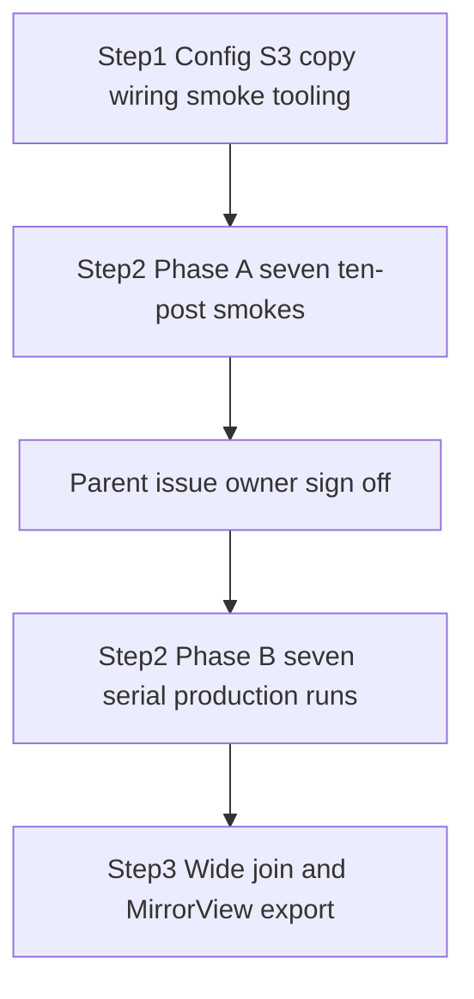

# Generate seven S3-backed LLM features for 6,374 Twitter posts

Do not start any 6,374-row feature run until the repository owner signs off on the smoke cost in the parent GitHub issue. The dated Twitter collection is small next to Bluesky and Reddit, and it still needs the same human gate.

## Remember
- Exact file paths always
- Exact commands with expected output
- DRY and YAGNI
- Use only the approved smoke checks. Do not add or run automated tests.
- Frequent commits
- Delegated tasks must be impossible to misread.

## Overview

The campaign labels the 6,374 preprocessed Twitter posts from pull request 215 with the same seven LLM features as Bluesky and Reddit. All seven features run on OpenAI Batch with `gpt-5.4-nano`. Operators upload only the pinned preprocessed `posts.csv` to `mirrorview-experimental-artifacts`. Git LFS keeps the local copy. `dataset.json` stays `format: csv`. Campaign outputs are parquet. Each feature writes four immutable batch objects, `final.parquet`, a SHA-256 manifest, progress records, and a permanent run report. Step 3 joins all seven outputs to fourteen preprocessed post columns and runs the existing MirrorView curation export.

## Happy flow

The operator merges Step 1 as the bottom of a GitHub stack. Step 2, stacked on Step 1, runs the seven ten-post smokes, posts costs on the parent issue, and stops. After an explicit owner comment on the parent, Step 2 continues on the same stack pull request and labels all 6,374 posts, one feature at a time. Step 3 stacks on Step 2, writes the 21-column wide table, and runs `twitter/mirrorview.yaml`.

## Approach

Pin dataset `twitter_fba4ddb2-fcf7-4a13-a7cc-0d98db44b547` and preprocessed run `2026_09_06-19:28:47`. Record the input hash so a different dataset forces a new campaign id.

Campaign artifacts live under `s3://mirrorview-experimental-artifacts/data_platform/data/` with campaign id `twitter_2026_09_06_192847_llm_features_v1` and one isolated prefix per feature. Reuse the Bluesky OpenAI Batch resume path, 2,000-row parquet writer, smoke fold into `part-00000`, and 30-day lifecycle rule for tagged batch objects. Do not convert the dated Twitter dataset to parquet. Do not drop Git LFS. Do not change global `FEATURE_REGISTRY` defaults.

A Twitter campaign YAML names the campaign id, dataset, run, row count 6374, feature list, model, engine, and batch size. Code reads that file for this campaign id only.

Smoke writes untagged evidence under `{feature}/smoke/` and never writes production `batches/part-*.parquet`. After parent approval, `part-00000` folds ten unchanged smoke rows with 1,990 new labels. `part-00001` and `part-00002` each add 2,000 new labels. `part-00003` adds 374 new labels.

The repository owner records approval on the parent GitHub issue only. There is no `APPROVED.txt`. The three children ship as one GitHub stack. Watcher CLI prints prepared markdown and never posts to GitHub.

See `campaign_contract.md` for identities, S3 layout, YAML shape, schemas, and the dependency graph.

## Decisions

- Pinned identities, S3 layout, YAML shape, schemas, and the dependency graph live in `campaign_contract.md`.
- All seven LLM features use OpenAI Batch `gpt-5.4-nano`. Perspective `is_toxic_tiered` is out of scope.
- Keep `posts.csv` as the Git LFS source of truth. Copy only that one object to S3.
- One GitHub issue runs all seven feature smokes and, after sign-off, all seven production runs.
- Sign-off is a parent-issue comment, not a GitHub `blocked-by` and not a fourth child.
- Steps 2 and 3 use live smoke and runtime checks only. Do not add automated tests. Step 1 also uses smoke and runtime checks only.
- The existing 30-day lifecycle rule already expires objects tagged `intermediate-artifact=true` under `data_platform/data/`. Do not open a new lifecycle issue.
- Do not wait on the Reddit mixed-engine epic. This campaign is OpenAI only.

## Steps

### Step 1: Add Twitter campaign config, copy posts.csv to S3, and wire smoke tooling

Upload pinned `posts.csv`, add the Twitter campaign YAML, wire `generate_twitter_features.py` campaign flags, add `smoke_twitter_campaign.py`, scale cost aggregation to 6,374 rows, and add watcher `--platform` and `--dataset-id`. No dependencies.

### Step 2: Smoke and generate seven LLM features for 6,374 Twitter posts

Run the ten-post smoke for all seven features in YAML order, interrupt and resume only `is_news_or_opinion`, post per-feature and aggregate cost on the parent issue, wait for owner sign-off, then run all seven production jobs serially. Depends on Step 1. Docs and run artifacts only.

### Step 3: Consolidate seven Twitter LLM features and write the MirrorView curated export

Join the seven verified feature outputs to fourteen preprocessed post columns on `source_record_id` through `consolidate_twitter_llm_campaign.py`. Require exactly 6,374 unique records with no missing feature values, publish the wide artifact, then run `data_platform/curate/configs/twitter/mirrorview.yaml`. Depends on Step 2.

## What "done" looks like

1. The pinned preprocessed `posts.csv` is available from S3 with a verified hash, and Git LFS still holds the local copy.
2. Seven features each produce exactly 6,374 unique, valid LLM labels across four batch objects and one permanent run report.
3. OpenAI features resume without duplicate provider jobs or duplicate charges. The ten smoke rows keep their original `batch_id` and `request_id` inside `part-00000`.
4. Each feature writes `progress.jsonl` per part. Cost estimates and actuals are recorded.
5. One wide parquet artifact contains the fourteen pinned post columns and all seven LLM feature outputs, and the MirrorView curation export is written from `twitter/mirrorview.yaml`.
6. Intermediate batches expire after 30 days under the existing lifecycle rule, while final artifacts and run metadata remain in S3.
