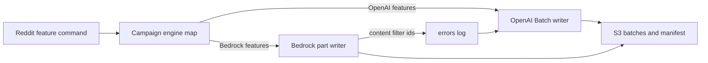

# Add a Reddit campaign engine map and a Bedrock S3 campaign path

## Remember
- Exact file paths always
- Exact commands with expected output
- DRY, YAGNI, frequent commits
- Use only the approved smoke checks. Do not add or run automated tests.
- Delegated tasks must be impossible to misread.

## Overview

Reddit campaign `reddit_2026_09_03_233928_llm_features_v1` labels 400,000 comments with seven LLM features. Four features stay on OpenAI Batch. Three boolean structure features use Bedrock Converse. Bluesky campaign `bluesky_2026_09_03_235130_llm_features_v1` stays on OpenAI for every LLM feature. Global registry engine values stay unchanged.

The package is one independently mergeable pull request for child issue [219](https://github.com/METResearchGroup/mirrorView-task/issues/219). The pull request is part of parent issue [218](https://github.com/METResearchGroup/mirrorView-task/issues/218). The parent issue stays open. Sibling issues stay out of the pull request. The pull request does not run the full 400,000 comment job.

## Happy flow

An operator runs the Reddit feature command with a campaign id and a pinned preprocessed run. The campaign engine map picks OpenAI or Bedrock for that feature. Both engines write the same S3 batch layout. Bedrock content filter blocks are recorded as errors and retried through OpenAI Batch in the same command.

## Approach

Add a campaign only engine map. Reuse the existing OpenAI campaign writer. Add a Bedrock campaign writer that labels one 2,000 row part at a time with eight threads, and that stores resume state in a Bedrock job file separate from the OpenAI batch file. Restore the missing feature path alias so Bluesky callers keep working, and require Reddit callers to pass platform and dataset id. Record engine type on the manifest and on local metadata. Do not add an engine type column to parquet.

Do not add a plugin framework. Do not add Reddit smoke tooling. Do not add watcher platform flags. Do not write under the pinned campaign batches prefix.

## Decisions

- Campaign id `reddit_2026_09_03_233928_llm_features_v1` is the only campaign with mixed engines.
- OpenAI features: `is_news_or_opinion`, `is_political`, `political_stance`, `llm_toxicity_tiered`.
- Bedrock features: `is_likely_spam`, `is_self_contained`, `is_structurally_complete`.
- Bedrock model id is the default Nova Micro constant. OpenAI model id stays the default Batch model.
- Bedrock uses one process and eight threads per part.
- Content filter writes reason `bedrock_content_filter`, then retries through OpenAI Batch. The manifest keeps engine type `bedrock` and adds an OpenAI retry block.
- Other Bedrock failures stay failed. Boolean features never get a content filter label.
- Feature path callers that still use the old alias get a forwarder to the current helper. Reddit generation always passes platform `reddit` and the pinned dataset id.
- Local campaign metadata records engine type without changing the shared metadata model module.
- Existing Bluesky manifests that omit engine type compare as OpenAI on resume.
- Phase 4 and Phase 6 for this package are the offline and optional live smoke commands in the step files. Do not add or run files under `tests/`.
- Changelog is updated after the pull request exists.

## Steps

### Step 1: Add the campaign engine map, feature paths, and Reddit campaign flags

Add the Reddit campaign engine map. Restore the missing feature path alias and pass platform plus dataset id from Reddit campaign generation. Record engine type on new manifests and on local campaign metadata. Accept OpenAI or Bedrock in campaign validation. Wire the Reddit Python API to campaign flags. See [steps/step1.md](steps/step1.md).

### Step 2: Generalize Bedrock Converse and add the Bedrock S3 campaign writer

Build Bedrock JSON instructions from each feature schema. Treat content filter as a failure, not a label. Label Bedrock campaign parts serially with eight threads and a Bedrock resume file. Retry content filter ids through OpenAI Batch in the same command. See [steps/step2.md](steps/step2.md).

### Step 3: Run offline smoke and confirm unused production prefixes

Run the engine map check, the Reddit feature path check, the disposable prefix helper print, the pinned batches listing, Reddit help, registry inspection, and parquet column inspection. Optional live Bedrock proof uses only the disposable smoke prefix and must be deleted before merge. See [steps/step3.md](steps/step3.md).

## What "done" looks like

1. The campaign engine map returns OpenAI or Bedrock for the pinned Reddit campaign and returns OpenAI for the Bluesky campaign.
2. `generate_reddit_features.py` accepts campaign id and preprocessed run flags and returns the S3 feature prefix in campaign mode.
3. Bedrock features write immutable batch objects, a manifest with engine type, progress, errors, and a final file with the same layout as OpenAI features.
4. Local metadata records engine type. Parquet rows keep the six label metadata fields and have no engine type column.
5. Bedrock resume state lives in `active_bedrock_job.json`. OpenAI resume and content filter retries use `active_openai_batch.json`.
6. Offline smoke commands pass. The pinned campaign batches prefix has no objects from this pull request. The disposable smoke prefix is empty before merge.
7. Registry default engine values are unchanged. No automated tests were added or run. The full 400,000 row job did not run.
