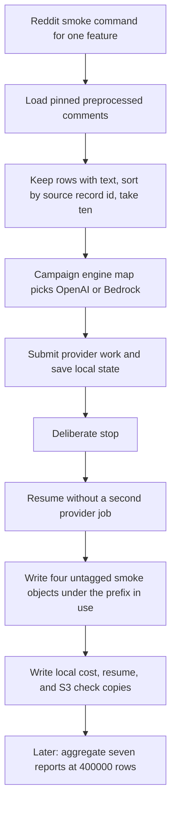

# Add Reddit campaign smoke, mixed-engine cost aggregate, and watcher platform flags

## Remember
- Exact file paths always
- Exact commands with expected output
- DRY, YAGNI, frequent commits
- Use only the approved offline checks and one live disposable-prefix proof. Do not add or run automated tests.
- Delegated tasks must be impossible to misread.

## Overview

Seven later feature issues need one mixed-engine cost number before anyone labels 400,000 Reddit comments. This package adds a Reddit smoke command that labels the same ten comments for every feature, records OpenAI Batch and Bedrock on-demand prices at 400,000-row scale, sums those reports into one parent file, and lets the progress watcher resolve Reddit S3 prefixes when the operator passes platform and dataset id.

The package is one independently mergeable pull request for child issue [221](https://github.com/METResearchGroup/mirrorView-task/issues/221). The pull request is part of parent issue [218](https://github.com/METResearchGroup/mirrorView-task/issues/218). The parent issue stays open. Sibling issues stay out of the pull request. The pull request is tooling only. It does not label 400,000 comments, and it does not run all seven live smokes.

The authoritative spec is `docs/plans/2026-09-07_generate_reddit_llm_features_c7a14e/steps/step3.md` on `origin/cursor/reddit-llm-features-plan-d983`. Read it with `git show`. Do not check out that docs-only branch. Do not copy the rest of that epic plan package into this branch.

## Happy flow

An operator runs the Reddit smoke command for one feature under a disposable S3 prefix. The command loads the pinned preprocessed comments, keeps rows with text, sorts by source record id, and takes the first ten. It labels those ten comments with the engine from the campaign map. After the provider work is submitted and before smoke objects are written, it stops once on purpose, then resumes without a second provider job. It writes four untagged smoke objects under the disposable prefix, writes local copies of the cost report, resume proof, and S3 checks, and prints token averages, token maximums, engine type, and the estimated cost of 400,000 comments.

A later operator, after all seven reports exist, runs the aggregate command with a 400,000-row scale flag. The command prints seven features, four OpenAI features, three Bedrock features, and both full-run totals.

## Approach

Reuse the Bluesky smoke helpers instead of building a third smoke framework. Parameterize the ten-row selector with a platform spec so the Bluesky helpers keep working. Import the campaign engine map. Do not change registry engine defaults. Do not change the Bedrock campaign writer. Do not change the Reddit migrate scripts.

Cost math for this campaign always uses 400,000 rows. The Bluesky default of 200,000 stays when the new row-count flag is omitted. Mixed-engine totals come from the campaign map for the campaign id on the command line.

The live proof in this pull request labels `is_political` only, under the disposable prefix `s3://mirrorview-experimental-artifacts/data_platform/data/_smoke/reddit_step3_campaign_smoke/`. Primary campaign smoke and batches prefixes stay empty. Temporary local copies under `reports/smoke/{feature}/` are deleted before the last commit. The ten comment ids JSON stays.

## Decisions

- Campaign id `reddit_2026_09_03_233928_llm_features_v1` is the only mixed-engine campaign.
- OpenAI features: `is_news_or_opinion`, `is_political`, `political_stance`, `llm_toxicity_tiered`. Batch rates 0.10 and 0.625 USD per million tokens.
- Bedrock features: `is_likely_spam`, `is_self_contained`, `is_structurally_complete`. On-demand rates 0.035 and 0.14 USD per million tokens, matching `smoke_bedrock_engine.py`.
- The ten comment rule does not take a feature name, so every feature gets the same ids.
- Watcher `--platform` and `--dataset-id` keep Bluesky defaults when omitted. Passing `reddit` plus the pinned dataset id must put the Reddit dataset prefix in the path.
- The watcher never posts to GitHub.
- Cost reports record `engine_type`, max token fields, `full_run_post_count`, and `full_run_row_count` with the same integer. Parquet rows still have no `engine_type` column.
- Interrupt-and-resume lives only in `smoke_reddit_campaign.py`. OpenAI reuses the Bluesky submit-then-reattach helpers. Bedrock saves labeled rows to a local file after Converse returns and before S3 writes, then resumes from that file with zero extra Converse calls.
- `s3_feature_campaign.py` is unchanged unless a missing helper blocks smoke paths. Smoke object keys already exist.
- Phase 4 and Phase 6 are the offline commands and the one live disposable-prefix proof. Do not add or run files under `tests/`.
- Changelog is updated after the pull request exists.

## Steps

### Step 1: Extend the ten-comment selector and the mixed-engine cost report

Parameterize the sample loader with a platform spec, keep the Bluesky helpers as wrappers, and commit the ten Reddit comment ids. Add `--full-run-row-count` to the cost report command, keep the Bluesky default of 200,000, and make `--aggregate` emit OpenAI and Bedrock subtotals from the campaign map. See [steps/step1.md](steps/step1.md).

### Step 2: Add watcher platform flags and the Reddit smoke caller

Pass `--platform` and `--dataset-id` through `FeaturePaths.for_campaign`. Add `smoke_reddit_campaign.py` that reuses Bluesky smoke helpers, labels ten comments with the mapped engine, proves interrupt-and-resume, and writes untagged smoke objects. See [steps/step2.md](steps/step2.md).

### Step 3: Run offline checks, one live proof, and cleanup

Run the deterministic sample check, the watcher path check, the aggregate command shape check with synthetic reports, and one live `is_political` smoke under the disposable prefix. Delete the disposable prefix and the temporary Git copies under `reports/smoke/{feature}/`. Keep `deterministic_ten_comment_ids.json`. See [steps/step3.md](steps/step3.md).

## What "done" looks like

1. `load_deterministic_ten_post_ids_for_spec` with the Reddit spec, the pinned dataset id, and run `2026_09_03-23:39:28` returns ten sorted ids. Those ids are committed in `docs/plans/2026-09-07_generate_reddit_llm_features_c7a14e/reports/smoke/deterministic_ten_comment_ids.json`.
2. `smoke_reddit_campaign.py` labels those ten comments for one feature, performs one deliberate interrupt after provider submit, resumes without a second provider job, and prints `engine_type`, `smoke_rows=10`, `full_run_row_count=400000`, and the S3 check lines from the spec.
3. The four smoke objects exist untagged under the prefix in use. `output.parquet` holds exactly ten rows with the label metadata columns. No object exists under that prefix's `batches/`.
4. Per-feature cost reports record pricing, `engine_type`, average and maximum tokens, and both 400,000-row estimates. The parent aggregate for this campaign id prints `features_included=7`, `openai_features=4`, `bedrock_features=3`, and `full_run_row_count=400000`. Omitting `--full-run-row-count` still uses 200,000.
5. `feature_progress_watcher.py --help` shows `--platform` and `--dataset-id`. `resolve_feature_paths` with platform `reddit` and the pinned dataset id includes `/reddit/reddit_3d8a2c41` in the prefix. The module still does not post to GitHub.
6. The live proof wrote only under the disposable prefix. That prefix is empty before merge. Primary `is_political/smoke/` and `is_political/batches/` stay empty.
7. Temporary `reports/smoke/{feature}/` Git copies are gone. No files under `tests/` were added or run. The 400,000-row production job did not run.
