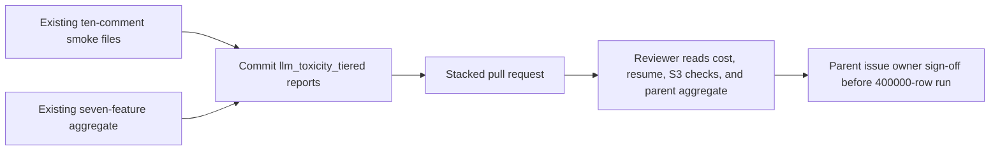

# Commit the ten-comment LLM toxicity smoke artifacts and the mixed-engine 400000-row cost aggregate

## Remember
- Exact file paths always
- Exact commands with expected output
- DRY, YAGNI, frequent commits
- Do not add or run automated tests. Do not change product Python. Do not run the 400000-row job.
- Delegated tasks must be impossible to misread.

## Overview

The package is one independently mergeable pull request for child issue [228](https://github.com/METResearchGroup/mirrorView-task/issues/228). The pull request records the ten-comment smoke for `llm_toxicity_tiered` and the scaled cost of labeling 400000 Reddit comments with OpenAI Batch. The same pull request records the mixed-engine parent cost aggregate, because all seven per-feature smoke reports now exist on the stack. The pull request is part of parent issue [218](https://github.com/METResearchGroup/mirrorView-task/issues/218). The parent issue stays open. Sibling feature smoke directories stay out of the pull request.

The work is documentation and run artifacts only. Product Python is unchanged. The 400000-row production job does not run. Owner sign-off on the parent issue is still required before anyone labels the full set. `llm_toxicity_tiered` is the LLM toxicity feature. It is not Perspective API `is_toxic_tiered`.

## Happy flow

A reviewer opens the three committed smoke files and the parent aggregate file. In the cost file, OpenAI `gpt-5.4-nano` labeled the ten shared comments, the output column is `toxicity_tier`, and the scaled cost is 21.144 USD on average and 27.34 USD at the token maximum. In the resume file, the smoke reattached the same OpenAI batch. In the S3 check file, four untagged objects sit under the primary smoke prefix, and zero objects sit under `batches/`. In the parent aggregate file, seven features sum to 99.0182 USD on average and 130.366 USD at the token maximum for 400000 rows.

## Approach

Commit files that already exist. Do not rerun the smoke. Do not invent product work. Stage only the `llm_toxicity_tiered` smoke directory, the parent cost aggregate file, and this plan directory. Leave every sibling smoke directory out of the new commits.

## Decisions

- Smoke row count is 10. The first id is `t1_mpxmfe6`. The ten ids match `docs/plans/2026-09-07_generate_reddit_llm_features_c7a14e/reports/smoke/deterministic_ten_comment_ids.json`.
- Engine is OpenAI. Model is `gpt-5.4-nano`.
- Output column is `toxicity_tier`. Perspective API `is_toxic_tiered` is not in the smoke output.
- Scaled cost is `estimated_full_run_usd_avg=21.144` and `estimated_full_run_usd_max=27.34` at 400000 rows.
- Resume reattached the same OpenAI batch. `resume_ok` is true.
- Primary smoke prefix on S3 is `s3://mirrorview-experimental-artifacts/data_platform/data/reddit/reddit_3d8a2c41-9b17-4e6f-a5d0-8c1b2e4f6079/features/reddit_2026_09_03_233928_llm_features_v1/llm_toxicity_tiered/smoke/`.
- The `batches/` prefix has no objects. No `part-*.parquet` files exist for this feature.
- Parent aggregate includes seven features, four OpenAI and three Bedrock. Totals are `total_estimated_full_run_usd_avg=99.0182` and `total_estimated_full_run_usd_max=130.366`. `total_smoke_cost_usd=0.002476`.
- Production labeling waits for an explicit repository-owner comment on parent issue 218. Merged pull requests are not permission. No `APPROVED.txt` is written. Bedrock content-filter OpenAI retry cost may add to production beyond this smoke estimate.
- Changelog is updated after the pull request exists.

## Steps

### Step 1: Commit the plan, the three existing smoke files, and the parent aggregate

Add this plan directory, the three `llm_toxicity_tiered` smoke files, and `parent_cost_aggregate.json`. Confirm the git index holds only those paths. See [steps/step1.md](steps/step1.md).

## What "done" looks like

1. `docs/plans/2026-09-07_reddit_llm_toxicity_tiered_smoke_dcc272/` is committed with this plan and `steps/step1.md`.
2. These four files are committed and no sibling smoke report directories are committed in this pull request:
   - `docs/plans/2026-09-07_generate_reddit_llm_features_c7a14e/reports/smoke/llm_toxicity_tiered/llm_toxicity_tiered_cost_report.json`
   - `docs/plans/2026-09-07_generate_reddit_llm_features_c7a14e/reports/smoke/llm_toxicity_tiered/llm_toxicity_tiered_resume_evidence.json`
   - `docs/plans/2026-09-07_generate_reddit_llm_features_c7a14e/reports/smoke/llm_toxicity_tiered/llm_toxicity_tiered_s3_checks.txt`
   - `docs/plans/2026-09-07_generate_reddit_llm_features_c7a14e/reports/smoke/parent_cost_aggregate.json`
3. The cost file records `smoke_rows` equivalent `request_count=10`, `engine_type=openai`, `model=gpt-5.4-nano`, `estimated_full_run_usd_avg=21.144`, and `estimated_full_run_usd_max=27.34`.
4. The resume file records `resume_ok=true` and `reattached_same_batch_id=true`.
5. The S3 check file records the primary smoke prefix, four untagged smoke objects, `output_rows=10`, output column `toxicity_tier`, and `no_batches_prefix_objects=true`.
6. The parent aggregate records seven features, OpenAI subtotal 80.646 / 105.53, Bedrock subtotal 18.3722 / 24.836, and campaign totals 99.0182 / 130.366.
7. Product Python, pytest, and the 400000-row job were not run. Parent issue 218 is not closed by this pull request. Issue 229 is not started.
