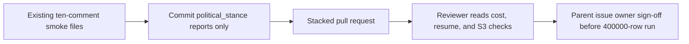

# Commit the ten-comment political stance smoke artifacts and the 400000-row cost estimate

## Remember
- Exact file paths always
- Exact commands with expected output
- DRY, YAGNI, frequent commits
- Do not add or run automated tests. Do not change product Python. Do not run the 400000-row job.
- Delegated tasks must be impossible to misread.

## Overview

The package is one independently mergeable pull request for child issue [227](https://github.com/METResearchGroup/mirrorView-task/issues/227). The pull request records the ten-comment smoke for `political_stance` and the scaled cost of labeling 400000 Reddit comments. The pull request is part of parent issue [218](https://github.com/METResearchGroup/mirrorView-task/issues/218). The parent issue stays open. Sibling feature smoke directories stay out of the pull request.

The work is documentation and run artifacts only. Product Python is unchanged. The 400000-row production job does not run. Owner sign-off on the parent issue is still required before anyone labels the full set.

## Happy flow

A reviewer opens the three committed smoke files. In the cost file, OpenAI `gpt-5.4-nano` labeled the ten shared comments, and the scaled cost is 23.744 USD on average and 30.04 USD at the token maximum. In the resume file, the smoke reattached the same OpenAI batch. In the S3 check file, four untagged objects sit under the primary smoke prefix, and zero objects sit under `batches/`.

## Approach

Commit files that already exist. Do not rerun the smoke. Do not invent product work. Stage only the `political_stance` smoke directory and this plan directory. Leave every other untracked report directory and the parent cost aggregate file untouched.

## Decisions

- Smoke row count is 10. The first id is `t1_mpxmfe6`. The ten ids match `docs/plans/2026-09-07_generate_reddit_llm_features_c7a14e/reports/smoke/deterministic_ten_comment_ids.json`.
- Engine is OpenAI. Model is `gpt-5.4-nano`.
- Scaled cost is `estimated_full_run_usd_avg=23.744` and `estimated_full_run_usd_max=30.04` at 400000 rows.
- Resume reattached the same OpenAI batch. `resume_ok` is true.
- Primary smoke prefix on S3 is `s3://mirrorview-experimental-artifacts/data_platform/data/reddit/reddit_3d8a2c41-9b17-4e6f-a5d0-8c1b2e4f6079/features/reddit_2026_09_03_233928_llm_features_v1/political_stance/smoke/`.
- The `batches/` prefix has no objects. No `part-*.parquet` files exist for this feature.
- Production labeling waits for parent issue 218 owner sign-off.
- Changelog is updated after the pull request exists.

## Steps

### Step 1: Commit the plan and the three existing smoke files

Add this plan directory and the three `political_stance` smoke files. Confirm the git index holds only those paths. See [steps/step1.md](steps/step1.md).

## What "done" looks like

1. `docs/plans/2026-09-07_reddit_political_stance_smoke_788914/` is committed with this plan and `steps/step1.md`.
2. These three files are committed and no other smoke report directories are committed:
   - `docs/plans/2026-09-07_generate_reddit_llm_features_c7a14e/reports/smoke/political_stance/political_stance_cost_report.json`
   - `docs/plans/2026-09-07_generate_reddit_llm_features_c7a14e/reports/smoke/political_stance/political_stance_resume_evidence.json`
   - `docs/plans/2026-09-07_generate_reddit_llm_features_c7a14e/reports/smoke/political_stance/political_stance_s3_checks.txt`
3. The cost file records `smoke_rows` equivalent `request_count=10`, `engine_type=openai`, `model=gpt-5.4-nano`, `estimated_full_run_usd_avg=23.744`, and `estimated_full_run_usd_max=30.04`.
4. The resume file records `resume_ok=true` and `reattached_same_batch_id=true`.
5. The S3 check file records the primary smoke prefix, four untagged smoke objects, `output_rows=10`, and `no_batches_prefix_objects=true`.
6. Product Python, pytest, and the 400000-row job were not run. Parent issue 218 is not closed by this pull request.
