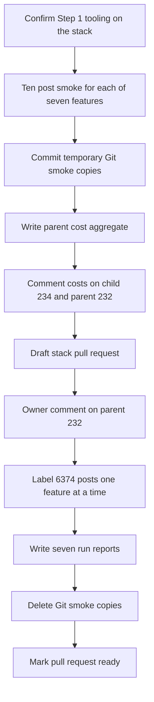

# Smoke seven Twitter LLM features, then label 6374 posts after owner sign-off

## Remember
- Exact file paths always
- Exact commands with expected output
- DRY, YAGNI, frequent commits
- Use only the approved smoke and runtime checks. Do not add or run automated tests.
- Delegated tasks must be impossible to misread.

## Overview

Operators need cost estimates for seven OpenAI features on the pinned Twitter collection, then a pause for an owner comment on the parent issue, then labels for all 6,374 posts. The pull request holds documentation and run artifacts. Product Python stays unchanged.

## Happy flow

An operator runs a ten-post smoke for each feature on the primary campaign prefix, posts per-feature and aggregate cost, and leaves the stack pull request as a draft. After the owner comments on the parent issue, the same pull request labels all 6,374 posts, writes seven run reports, and deletes the temporary Git smoke copies.

## Approach

Run the Step 1 smoke caller against the primary campaign smoke prefix. Do not add product code. Interrupt and resume only `is_news_or_opinion`. Keep the temporary Git copies until Phase B. Do not start the 6,374-post runs until the parent issue has an owner sign-off comment.

## Decisions

- Phase A runs in this round. Phase B stays in this same pull request and waits for an owner comment on [issue 232](https://github.com/METResearchGroup/mirrorView-task/issues/232). A merged or open Step 1 pull request is not permission for Phase B.
- Do not pass `--smoke-prefix`. Smoke objects go under each feature's primary `smoke/` prefix.
- Do not pass a new interrupt flag. Interrupt and resume runs only for `is_news_or_opinion`.
- Watcher `--once` prints markdown and does not write to GitHub.
- Temporary Git copies under `docs/plans/2026-09-07_generate_twitter_llm_features_e3c91a/reports/smoke/{feature}/` stay through Phase A. Phase B deletes them. S3 smoke objects remain.
- Do not write the seven `*_run_report.md` files until Phase B.
- Do not add pytest. Do not commit parquet or csv label files. Prefer "standardized" over "canonical" in new names.
- Do not edit the epic `plan.md`, `campaign_contract.md`, `step1.md`, or `step3.md`. Edit `step2.md` only to correct a spec bug.

## Locked identities

Pinned values live in `docs/plans/2026-09-07_generate_twitter_llm_features_e3c91a/campaign_contract.md`.

| Field | Value |
|-------|-------|
| Dataset id | `twitter_fba4ddb2-fcf7-4a13-a7cc-0d98db44b547` |
| Preprocessed run | `2026_09_06-19:28:47` |
| Campaign id | `twitter_2026_09_06_192847_llm_features_v1` |
| Row count | 6374 posts |
| Model | `gpt-5.4-nano` on OpenAI Batch |
| Batch size | 2000 |

Feature order: `is_news_or_opinion`, `is_political`, `is_likely_spam`, `is_self_contained`, `is_structurally_complete`, `political_stance`, `llm_toxicity_tiered`.

## Steps

### Step 1: Confirm Step 1 tooling is on the stack

Read the smoke caller, campaign YAML, cost aggregate flag, and watcher flags on this GitHub stack branch. Stop if any of those files are missing. See [steps/step1.md](steps/step1.md).

### Step 2: Run seven primary-prefix smokes and commit Git copies

Run `smoke_twitter_campaign.py` once per feature in YAML order, wait for each OpenAI Batch job, and commit the temporary Git copies. See [steps/step2.md](steps/step2.md).

### Step 3: Aggregate cost, post comments, verify S3, and open the draft pull request

Write `parent_cost_aggregate.json`, comment on issues 234 and 232, confirm smoke objects only on S3, run watcher `--once`, add a changelog line, and open the stacked pull request as a draft. See [steps/step3.md](steps/step3.md).

### Step 4: Label 6374 posts after parent owner sign-off

Do not start this step until issue 232 has an explicit owner comment signing off on Step 1, the seven smokes, and the aggregate cost. Then run production one feature at a time with batch size 2000. See [steps/step4.md](steps/step4.md).

### Step 5: Write run reports, delete Git smoke copies, and mark the pull request ready

Write seven permanent run reports, delete the temporary Git smoke copies, and mark the stack pull request ready. See [steps/step5.md](steps/step5.md).

## What "done" looks like

1. Seven ten-post smokes exist on the primary campaign prefix. Only `is_news_or_opinion` has `resume_evidence.json`. No `batches/part-*.parquet` object exists until Phase B.
2. Per-feature `estimated_full_run_usd_avg` and `estimated_full_run_usd_max` are commented on [issue 234](https://github.com/METResearchGroup/mirrorView-task/issues/234). The aggregate JSON is commented on [issue 232](https://github.com/METResearchGroup/mirrorView-task/issues/232) without editing that issue body.
3. The stack pull request stays draft through Phase A. Its body includes `Fixes #234` and `Part of #232`. It never uses a closing keyword on 232.
4. After owner sign-off, each feature has four batch objects and `final.parquet` with 6,374 unique `source_record_id` values.
5. Seven `reports/*_run_report.md` files remain in Git. Temporary Git smoke copies are gone. S3 smoke objects remain.
6. Watcher `--once` printed markdown and did not write to GitHub.
7. No product-code diff. No pytest added or run.
