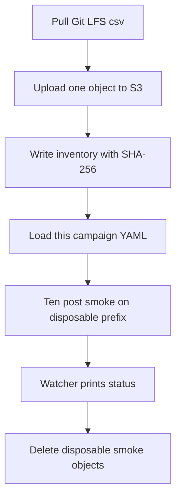

# Add Twitter campaign config, S3 csv copy, and smoke tooling

## Remember
- Exact file paths always
- Exact commands with expected output
- DRY, YAGNI, frequent commits
- Use only the approved smoke and runtime checks. Do not add or run automated tests.
- Delegated tasks must be impossible to misread.

## Overview

Campaign workers need the pinned Twitter posts file on S3, a campaign config for this campaign only, Twitter campaign mode, a ten-post smoke caller, cost math scaled to 6,374 rows, and watcher flags that resolve Twitter feature paths. This pull request ships that product code. It does not label all 6,374 posts.

## Happy flow

An operator copies the pinned preprocessed csv to S3, loads this campaign's YAML, and runs a ten-post smoke on a disposable prefix. The watcher prints a status comment and does not write to GitHub.

## Approach

Copy the Bluesky migrate, campaign Python API, smoke, cost, and watcher patterns. Keep the work to this campaign's identities. Upload only `posts.csv`. Keep Git LFS. Keep `dataset.json` as csv. Do not convert the file to parquet. Do not change registry defaults. Do not write production batch objects.

## Decisions

- Pinned identities and YAML fields come from `docs/plans/2026-09-07_generate_twitter_llm_features_e3c91a/campaign_contract.md`.
- The YAML loader accepts only `twitter_2026_09_06_192847_llm_features_v1`. Any other id raises `ValueError` naming the rejected id.
- Twitter smoke imports helpers from the Bluesky smoke module. It does not edit that module. Path building uses `FeaturePaths.for_campaign` with platform `twitter`.
- The ten-row sample loader takes an optional platform spec. Omitting it keeps today's Bluesky behavior. Twitter smoke passes `TWITTER_SPEC`.
- Cost aggregate adds `--full-run-row-count` with default `200000`. Twitter smoke and later aggregate calls pass `6374`.
- Watcher `--platform` and `--dataset-id` default to today's Bluesky values. The watcher calls `FeaturePaths.for_campaign` and never posts to GitHub.
- Live smoke uses only `s3://mirrorview-experimental-artifacts/data_platform/data/_smoke/twitter_step1_campaign_smoke/`. Delete that prefix and local `_step1_disposable` copies before the PR is ready.
- Phase 4 of implement-from-spec is given/when/then smoke and runtime checks in the step files. Do not add or run pytest.

## Steps

### Step 1: Upload the pinned csv and write the inventory

Add migrate and verify scripts for one frozen csv path. Pull LFS, reject pointer text, upload, hash with SHA-256 of full object bytes, and write the inventory. See [steps/step1.md](steps/step1.md).

### Step 2: Add the campaign YAML and the one-id loader

Add the Twitter campaign YAML and a loader that returns this campaign's fields. Reject any other campaign id. See [steps/step2.md](steps/step2.md).

### Step 3: Add campaign mode to the Twitter feature generator

Add `campaign_id` and `preprocessed_run` to `generate_twitter_features()` the same way Bluesky campaign mode works. See [steps/step3.md](steps/step3.md).

### Step 4: Wire smoke, cost row count, and watcher flags

Parameterize the ten-row sample loader, add `smoke_twitter_campaign.py`, add `--full-run-row-count` on the cost aggregator, and add watcher `--platform` and `--dataset-id`. Run the live smoke commands. Delete the disposable prefix and Git copies. See [steps/step4.md](steps/step4.md).

## What "done" looks like

1. `posts.csv` is on S3 at the repo-relative key. The inventory SHA-256 matches the object bytes.
2. Git still tracks the csv as LFS. `dataset.json` still says `format: csv`. No Bluesky or Reddit path was uploaded.
3. The YAML loader returns seven OpenAI features for this campaign id and rejects any other id.
4. `generate_twitter_features.py` accepts `--campaign-id` with `--preprocessed-run`.
5. Disposable-prefix smoke writes ten rows, prints `full_run_row_count=6374`, and writes no production batch objects.
6. The watcher resolves Twitter paths through `FeaturePaths.for_campaign` and does not post to GitHub.
7. The disposable smoke prefix and `_step1_disposable` Git copies are deleted.
8. No pytest file was added or run. No production `batches/part-*.parquet` object was written.
