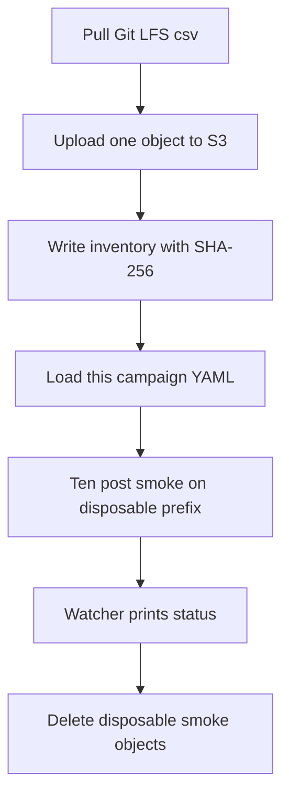

# Add Twitter campaign config, S3 csv copy, and smoke tooling

## Remember
- Exact file paths always
- Exact commands with expected output
- DRY, YAGNI, frequent commits
- Use only the approved smoke and runtime checks. Do not add or run automated tests.
- Delegated tasks must be impossible to misread.

## Overview

Campaign workers need the pinned Twitter posts file on S3, a campaign config for one campaign, Twitter campaign mode, a ten-post smoke caller, cost math scaled to 6,374 rows, and watcher flags that resolve Twitter feature paths. The pull request ships that product code and does not label all 6,374 posts.

## Happy flow

An operator copies the pinned preprocessed csv to S3, loads this campaign's YAML, and runs a ten-post smoke on a disposable prefix. The watcher prints a status comment and does not write to GitHub.

## Approach

Reuse the Bluesky migrate, campaign Python API, smoke, cost, and watcher patterns for this campaign's identities only. Upload only the pinned `posts.csv`. Keep Git LFS. Keep the dataset format as csv. Do not convert the file to parquet. Do not change registry defaults. Do not write production batch objects.

## Decisions

- Pinned identities and YAML fields live in `docs/plans/2026-09-07_generate_twitter_llm_features_e3c91a/campaign_contract.md`.
- The YAML loader accepts only campaign id `twitter_2026_09_06_192847_llm_features_v1`. Any other id raises an error that names the rejected id.
- Twitter smoke imports helpers from the Bluesky smoke module and does not edit that module. Path building uses the existing campaign path helper with platform `twitter`.
- The ten-row sample loader takes an optional platform spec. Omitting the spec keeps today's Bluesky behavior.
- Cost aggregate adds a full-run row-count flag whose default stays `200000`. Twitter smoke and later aggregate calls pass `6374`.
- Watcher platform and dataset flags default to today's Bluesky values. The watcher uses the campaign path helper and never posts to GitHub.
- Live smoke uses only `s3://mirrorview-experimental-artifacts/data_platform/data/_smoke/twitter_step1_campaign_smoke/`. Delete that prefix and local disposable copies before the PR is ready.
- Implement-from-spec Phase 4 is the given/when/then smoke and runtime checks in the step files. Do not add or run pytest.
- Do not add a shared campaign-config framework, a `FeaturePaths.canonical` alias, or a third smoke module. Import Bluesky smoke helpers. Keep the Twitter loader on this campaign id only.

## Steps

### Step 1: Upload the pinned csv and write the inventory

Add migrate and verify scripts for one frozen csv path. Pull LFS, reject pointer text, upload, hash with SHA-256 of full object bytes, and write the inventory. See [steps/step1.md](steps/step1.md).

### Step 2: Add the campaign YAML and the one-id loader

Add the Twitter campaign YAML and a loader that returns this campaign's fields. Reject any other campaign id. See [steps/step2.md](steps/step2.md).

### Step 3: Add campaign mode to the Twitter feature generator

Add campaign id and preprocessed run arguments to the Twitter feature generator the same way Bluesky campaign mode works. See [steps/step3.md](steps/step3.md).

### Step 4: Wire smoke, cost row count, and watcher flags

Parameterize the ten-row sample loader, add the Twitter smoke caller, add the full-run row-count flag on the cost aggregator, and add watcher platform and dataset flags. Run the live smoke commands. Delete the disposable prefix and Git copies. See [steps/step4.md](steps/step4.md).

## What "done" looks like

1. `posts.csv` is on S3 at the repo-relative key. The inventory SHA-256 matches the object bytes.
2. Git still tracks the csv as LFS. The dataset file still says format csv. No Bluesky or Reddit path was uploaded.
3. The YAML loader returns seven OpenAI features for this campaign id and rejects any other id.
4. The Twitter feature generator accepts campaign id together with preprocessed run.
5. Disposable-prefix smoke writes ten rows, reports a full-run row count of 6374, and writes no production batch objects.
6. The watcher resolves Twitter paths through the campaign path helper and does not post to GitHub.
7. The disposable smoke prefix and local disposable Git copies are deleted.
8. No pytest file was added or run. No production batch parquet object was written.
