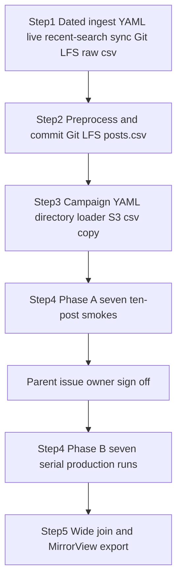

# Sync, preprocess, generate, and curate a new dated Twitter LLM campaign

Do not start the full OpenAI Batch labeling run until the repository owner signs off on the seven ten-post smoke costs in the parent GitHub issue. Merged campaign tooling is not permission.

## Remember
- Exact file paths always
- Exact commands with expected output
- DRY, YAGNI, TDD, frequent commits
- Delegated tasks must be impossible to misread.

## Overview

Collect a new dated Twitter Mirrorview corpus on 2026-09-07, preprocess it, label every surviving post with the same seven OpenAI Batch LLM features as the 2026-09-05 campaign, and write the MirrorView curated export. This is a new dataset and a new campaign. It is not a second run under the 2026-09-05 dataset, and it is not a relabel of those posts.

Reuse the existing Twitter sync, preprocess, campaign smoke, campaign generate, cost aggregate, watcher, and consolidator entry points. Unlock the campaign loader so it reads whichever Twitter campaign YAML matches the campaign id. Keep the 2026-09-05 campaign working.

## Happy flow

An operator adds the dated ingest config, runs recent search, and commits the raw Git LFS csv. The next pull request preprocesses that run and commits the filtered csv. The third pull request adds the new campaign YAML, unlocks the loader, and copies only preprocessed `posts.csv` to S3. The fourth pull request runs seven ten-post smokes, posts cost on the parent issue, waits for owner sign-off, then labels the full preprocessed set. The fifth pull request joins the seven features and writes the MirrorView export.

## Approach

Give the new collection its own dataset id and dated ingest YAML. Copy ingest parameters from the 2026-09-05 Mirrorview config. A 7-day recent-search shortfall below 8,000 posts is documented success. Git LFS stores the new dataset's csv files. S3 receives only the preprocessed `posts.csv`.

Campaign id is derived from the new preprocessed run timestamp after Step 2 exists. All seven features use OpenAI Batch `gpt-5.4-nano` and batch size 2,000. Interrupt-and-resume proof plus `resume_evidence.json` run only on `is_news_or_opinion`. Dataset format stays csv. Do not change MirrorView filter semantics. Do not add Perspective or Bedrock. The watcher never posts to GitHub.

The owner records production approval on the parent GitHub issue only. There is no `APPROVED.txt`.

See `campaign_contract.md` for identities, S3 layout, YAML shape, schemas, and the dependency graph.

## Decisions

- Identities, S3 layout, YAML shape, schemas, and the dependency graph live in `campaign_contract.md`.
- Collection is a new `twitter_<uuid>` dataset with ingest YAML dated 2026-09-07. Do not append a run under the 2026-09-05 dataset.
- Cost gate matches the prior Twitter LLM epic: seven ten-post smokes, per-feature and aggregate cost on the new parent, explicit owner comment, then full OpenAI Batch.
- Live sync runs in Step 1 in this Cloud Agent environment. `X_BEARER_TOKEN` is expected. Ceiling is about $40 at $0.005 Posts Read.
- Five children, one GitHub stack, serial `blocked-by`: 2 depends on 1, 3 on 2, 4 on 3, 5 on 4.
- Campaign loader scans `data_platform/generate_features/configs/twitter/` for a YAML whose `campaign_id` matches. The 2026-09-05 YAML stays loadable. Unknown ids raise `ValueError` naming the bad id.
- Consolidator expected row count comes from the campaign YAML, not the 6,374 constant from the prior campaign.
- Migrate and verify take `--dataset-id` and `--preprocessed-run`. They must not pin the 2026-09-05 csv.
- Step 1 may run the existing ingest YAML key tests. Steps 2 through 5 use live smoke and runtime checks only. Do not add automated tests in those steps.
- Do not edit files under `docs/plans/2026-09-07_generate_twitter_llm_features_e3c91a/`.

## Steps

### Step 1: Add dated Twitter ingest config and run recent-search sync for 2026-09-07

Copy the 2026-09-05 ingest YAML to a 2026-09-07 file with the locked new dataset id. Add git ignore exceptions and a Git LFS csv rule. Record X usage, run recent search, and commit the raw run. See [steps/step1.md](steps/step1.md).

### Step 2: Preprocess the new dated Twitter collection and store it in Git LFS

Run the existing Twitter preprocess entry point on the new dataset. Commit preprocessed `posts.csv` through Git LFS and `metadata.json` as an ordinary git file. See [steps/step2.md](steps/step2.md).

### Step 3: Add campaign YAML for the new collection, unlock the campaign loader, copy posts.csv to S3

Add the new campaign YAML, change the loader to directory lookup, add migrate and verify CLI flags, and upload only the new preprocessed `posts.csv`. See [steps/step3.md](steps/step3.md).

### Step 4: Smoke and generate seven LLM features for the new Twitter posts

Run the seven ten-post smokes, post costs on the parent, wait for owner sign-off, then label the full preprocessed set on the same pull request. Docs and run artifacts only. See [steps/step4.md](steps/step4.md).

### Step 5: Join seven Twitter LLM features and write the MirrorView curated export

Read expected row count from the new campaign YAML, join the seven verified feature outputs to fourteen preprocessed columns, publish the wide artifact, and run the existing Twitter MirrorView rules. See [steps/step5.md](steps/step5.md).

## What "done" looks like

1. A new dated ingest YAML and a new Twitter dataset exist. Raw `posts.csv` is on the branch as Git LFS. `username` is empty on every raw row. A 7-day shortfall below 8,000 is documented if it happens.
2. Preprocessed `posts.csv` for that dataset is on the branch as Git LFS, and `dataset.json` still says format `csv`.
3. The new campaign YAML loads by campaign id. The 2026-09-05 campaign still loads. The new preprocessed csv is on S3 with a verified SHA-256. Git LFS still holds the local copy.
4. Seven features each produce exactly the new preprocessed row count of unique, valid LLM labels, with smoke rows folded into `part-00000`, interrupt-and-resume proof only on `is_news_or_opinion`, and a permanent run report per feature.
5. One wide parquet artifact contains the fourteen post columns and all seven LLM feature outputs. The MirrorView curation export is written from `data_platform/curate/configs/twitter/mirrorview.yaml`. The pull request records curated row count and the `political_stance` × `llm_toxicity_tier` crosstab.
6. Intermediate batches expire after 30 days under the existing lifecycle rule. Final artifacts and run metadata remain in S3.
