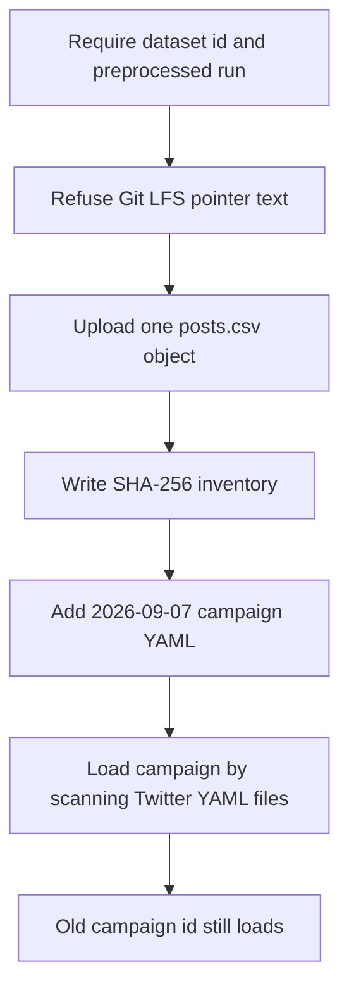

# Add campaign YAML, unlock the Twitter campaign loader, and copy posts.csv to S3

## Remember
- Exact file paths always
- Exact commands with expected output
- DRY, YAGNI, TDD, frequent commits
- Delegated tasks must be impossible to misread.

## Overview

Campaign workers need the 2026-09-07 preprocessed csv on S3, a campaign YAML for that collection, and a loader that finds the YAML by campaign id. This pull request ships that product code. It does not label the 6,408 posts.

## Happy flow

An operator passes dataset id and preprocessed run to the migrate command. The command uploads one `posts.csv` object, writes a SHA-256 inventory, and the campaign loader then returns the new YAML by campaign id while the 2026-09-05 campaign still loads.

## Approach

Reuse the existing migrate, verify, and campaign loader entry points. Replace the pinned 2026-09-05 dataset and run with required command flags. Add one new YAML. Scan the Twitter campaign config directory instead of locking a single file. Skip disposable smoke. Skip pytest.

## Decisions

- Dataset identity is `twitter_5901767a-e609-46fc-9a17-742516b548f2`.
- Preprocessed run is `2026_09_08-01:48:08`.
- Row count is `6408`.
- Campaign id is `twitter_2026_09_08_014808_llm_features_v1`.
- Migrate and verify require `--dataset-id` and `--preprocessed-run`. They must not default to the 2026-09-05 dataset. Missing flags must exit non-zero.
- Upload only `posts.csv` for that dataset and run. Expected object count is 1. Hash is SHA-256 of bytes. Never use S3 ETag. Abort if the file still starts with Git LFS pointer text.
- Inventory path is `data_platform/data/twitter/{dataset_id}/s3_preprocessed_inventory.json`.
- Do not edit the 2026-09-05 campaign YAML. That campaign id must still load with row count 6374.
- Loader scans `data_platform/generate_features/configs/twitter/*.yaml`. Two files with the same campaign id raise. No match raises with `unsupported twitter campaign id: {campaign_id}`.
- Do not label 6408 rows. Do not write primary batches. Do not add pytest. Official seven-feature smoke is child #255.

## Steps

### Step 1: Require dataset id and preprocessed run on migrate and verify

Add required `--dataset-id` and `--preprocessed-run` flags. Derive the csv path and inventory path from those flags. See [steps/step1.md](steps/step1.md).

### Step 2: Add the 2026-09-07 campaign YAML

Add `mirrorview_2026-09-07_llm_features_v1.yaml` with the locked campaign id, dataset id, preprocessed run, row count 6408, batch size 2000, OpenAI engine, model `gpt-5.4-nano`, and seven features in YAML order. See [steps/step2.md](steps/step2.md).

### Step 3: Scan the Twitter campaign YAML directory

Change the Twitter campaign loader to return the YAML whose campaign id matches. Keep the 2026-09-05 campaign loadable. Reject unknown ids with the id in the message. See [steps/step3.md](steps/step3.md).

### Step 4: Copy posts.csv to S3 and write the inventory

Pull Git LFS bytes, run migrate and verify against the new dataset, and commit the inventory. See [steps/step4.md](steps/step4.md).

## What "done" looks like

1. Migrate and verify require `--dataset-id` and `--preprocessed-run` and exit non-zero without them.
2. One `posts.csv` object is on S3 for the new dataset and run, with a matching SHA-256 inventory.
3. The new campaign YAML loads by campaign id with row count 6408, engine openai, seven features, and the locked dataset id.
4. The 2026-09-05 campaign still loads with row count 6374.
5. An unknown campaign id fails and names that id.
6. Git LFS still holds the local csv. No pytest was added. No full labeling ran.
