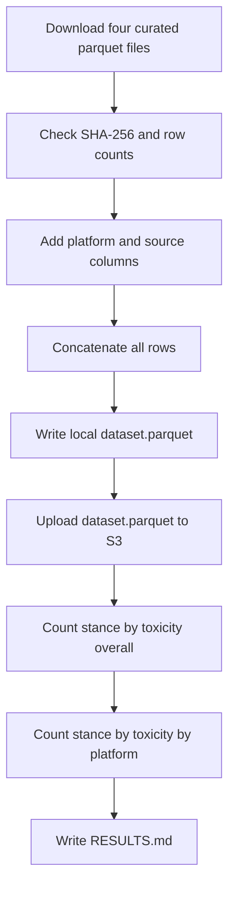

# Combine curated Bluesky, Reddit, and Twitter posts into one stimulus parquet

## Remember
- Exact file paths always
- Exact commands with expected output
- DRY, YAGNI, TDD, frequent commits
- Delegated tasks must be impossible to misread.

## Overview

Operators have four MirrorView curated exports from the recent labeling PRs. The experiment downloads those four files, concatenates them into one parquet, writes that file locally and to S3, and reports post counts by political stance and toxicity, first overall and then split by Bluesky, Reddit, and Twitter.

## Happy flow

An operator runs one command from the repo root. The script downloads the four pinned curated parquet files from S3, checks each file's SHA-256 and row count, writes one combined parquet locally and to S3, and prints two count tables. The same tables are written to RESULTS.md.

## Approach

Treat the four curated exports as the inputs. Do not re-run labeling, curation filters, or the older sampler. Keep every curated row. Use the Reddit second file that moved 3000 medium comments to high. Add a platform column so the two Twitter collections sit in one Twitter group in the three-platform table.

## Steps

### Step 1: Add the combine script

Add a command under `experiments/combine_data_into_stimulus_set_2026_09_08/` that downloads the four pinned curated files, checks hashes and row counts, concatenates a shared column set, writes the local parquet, and uploads it to S3. The step file is [steps/step1.md](steps/step1.md).

### Step 2: Run the command and write RESULTS.md

Run the command with AWS credentials. Confirm the local file and the S3 object, then commit RESULTS.md with the overall stance by toxicity table and the table that splits those counts by Bluesky, Reddit, and Twitter. The step file is [steps/step2.md](steps/step2.md).

## What "done" looks like

1. The experiment folder exists at `experiments/combine_data_into_stimulus_set_2026_09_08/`.
2. `dataset.parquet` exists locally under that folder and at `s3://mirrorview-experimental-artifacts/experiments/combine_data_into_stimulus_set_2026_09_08/dataset.parquet`.
3. Combined row count equals 9756 + 1457 + 1299 + 43061, which is 55573.
4. `RESULTS.md` has the overall stance by toxicity table and the three-platform table.
5. Stdout prints the same two tables.
6. Product curate scripts and MirrorView filter YAML files are unchanged.
7. No pytest files were added, because this is experiment code.
