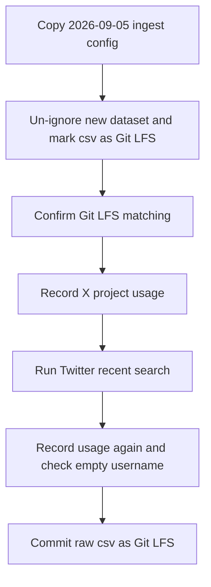

# Add a dated Twitter ingest config and run recent search for 2026-09-07

## Remember
- Exact file paths always
- Exact commands with expected output
- DRY, YAGNI, TDD, frequent commits
- Delegated tasks must be impossible to misread.

## Overview

Operators need a new 2026-09-07 Mirrorview Twitter collection with its own dataset identity. The pull request copies the 2026-09-05 ingest config, un-ignores that dataset, stores its csv files with Git LFS, runs live recent search, and commits the raw run. Preprocess, features, and S3 stay out of the pull request.

## Happy flow

An operator runs the existing Twitter sync command against the new dated config. The command writes `dataset.json` and a timestamped raw folder with `posts.csv` and `metadata.json`. Git tracks the csv through Git LFS.

## Approach

Reuse the existing Twitter sync entrypoint. Do not add ingest Python. Do not generate a new dataset identity. Copy only four dated fields on the YAML. Keep the 73 keywords, caps, language, exclude list, and skip policy from the 2026-09-05 file.

## Decisions

- Dataset identity is `twitter_5901767a-e609-46fc-9a17-742516b548f2`. Do not regenerate it.
- Copy from `data_platform/ingestion/configs/twitter/mirrorview_2026-09-05.yaml`. Do not copy from the undated `mirrorview.yaml`.
- Git ignore exceptions and Git LFS rules for the 2026-09-05 Twitter dataset stay in place.
- Live recent search is required. `X_BEARER_TOKEN` is already set.
- A completed run with fewer than 8,000 posts in the 7-day window is success when the pull request body records the shortfall.
- Empty `username` is required. Usage increase must match Posts Read, not User Read.
- The coding phases add no new Python product code. Phase 4 is the existing YAML key test plus the given, when, and then checks in the step files. Do not add pytest.

## Steps

### Step 1: Add the dated config and Git tracking

Write `mirrorview_2026-09-07.yaml`, append git ignore exceptions, append the Git LFS csv rule, and extend the runbook exception for live sync files. Confirm Git LFS matching before any sync writes files. See [steps/step1.md](steps/step1.md).

### Step 2: Run live recent search and commit the raw run

Record X usage, run `sync_twitter.py` without `--run-dir`, resume only if interrupted, verify empty username and usage increase, then commit `dataset.json`, `metadata.json`, and Git LFS `posts.csv`. See [steps/step2.md](steps/step2.md).

## What "done" looks like

1. The dated ingest config exists with the locked dataset identity, the same 73 keywords, a run cap of 8000 posts, and 110 posts per keyword task.
2. `PYTHONPATH=. uv run pytest tests/data_platform/ingestion/test_ingest_yaml_keys.py -q` exits 0.
3. The raw run is `completed`. Every `username` is empty. Usage increased by about the row count at Posts Read only.
4. Raw `posts.csv` is on the branch as Git LFS. `dataset.json` and `metadata.json` are ordinary git files.
5. The 2026-09-05 Twitter git exceptions stay. Other Twitter datasets stay ignored.
6. No ingest Python, preprocess, feature, curate, or S3 work ran.
