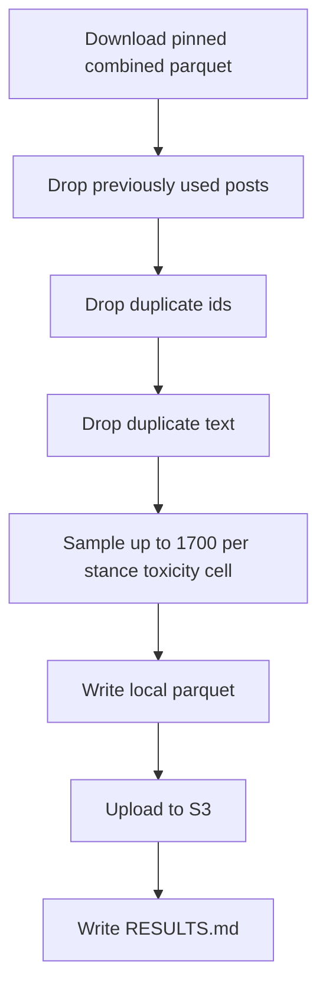

# Filter the combined stimulus parquet to a balanced sample for the next study

## Remember
- Exact file paths always
- Exact commands with expected output
- DRY, YAGNI, TDD, frequent commits
- Delegated tasks must be impossible to misread.

## Overview

Operators have a combined stimulus parquet of 55,573 posts from the 2026-09-08 combine experiment. The next study needs about 10,000 new posts so that, together with the existing 10,000-post catalog, operators can collect 5 labels on 20,000 posts. Operators drop posts already used in earlier catalogs. They also drop duplicate ids and duplicate text, and then sample toward 1,700 posts in each political stance by toxicity cell.

## Happy flow

An operator runs one command from the repo root. The run downloads the pinned combined parquet and applies cleanup. It then samples up to 1,700 posts in each of the six stance by toxicity cells. The run uploads the filtered parquet and writes RESULTS.md.

## Approach

Treat the task as a one-off experiment under `experiments/filter_posts_used_for_stimulus_dataset_2026_09_08/`. Reuse the combine experiment's S3 download and upload helpers. Reuse the existing previously used stimuli helper so posts from the Part 1 and Part 2 catalogs are excluded by id and by original text. Do not change product curate scripts. Do not add pytest. Do not edit `experiments/filter_posts_used_for_stimulus_dataset_2026_09_08/README.md`, because that file is marked read-only.

The cell for right stance and high toxicity has fewer than 1,700 unique posts after cleanup. Take every cleaned post in that cell, take 1,700 in every other cell, and then take extra posts from the cell for right stance and medium toxicity until left and right have the same number of posts and the sample has 10,200 posts.

## Decisions

- Stay on branch `filter-posts-used-for-stimulus-set-2026-09-08` (pull request 267).
- The candidate file is `s3://mirrorview-experimental-artifacts/experiments/combine_data_into_stimulus_set_2026_09_08/dataset.parquet`. The SHA-256 is `f24ad1fd8c3709ffbbba9fb5dc953dcaee2f11ad8916ae21612b7f25cb5ca3f0`. Expected row count is 55573.
- Exclude previously used stimuli with `data_platform/preprocessing/previously_used_stimuli.py`. Match on record id, and also drop candidate rows whose text equals a previous catalog `original_text`.
- Duplicate id means duplicate `record_id`. Keep the first row after sorting by integration, source dataset id, and source record id.
- Duplicate text means exact equality on the stored `text` column. Keep the first row after the same sort.
- Sample with seed 42. Target 1,700 posts per cell of political stance (`left`, `right`) by LLM toxicity tier (`low`, `medium`, `high`). If a cell has fewer than 1,700 cleaned posts, keep all of them.
- Upload to `s3://mirrorview-experimental-artifacts/experiments/filter_posts_used_for_stimulus_dataset_2026_09_08/dataset.parquet` with `put_new`. A second run must fail if that key already exists.
- The four modules named in the README are required. `run.py` is the caller that runs them in order.
- Implement-from-spec Phase 4 is the live runtime checks in the step files. Do not add files under `tests/`.

## Steps

### Step 1: Add the load, cleanup, sample, and upload command

Add the four modules named in the experiment README, plus a `run.py` caller. Pin the combined parquet hash, apply cleanup, and sample with a fixed seed. See [steps/step1.md](steps/step1.md).

### Step 2: Run the command and write RESULTS.md

Run the command with AWS credentials. Confirm the local file and the S3 object, then commit RESULTS.md with cleanup counts and the sampled stance by toxicity table. See [steps/step2.md](steps/step2.md).

## What "done" looks like

1. `experiments/filter_posts_used_for_stimulus_dataset_2026_09_08/` has `load_raw_candidate_dataset.py`, `cleanup_raw_candidate_dataset.py`, `sample_raw_candidate_dataset.py`, `upload_filtered_candidate_dataset.py`, and a runnable `run.py`.
2. `experiments/filter_posts_used_for_stimulus_dataset_2026_09_08/README.md` is unchanged from the pull request 267 draft.
3. The filtered parquet exists locally under that folder and at `s3://mirrorview-experimental-artifacts/experiments/filter_posts_used_for_stimulus_dataset_2026_09_08/dataset.parquet`.
4. `RESULTS.md` records cleanup drop counts, cleaned cell counts, and sampled cell counts.
5. The sample has 10,200 posts. Left and right each have 5,100 posts. The cell for right stance and high toxicity has every cleaned post in that cell. Extra posts come from the cell for right stance and medium toxicity.
6. Product curate scripts and the combined source parquet are unchanged.
7. No pytest file was added or run.
