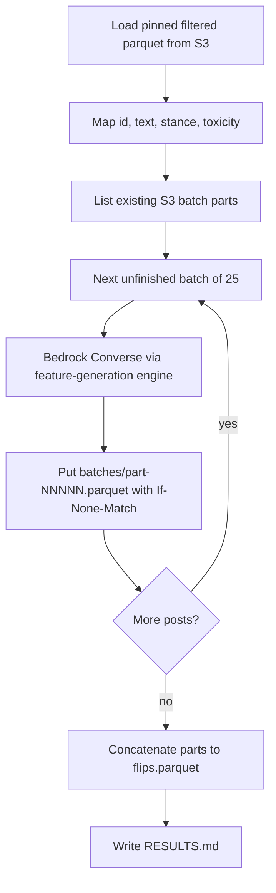

# Extract reusable flip generation and run it on the new 10,200-post sample

## Remember

- Exact file paths always
- Exact commands with expected output
- DRY, YAGNI, TDD, frequent commits
- Delegated tasks must be impossible to misread.

## Overview

Operators need politically mirrored posts for the new 10,200-post stimulus sample. Flip generation today lives only in June 2026 experiment scripts that write CSV. This work adds a shared generator that takes a table of posts, calls Bedrock through the existing Converse engine, and writes one immutable parquet object to S3 after each batch. An experiment then loads the filtered 10,200-post sample and runs that generator.

## Happy flow

An operator runs one experiment command. The command downloads the pinned filtered parquet, maps it into the shared generator, and the generator labels the next unfinished batch through Bedrock. Each finished batch becomes a new S3 parquet part. A crash and rerun skip parts already on S3.



## Approach

Reuse the Bedrock Converse path from `data_platform/generate_features/engines/bedrock_engine.py` (`label_tasks_collecting_failures`, JSON parse, retries, thread pool). Do not copy a second Converse client. The engine cannot generate full post rewrites today because max tokens is 32 and the default model is Nova Micro. Parameterize those two values with the current defaults unchanged so feature labeling stays the same. Shared flip code then calls that engine with Claude Sonnet and a larger token cap. Persistence copies the campaign batch pattern: one immutable parquet part per LLM batch, `put_new`, skip existing parts. Do not route flips through the feature campaign prefix or `write_batch` campaign row schema.

## Decisions

- The shared module is Python: `shared/flip_generation/generate_flips.py`.
- Incremental output is S3 parquet parts, not a single growing local file and not only a final file. Layout:

  `s3://mirrorview-experimental-artifacts/experiments/generate_flips_2026_09_08/{run_id}/batches/part-NNNNN.parquet`

  `s3://mirrorview-experimental-artifacts/experiments/generate_flips_2026_09_08/{run_id}/errors.jsonl`

  `s3://mirrorview-experimental-artifacts/experiments/generate_flips_2026_09_08/{run_id}/flips.parquet` (concatenated, `put_new` once)

- Each part is one LLM batch of 25 rows. Resume lists existing parts, unions their record ids, and skips them. A second put of the same part key fails.
- Use `CampaignObjectStore.put_new` and `rows_to_parquet_bytes`. Do not call `write_batch` in `s3_feature_batches.py` (that writer requires campaign audit columns).
- Call `label_tasks_collecting_failures` from the Bedrock engine. Thread `max_tokens` through `converse_label` / `_converse_once` / `label_tasks_collecting_failures` with default `BEDROCK_MAX_TOKENS`. The experiment command passes Sonnet and `MAX_TOKENS`. `build_bedrock_engine` stays Nova Micro and omits `max_tokens`.
- `generate_flips` takes only required arguments. The experiment `run.py` is the only place that may default a Bedrock client, slice `--max-posts`, or pass file-level constants.
- Required input columns: `record_id`, `text`, `political_stance` (`left` or `right`), `llm_toxicity_tier`. No nullable model fields.
- Prompt: June flip prompt plus topic-alignment. Target group is injected in the user message (`left` → `right`, `right` → `left`). No length truncation.
- Experiment input: `s3://mirrorview-experimental-artifacts/experiments/filter_posts_used_for_stimulus_dataset_2026_09_08/dataset.parquet`, SHA-256 `9788331f898aa27352dcdf32a962b5722aecc1da61a4638b7bbd77a404415ab9`, 10200 rows.
- No new pytest. Step 1 smoke is an import check. Live Bedrock smoke is Step 3.
- Do not edit the filter-posts README. Do not change June flip scripts.

## Implementation sketch

Public caller: `generate_flips(posts, store, run_prefix, client, batch_size, max_concurrency, max_tokens, model_id) -> FlipRunResult`. All arguments required. File-level constants live next to `generate_flips`; `run.py` passes them.

### Pydantic models (`shared/flip_generation/models.py`)

Bedrock structured output (what Converse must return; same two fields as June `FlipResponse`):

```python
class FlipLlmOutput(BaseModel):
    model_config = ConfigDict(extra="forbid")

    flipped_text: str = Field(min_length=1)
    explanation: str = Field(min_length=1)
```

Row the Bedrock engine validates (`FeatureSpec.model`). Identity columns match other Bedrock features:

```python
class FlipEngineRow(BaseModel):
    source_record_id: str
    label_timestamp: str
    flipped_text: str
    explanation: str
```

Row written to parquet (engine output joined to the input table):

```python
class FlipRow(BaseModel):
    model_config = ConfigDict(extra="forbid")

    record_id: str = Field(min_length=1)
    original_text: str = Field(min_length=1)
    llm_toxicity_tier: str
    political_stance: Literal["left", "right"]
    mirrored_text: str = Field(min_length=1)
    explanation: str = Field(min_length=1)
    label_timestamp: str = Field(min_length=1)
```

`FeatureSpec` for the engine: `name="flip"`, `engine_type="bedrock"`, `model=FlipEngineRow`, `llm_output_schema=FlipLlmOutput`, `system_prompt` = June prompt + topic-alignment, with the old target-group bracket replaced by “the target group named in the user message”.

User message per `LabelTask`:

```text
Target group: {right if stance is left else left}

Post:
{original_text}
```

`LabelTask.uri` is `record_id`. `LabelTask.text` is that user message.

### Bedrock engine change (defaults unchanged)

```python
def converse_label(..., max_tokens: int = BEDROCK_MAX_TOKENS) -> ...
def _converse_once(..., max_tokens: int = BEDROCK_MAX_TOKENS) -> ...
    inferenceConfig={"maxTokens": max_tokens, "temperature": BEDROCK_TEMPERATURE}
def label_tasks_collecting_failures(..., max_tokens: int = BEDROCK_MAX_TOKENS) -> BedrockTaskOutcome
```

Existing feature tests keep passing because the default stays 32.

### Shared loop

```python
tasks = tasks_from_posts(posts)
for part_index, chunk in batched(tasks, batch_size):
    if part_exists(store, run_prefix, part_index):
        continue
    outcome = label_tasks_collecting_failures(
        client, model_id, spec, chunk,
        max_concurrency, label_timestamp, max_tokens=max_tokens,
    )
    rows = join_flip_rows(posts, outcome.rows)
    put_new(part_key(run_prefix, part_index), parquet_bytes(rows))
    append_errors(outcome.content_filter_failures + outcome.other_failures)
concatenate_parts_to_flips_parquet()
```

File-level `BATCH_SIZE`, `MAX_CONCURRENCY`, and `MAX_TOKENS` live in `shared/flip_generation/generate_flips.py`. `run.py` passes those names in. The numbers match `experiments/scaled_mirrors_generation_2026_06_02/generate_flips.py`.

## Steps

### Step 1: Parameterize Bedrock max tokens and add the shared flip generator

Thread `max_tokens` through the existing Converse helpers. Add `shared/flip_generation/` with models, prompt, S3 part writer, and a required-argument dataframe entry point. See [steps/step1.md](steps/step1.md).

### Step 2: Add the experiment command

Add `experiments/generate_flips_2026_09_08/` that downloads the pinned filtered parquet, maps columns, calls the shared generator, and accepts a row cap for smoke. See [steps/step2.md](steps/step2.md).

### Step 3: Smoke on Bedrock, then generate the full sample

Run a 10-post smoke (writes `part-00000.parquet` under a smoke prefix). If that succeeds, run the full 10,200-post job and write `RESULTS.md`. See [steps/step3.md](steps/step3.md).

## What "done" looks like

1. `shared/flip_generation/generate_flips.py` accepts a pandas dataframe and writes immutable S3 parquet parts under the run prefix.
2. Rerunning the same run prefix skips parts that already exist and does not rewrite them.
3. `experiments/generate_flips_2026_09_08/run.py` is the operator entry point.
4. `generate_flips` imports. No new pytest files. Feature labeling still uses Nova Micro and `BEDROCK_MAX_TOKENS`.
5. A 10-post smoke writes one S3 part with 10 mirrored rows.
6. The full run writes 408 parts (or fewer if the last part is short), concatenates `flips.parquet`, and successes plus `errors.jsonl` ids equal 10,200.
7. June flip scripts and the filter-posts README are unchanged. Feature labeling still uses Nova Micro and 32 max tokens.
