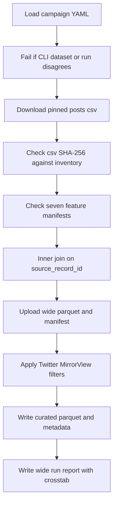

# Join seven Twitter LLM features and write the MirrorView curated export

## Remember
- Exact file paths always
- Exact commands with expected output
- DRY, YAGNI, frequent commits
- Use only the approved live runtime checks. Do not add or run automated tests.
- Delegated tasks must be impossible to misread.

## Overview

Operators need one Twitter table with 21 columns and a MirrorView curated export for the 2026-09-07 collection. This pull request teaches the existing consolidator to take expected row count from the campaign YAML, joins seven verified feature files to the pinned preprocessed csv, uploads the wide table, applies the existing Twitter MirrorView filters, and records the curated row count plus the stance by toxicity table.

## Happy flow

An operator runs the consolidator with the locked dataset id, preprocessed run, and campaign id. The script checks that those flags match the YAML, checks hashes, writes the wide table of 6,408 rows, writes a timestamped MirrorView export, and prints the curated counts.

## Approach

Keep csv loading, Twitter column order, and MirrorView curation inside the existing Twitter consolidator. Read expected wide row count from the campaign YAML for the campaign id on the command line. Fail when `--dataset-id` or `--preprocessed-run` disagrees with that YAML. Leave Bluesky wide-row and column constants unchanged. Leave Twitter MirrorView filter semantics unchanged. Do not add pytest.

## Decisions

- Locked identities live in `/workspace/data_platform/generate_features/configs/twitter/mirrorview_2026-09-07_llm_features_v1.yaml`.
- Expected wide row count is that YAML `row_count` (6408). Do not keep a module constant that forces 6374 for every Twitter campaign.
- Campaign id `twitter_2026_09_06_192847_llm_features_v1` must still expect 6374, because `/workspace/data_platform/generate_features/configs/twitter/mirrorview_2026-09-05_llm_features_v1.yaml` still says `row_count: 6374`.
- Fail if CLI `--dataset-id` or `--preprocessed-run` disagrees with the YAML for that campaign id.
- Path helper calls use platform `twitter` and the locked dataset id.
- The left table is S3 csv `posts.csv`. Verify SHA-256 against `/workspace/data_platform/data/twitter/twitter_5901767a-e609-46fc-9a17-742516b548f2/s3_preprocessed_inventory.json`. The inventory hash for that object is `0461a0dc7ac5ecf1c5699fa893013dc7165af482a5347067e413bf4315ffdbd2`.
- Join on `CAST(source_record_id AS VARCHAR)`. Sort `source_record_id ASC`.
- Wide columns are the 21 names in contract order. Forbidden extra columns include `author_id`, `toxicity_prob`, `toxicity_tier`, any `is_toxic_tiered` field, `label_timestamp`, and `run_id`.
- Feature label aliases stay as in the earlier campaign contract: `is_news_or_opinion.category` becomes `news_or_opinion_category`, and `llm_toxicity_tiered.toxicity_tier` becomes `llm_toxicity_tier`.
- Curated files live under the dataset `curated/` stage, not under `wide/curated/`. Use `TwitterStorageManager("curated", dataset_id)` to create the run directory and write `metadata.json`. Upload parquet bytes to `curated/<timestamp>/mirrorview.parquet`. Do not change `twitter/mirrorview.yaml`. Do not change `dataset.json`.
- The report must include curated row count and a `political_stance` by `llm_toxicity_tier` table for rows that survive the filters. Stance rows are `left` and `right`. Toxicity columns are `low`, `medium`, and `high`.
- Copy report shape from `/workspace/docs/plans/2026-09-07_generate_twitter_llm_features_e3c91a/reports/wide_run_report.md`. Write the new report under this plan folder. Do not edit the 2026-09-07 generate-features plan folder. Do not rewrite the 4a9cd5 epic package.
- Implement-from-spec Phase 4 is the live runtime checks in the step files. Do not add files under `tests/`.
- Stay on branch `cursor/epic-251-256-join-curate-mirrorview-8500`. Stack below is pull request 264.

## Locked identities

| Field | Value |
|-------|-------|
| Dataset id | `twitter_5901767a-e609-46fc-9a17-742516b548f2` |
| Preprocessed run | `2026_09_08-01:48:08` |
| Campaign id | `twitter_2026_09_08_014808_llm_features_v1` |
| Row count | 6408 posts |
| Inventory SHA-256 for posts.csv | `0461a0dc7ac5ecf1c5699fa893013dc7165af482a5347067e413bf4315ffdbd2` |

## Steps

### Step 1: Read expected wide row count from the campaign YAML

Change `/workspace/data_platform/curate/consolidate_twitter_llm_campaign.py` so expected wide row count comes from `load_twitter_campaign_config(campaign_id)["row_count"]`. Fail if CLI dataset id or preprocessed run disagrees with that YAML. See [steps/step1.md](steps/step1.md).

### Step 2: Run the live join and write the report

Run the consolidator and the parquet column check. Write `/workspace/docs/plans/2026-09-08_join_twitter_llm_curate_19e01b/reports/wide_run_report.md` with curated row count and the stance by toxicity table. See [steps/step2.md](steps/step2.md).

## What "done" looks like

1. Wide `features.parquet` has 6408 rows and 21 columns in contract order, with no nulls in the seven label columns.
2. Wide `manifest.json` links all seven feature manifests and the preprocessed csv SHA-256.
3. MirrorView curation writes `curated/<timestamp>/mirrorview.parquet` and `metadata.json` through the Twitter curated-stage manager.
4. The wide run report is committed with curated row count and the stance by toxicity table for valid curated rows.
5. Filter YAML semantics are unchanged.
6. The old campaign id still expects 6374 because that YAML still says 6374.
7. No pytest file was added or run. Bluesky wide-row and column constants are unchanged.
