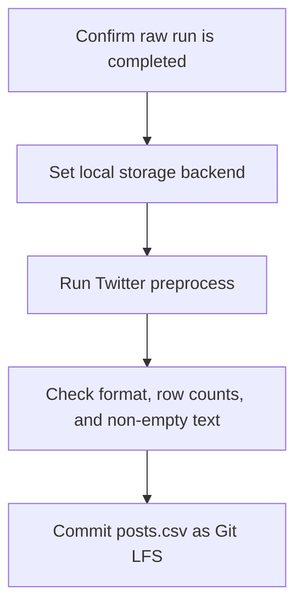

# Preprocess the dated Twitter collection and store it in Git LFS

## Remember
- Exact file paths always
- Exact commands with expected output
- DRY, YAGNI, TDD, frequent commits
- Delegated tasks must be impossible to misread.

## Overview

Operators need a preprocessed copy of the 2026-09-07 Mirrorview Twitter collection so later feature work can load a stable csv. This pull request runs the existing Twitter preprocess command on local disk, then commits `posts.csv` through Git LFS and `metadata.json` as an ordinary git file. Feature labeling, campaign YAML, and S3 stay out of the pull request.

## Happy flow

An operator sets local storage, runs the existing preprocess command with the locked dataset id, and gets a timestamped preprocessed folder. Git tracks the csv through Git LFS.

## Approach

Reuse the existing Twitter preprocess entry point. Do not add preprocess Python. Do not pass a YAML config. Keep `dataset.json` format as csv. Write the campaign id from the preprocess timestamp so the next child can copy it.

## Decisions

- Dataset identity stays `twitter_5901767a-e609-46fc-9a17-742516b548f2`.
- Storage backend must be `local`. Unset storage would look on S3, and this collection is not on S3.
- Do not pass `--config`. There is no Twitter preprocess YAML.
- `dataset.json` format stays `csv`. The preprocessed records file is `posts.csv`.
- Row count is `row_counts.output`. It may be below 6900 because validators, prior-preprocessed skips, and previously used stimuli drop rows. Do not force 6374.
- Campaign id is `twitter_` plus the preprocess timestamp with `-` changed to `_` and `:` removed, then `_llm_features_v1`.
- Git LFS stores preprocessed `posts.csv`. `metadata.json` is an ordinary git file.
- The coding phases add no new Python product code. Phase 4 is the given, when, and then checks in the step files. Do not add pytest.

## Steps

### Step 1: Confirm the completed raw run

Confirm the locked raw folder is present, `sync_status` is completed, and local storage is set before preprocess runs. See [steps/step1.md](steps/step1.md).

### Step 2: Run preprocess and commit Git LFS files

Run the locked preprocess command, check format and row counts, derive the campaign id, and commit `posts.csv` through Git LFS with `metadata.json` as an ordinary git file. See [steps/step2.md](steps/step2.md).

## What "done" looks like

1. A preprocessed run folder exists under the locked dataset with `posts.csv` and `metadata.json`.
2. `dataset.json` format is `csv`.
3. Preprocessed `posts.csv` is Git LFS. `metadata.json` is an ordinary git file.
4. The pull request records `preprocessed_run`, `row_count`, derived `campaign_id`, and `format=csv`.
5. No preprocess Python, ingest, feature, curate, or S3 work ran.
